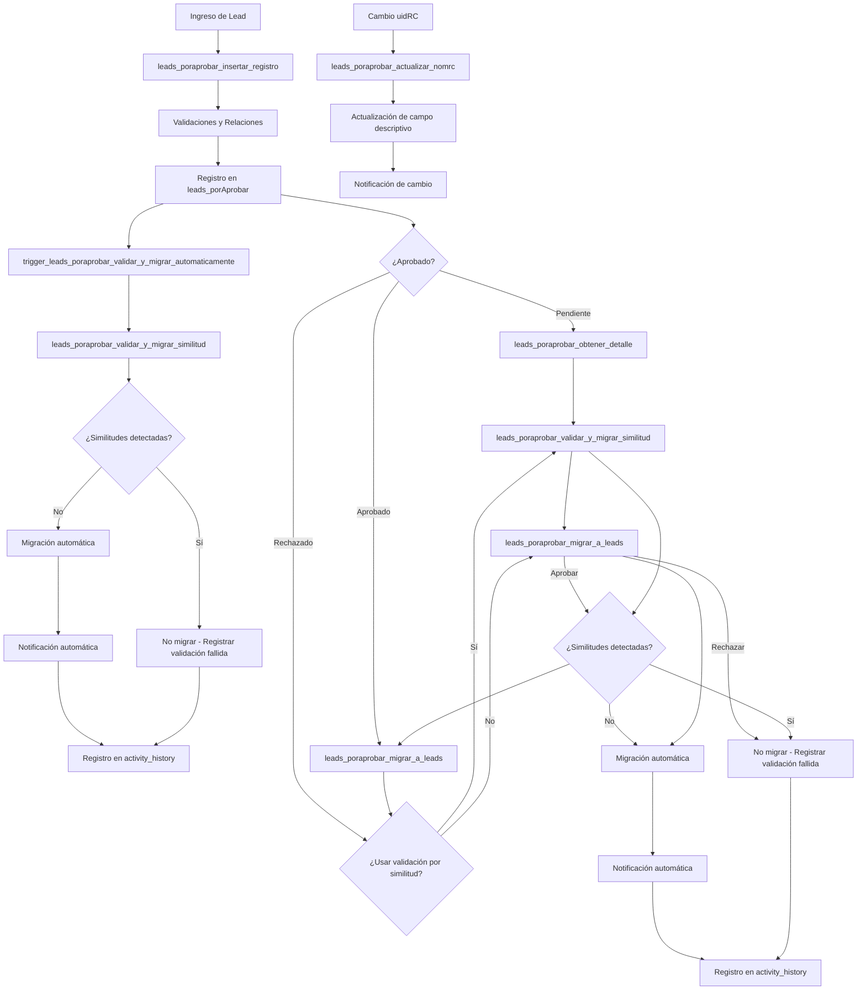
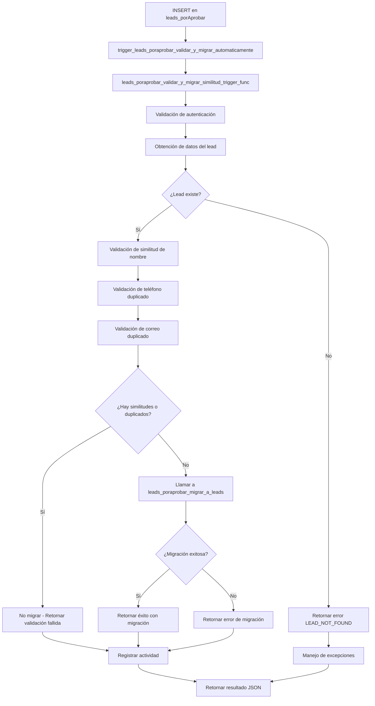
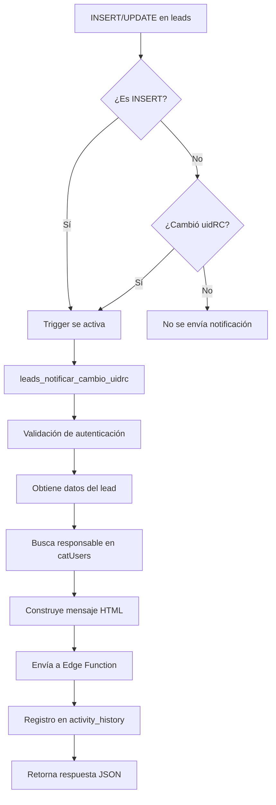
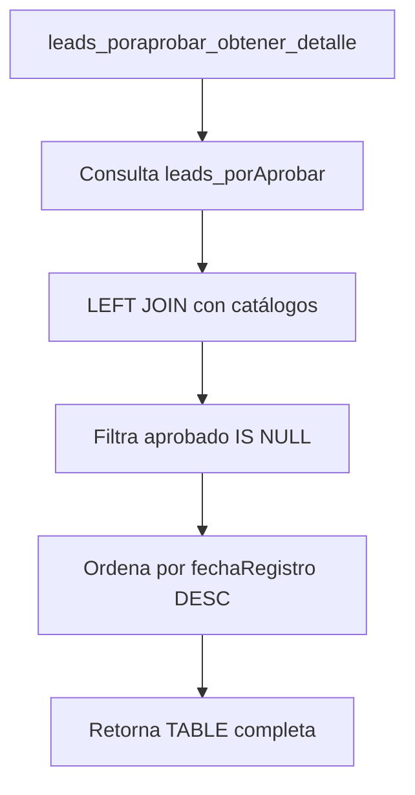

# Funciones y Triggers - Leads

## Información General
- **Tabla principal afectada**: `leads`, `leads_porAprobar`
- **Total de componentes**: 9 funciones principales, 5 funciones auxiliares, 7 triggers
- **Fecha de creación**: 20/10/2025
- **Última actualización**: 04/12/2025 05:20:00

---

## Componentes Disponibles

### 1. Función: `leads_poraprobar_obtener_detalle`
- **Tipo**: Función almacenada
- **Retorno**: TABLE con estructura completa
- **Seguridad**: SECURITY INVOKER
- **Propósito**: Obtener todos los leads pendientes de aprobación con información detallada

#### Descripción:
Función que retorna una tabla con todos los campos de `leads_porAprobar` y sus relaciones con tablas catálogo. Utiliza LEFT JOIN para incluir todos los registros aunque no tengan todas las relaciones completas.

#### Parámetros:
- Ninguno (no requiere parámetros de entrada)

#### Retorna:
TABLE con los siguientes campos:
- **Datos principales**: id, uidr, status, fc, nombreLead, telefono, correo, etc.
- **Relaciones con usuarios**: nombreRegistro (del usuario que registró)
- **Relaciones con catálogos**: nombreInmobiliaria, nombreAsesorInm, títulos de catálogos
- **Campos descriptivos**: Etapa, Origen, tipoCliente, tipoOperacion, tipoVenta

#### Uso típico:
```sql
-- Obtener todos los leads pendientes de aprobación
SELECT * FROM leads_poraprobar_obtener_detalle();

-- Filtrar por teléfono específico
SELECT * FROM leads_poraprobar_obtener_detalle()
WHERE telefono IS NOT NULL;

-- Ordenar por fecha de registro
SELECT * FROM leads_poraprobar_obtener_detalle()
ORDER BY "fechaRegistro" DESC;
```

#### Consideraciones importantes:
- Filtra automáticamente `aprobado IS NULL`
- Ordena por `fechaRegistro DESC` por defecto
- Usa LEFT JOIN para incluir todos los registros
- Incluye campos descriptivos de catálogos para facilitar visualización

---

### 2. Función: `leads_notificar_cambio_uidrc`
- **Tipo**: Función almacenada
- **Retorno**: jsonb con estructura estandarizada
- **Seguridad**: SECURITY DEFINER
- **Propósito**: Enviar notificaciones por correo cuando se crea o modifica un lead con cambio en uidRC

#### Descripción:
Función principal para enviar notificaciones por correo electrónico cuando se crea un nuevo lead o se modifica el responsable comercial asignado (uidRC). Integra con Edge Functions para el envío de correos.

#### Parámetros:
- **p_id_lead** (uuid): ID del lead que activó la notificación
- **p_tipo_accion** (text): Tipo de acción ('INSERT', 'UPDATE')
- **p_uid_anterior** (uuid): Valor anterior del uidRC (opcional)

#### Retorna:
jsonb con estructura estandarizada que incluye éxito/error y datos del proceso.

#### Uso típico:
```sql
-- Enviar notificación manualmente
SELECT leads_notificar_cambio_uidrc('123e4567-e89b-12d3-a456-426614174000', 'INSERT');

-- Notificar cambio de responsable
SELECT leads_notificar_cambio_uidrc('123e4567-e89b-12d3-a456-426614174000', 'UPDATE', 'uid-anterior');
```

#### Consideraciones importantes:
- Requiere autenticación obligatoria
- Registra actividad en activity_history
- Implementa manejo robusto de errores
- Construye mensajes HTML profesionales

---

### 3. Función: `leads_poraprobar_actualizar_nomrc`
- **Tipo**: Función almacenada
- **Retorno**: jsonb con estructura estandarizada
- **Seguridad**: SECURITY INVOKER
- **Propósito**: Actualizar el campo nomRC en leads_porAprobar cuando se modifica uidRC

#### Descripción:
Función que mantiene sincronizado el campo descriptivo nomRC cuando se cambia el responsable comercial asignado a un lead en la tabla de aprobación.

#### Parámetros:
- **p_id_lead** (uuid): ID del lead a actualizar
- **p_uid_rc** (uuid): Nuevo ID del responsable comercial asignado

#### Retorna:
jsonb con estructura estandarizada indicando éxito o error del proceso.

#### Uso típico:
```sql
-- Actualización manual del responsable comercial
SELECT leads_poraprobar_actualizar_nomrc('uuid-del-lead', 'nuevo-uid-rc');
```

#### Consideraciones importantes:
- Valida existencia del lead en leads_porAprobar
- Obtiene nombre del responsable desde catUsers
- Maneja caso de responsable no encontrado
- Se activa automáticamente mediante trigger

---

### 4. Función: `leads_poraprobar_insertar_registro`
- **Tipo**: Función almacenada
- **Retorno**: jsonb con estructura estandarizada
- **Seguridad**: SECURITY INVOKER
- **Propósito**: Insertar nuevos registros en leads_porAprobar con validaciones completas

#### Descripción:
Función para registrar nuevos leads en el sistema de aprobación con validaciones completas de campos requeridos y relaciones con tablas catálogo.

#### Parámetros:
- **p_uidr** (uuid): ID del usuario que registra el lead (obligatorio)
- **p_nombre_lead** (text): Nombre completo del lead (obligatorio)
- **Parámetros opcionales**: teléfono, correo, uid_rc, id_inmobiliaria, etc.

#### Retorna:
jsonb con estructura estandarizada que incluye éxito/error y datos del lead registrado.

#### Uso típico:
```sql
-- Insertar un nuevo lead básico
SELECT leads_poraprobar_insertar_registro(
    'uid-usuario-registro',
    'Juan Pérez García',
    '5512345678',
    'juan.perez@email.com'
);
```

#### Consideraciones importantes:
- Validación obligatoria de autenticación
- Verificación de campos requeridos
- Validación de relaciones con tablas catálogo
- Registro automático en activity_history

---

### 5. Función: `leads_poraprobar_migrar_a_leads`
- **Tipo**: Función almacenada
- **Retorno**: jsonb con estructura estandarizada
- **Seguridad**: SECURITY INVOKER
- **Propósito**: Migrar leads aprobados desde leads_porAprobar a la tabla principal leads

#### Descripción:
Función que completa el flujo de aprobación migrando leads aprobados a la tabla principal del sistema, manteniendo toda la información y relaciones.

#### Parámetros:
- **p_id_lead** (uuid): ID del lead a migrar (obligatorio)
- **p_forzar_migracion** (boolean): Forzar migración incluso si no está aprobado (default: false)

#### Retorna:
jsonb con estructura estandarizada indicando éxito o error del proceso de migración.

#### Uso típico:
```sql
-- Migrar un lead aprobado
SELECT leads_poraprobar_migrar_a_leads('uuid-del-lead-aprobado');

-- Forzar migración de un lead específico (uso administrativo)
SELECT leads_poraprobar_migrar_a_leads('uuid-del-lead', true);
```

#### Consideraciones importantes:
- Requiere autenticación obligatoria
- Verifica estado de aprobación del lead
- Previene duplicados en tabla leads
- Incluye función adicional para migración en lote

---

### 6. Función: `leads_enviar_webhook_uidrc`
- **Tipo**: Función almacenada
- **Retorno**: jsonb con estructura estandarizada
- **Seguridad**: SECURITY INVOKER
- **Propósito**: Enviar información de lead a webhook externo cuando se crea o actualiza uidRC

#### Descripción:
Función que envía automáticamente la información de un lead a un webhook externo cuando:
- Se crea un nuevo registro de lead
- Se actualiza el campo `uidRC` (Responsable Comercial)

La función obtiene el nombre completo del responsable desde la tabla `catUsers` y envía un JSON estructurado al webhook de n8n.

#### Parámetros:
- **p_id_lead** (uuid): ID del lead que activó el envío
- **p_tipo_accion** (text): Tipo de acción ('INSERT', 'UPDATE')
- **p_uid_anterior** (uuid): Valor anterior del uidRC (para detectar cambios)

#### Retorna:
jsonb con estructura estandarizada:

**Estructura de respuesta:**
```json
{
  "success": boolean,
  "message": string,
  "error": string (solo en caso de error),
  "error_code": number (solo en caso de error),
  "data": object (información adicional)
}
```

#### Uso típico:
```sql
-- Enviar manualmente información de un lead al webhook
SELECT leads_enviar_webhook_uidrc('uuid-del-lead', 'INSERT');

-- Ejemplo con UUID real
SELECT leads_enviar_webhook_uidrc('123e4567-e89b-12d3-a456-426614174000', 'UPDATE', 'uuid-anterior');
```

#### Ejemplos de Respuesta JSON:

**✅ Respuesta de éxito:**
```json
{
  "success": true,
  "message": "Webhook enviado exitosamente para lead 123e4567-e89b-12d3-a456-426614174000",
  "data": {
    "lead_id": "123e4567-e89b-12d3-a456-426614174000",
    "lead_name": "Juan Pérez",
    "responsible_name": "Carlos Rodríguez",
    "action_type": "nuevo_lead",
    "webhook_url": "https://sph-n8n.fn5wy3.easypanel.host/webhook/c66df01e-daaa-4c6f-be11-65945b760318",
    "webhook_status": 200,
    "timestamp": "2025-12-01T07:25:00.000000+00"
  }
}
```

**❌ Respuesta de error de webhook:**
```json
{
  "success": false,
  "error": "WEBHOOK_ERROR",
  "message": "Error al enviar datos al webhook: Connection timeout",
  "error_code": 500,
  "data": {
    "lead_id": "123e4567-e89b-12d3-a456-426614174000",
    "error_detail": "Connection timeout",
    "payload": {...}
  }
}
```

#### Consideraciones importantes:
- Función de tipo SECURITY INVOKER para ejecutar con privilegios del usuario
- Implementa manejo robusto de errores para no interrumpir operaciones principales
- Registra actividad en `activity_history` para auditoría
- Solo envía datos cuando hay cambios relevantes (nuevo lead o cambio de uidRC)
- Obtiene automáticamente el nombre del responsable desde `catUsers.nomCompleto`

---

### 2. Trigger: `trigger_leads_webhook_uidrc`
- **Tipo**: Trigger de base de datos
- **Evento**: AFTER INSERT OR UPDATE
- **Propósito**: Activar automáticamente la función de webhook

#### Descripción:
Trigger que se activa automáticamente cuando:
- Se INSERTA un nuevo registro en la tabla `leads`
- Se ACTUALIZA un registro y el campo `uidRC` cambia de valor

#### Condiciones de activación:
- **INSERT**: Siempre se ejecuta
- **UPDATE**: Solo si `OLD.uidRC IS DISTINCT FROM NEW.uidRC`

#### Consideraciones importantes:
- Se ejecuta AFTER para no bloquear la operación principal
- Implementa condición WHEN para optimizar rendimiento
- Maneja errores sin interrumpir la transacción principal

---

### 3. Función: `leads_eliminar_lead`
- **Tipo**: Función almacenada
- **Retorno**: jsonb con estructura estandarizada
- **Seguridad**: SECURITY DEFINER
- **Propósito**: Eliminar un registro de la tabla leads con validación de permisos

#### Descripción:
Función que elimina un lead específico de la tabla leads, validando que el usuario tenga el permiso 327 (CRM > Leads > Eliminar Leads) activo en segModulosUsuarios.

#### Parámetros:
- **p_id_lead** (uuid): ID del lead a eliminar

#### Retorna:
jsonb con estructura estandarizada:

**Estructura de respuesta:**
```json
{
  "success": boolean,
  "message": string,
  "error": string (solo en caso de error),
  "error_code": number (solo en caso de error),
  "data": object (información adicional)
}
```

**Tipos de respuesta:**
- **success: true**: Lead eliminado correctamente
- **success: false**: Error con código y descripción

#### Uso típico:
```sql
-- Eliminar un lead específico
SELECT leads_eliminar_lead('uuid-del-lead-a-eliminar');

-- Ejemplo con UUID real
SELECT leads_eliminar_lead('123e4567-e89b-12d3-a456-426614174000');
```

#### Ejemplos de Respuesta JSON:

**✅ Respuesta de éxito:**
```json
{
  "success": true,
  "message": "Lead eliminado correctamente",
  "data": {
    "lead_id": "123e4567-e89b-12d3-a456-426614174000",
    "lead_name": "Juan Pérez Pérez",
    "deleted_at": "2025-11-18T17:15:30.123456+00",
    "deleted_by": "896f01e5-283f-4bdb-b3f3-11381adedb30"
  }
}
```

**❌ Respuesta de error por permisos:**
```json
{
  "success": false,
  "error": "PERMISSION_DENIED",
  "message": "El usuario no tiene permiso para eliminar leads (permiso 327 no activo)",
  "error_code": 403,
  "data": {
    "required_permission": 327,
    "permission_name": "CRM > Leads > Eliminar Leads",
    "user_uid": "896f01e5-283f-4bdb-b3f3-11381adedb30"
  }
}
```

**❌ Respuesta de error por lead no encontrado:**
```json
{
  "success": false,
  "error": "LEAD_NOT_FOUND",
  "message": "El lead especificado no existe",
  "error_code": 404,
  "data": {
    "lead_id": "00000000-0000-0000-0000-000000000000"
  }
}
```

**❌ Respuesta de error de base de datos:**
```json
{
  "success": false,
  "error": "DATABASE_ERROR",
  "message": "No se pudo eliminar el lead",
  "error_code": 500,
  "data": {
    "lead_id": "uuid-invalido",
    "database_error": "invalid input syntax for type uuid",
    "error_detail": "22P02"
  }
}
```

#### Consideraciones importantes:
- Requiere permiso 327 activo en segModulosUsuarios
- Función de tipo SECURITY DEFINER para ejecutar con privilegios elevados
- Valida existencia del lead antes de eliminar
- Manejo de excepciones con mensajes descriptivos
- Registro automático de eliminación a través de logs de PostgreSQL

---

### 7. Función: `leads_poraprobar_validar_y_migrar_similitud`
- **Tipo**: Función almacenada
- **Retorno**: jsonb con estructura estandarizada
- **Seguridad**: SECURITY INVOKER
- **Propósito**: Validar similitudes de leads contra la tabla leads existente y realizar migración automática si no se detectan duplicados

#### Descripción:
Función que valida automáticamente si un lead pendiente de aprobación es similar a alguno existente en la tabla principal leads, y si no lo es, procede con su migración automática. Implementa validaciones de similitud de nombre con umbral del 35%, y validaciones exactas de teléfono y correo.

#### Parámetros:
- **p_id_lead_poraprobar** (uuid): ID del lead en leads_porAprobar a validar y migrar

#### Retorna:
jsonb con estructura estandarizada que incluye resultado del proceso, validaciones realizadas y estado de migración.

#### Uso típico:
```sql
-- Validar y migrar un lead específico
SELECT leads_poraprobar_validar_y_migrar_similitud('uuid-del-lead');
```

#### Ejemplos de Respuesta JSON:

**✅ Respuesta de validación exitosa con migración:**
```json
{
  "success": true,
  "message": "Lead validado y migrado correctamente (sin similitudes detectadas)",
  "migrated": true,
  "validation_results": {
    "similarity_name": false,
    "duplicate_phone": false,
    "duplicate_email": false,
    "threshold_used": 0.35,
    "validated_name": "Juan Pérez García",
    "validated_phone": "5512345678",
    "validated_email": "juan.perez@email.com"
  },
  "data": {
    "lead_id": "123e4567-e89b-12d3-a456-426614174000",
    "lead_name": "Juan Pérez García",
    "migration_reason": "Sin similitudes o duplicados detectados",
    "validation_timestamp": "2025-12-04T00:55:00.000000+00"
  }
}
```

**❌ Respuesta de validación con similitud detectada (no migra):**
```json
{
  "success": true,
  "message": "Lead no migrado por detectarse similitudes o duplicados",
  "migrated": false,
  "validation_results": {
    "similarity_name": true,
    "duplicate_phone": false,
    "duplicate_email": false,
    "threshold_used": 0.35,
    "validated_name": "Juan Pérez García",
    "validated_phone": "5512345678",
    "validated_email": "juan.perez@email.com"
  },
  "data": {
    "lead_id": "123e4567-e89b-12d3-a456-426614174000",
    "lead_name": "Juan Pérez García",
    "reason_for_no_migration": "Similitud de nombre detectada",
    "validation_timestamp": "2025-12-04T00:55:00.000000+00"
  }
}
```

#### Consideraciones importantes:
- Requiere autenticación obligatoria
- Implementa tres tipos de validación: similitud de nombre, teléfono duplicado, correo duplicado
- Usa constante de similitud 0.35 (35%) para validación de nombres
- Si CUALQUIER validación es positiva → NO migra el lead
- Si TODAS las validaciones son negativas → migra automáticamente
- NOTA IMPORTANTE: Solo registra en activity_history cuando la migración es exitosa
- Manejo robusto de errores con respuestas JSON estandarizadas

#### Validaciones implementadas:
- **Similitud de nombre**: Usa función similarity() con umbral del 35%
- **Teléfono duplicado**: Búsqueda exacta (case-sensitive)
- **Correo duplicado**: Búsqueda exacta (case-sensitive)
- **Autenticación obligatoria**: Verifica auth.uid() IS NOT NULL
- **Existencia del lead**: Valida que el lead exista en leads_porAprobar

---

### 8. Trigger: `trigger_leads_poraprobar_validar_y_migrar_automaticamente`
- **Tipo**: Trigger de base de datos
- **Evento**: AFTER INSERT
- **Propósito**: Ejecutar automáticamente la validación y migración de leads al insertar nuevos registros

#### Descripción:
Trigger que se activa automáticamente cada vez que se inserta un nuevo registro en la tabla `leads_porAprobar`. Ejecuta la función `leads_poraprobar_validar_y_migrar_similitud` para validar si el nuevo lead es similar a alguno existente y migrarlo automáticamente si no se detectan duplicados.

#### Condiciones de activación:
- **Evento**: AFTER INSERT en `leads_porAprobar`
- **Ejecución**: FOR EACH ROW (por cada fila insertada)

#### Consideraciones importantes:
- Se ejecuta AFTER INSERT para no afectar el rendimiento de la inserción
- Implementa manejo de errores para no causar rollback de la transacción principal
- Si la validación falla, el trigger no afecta la inserción del registro
- La función auxiliar `leads_poraprobar_validar_y_migrar_similitud_trigger_func` maneja los errores

---

### 9. Función Auxiliar: `leads_poraprobar_validar_y_migrar_similitud_trigger_func`
- **Tipo**: Función de trigger
- **Retorno**: trigger
- **Seguridad**: SECURITY DEFINER
- **Propósito**: Función interna del trigger que ejecuta la validación con manejo de errores

#### Descripción:
Función auxiliar que ejecuta la validación y migración de leads desde el trigger. Implementa un bloque BEGIN/EXCEPTION para capturar cualquier error durante la validación sin afectar la inserción del registro principal.

#### Consideraciones importantes:
- Usa SECURITY DEFINER para asegurar ejecución
- Implementa manejo completo de excepciones
- Si hay errores en la validación, los registra pero no interrumpe la inserción
- Retorna NEW para permitir que la inserción continúe normalmente

---

## Flujo de Procesamiento

### Flujo Completo de Gestión de Leads por Aprobar (Actualizado)


### Flujo de Validación y Migración Automática (Nuevo)


### Flujo de Notificaciones


### Flujo de Consulta de Leads por Aprobar


---

## Instalación

### Orden de instalación:
1. Ejecutar las funciones de leads_porAprobar:
   ```sql
   \i Leads/funciones y trigger/leads_poraprobar_obtener_detalle.sql
   \i Leads/funciones y trigger/leads_poraprobar_actualizar_nomrc.sql
   \i Leads/funciones y trigger/leads_poraprobar_insertar_registro.sql
   \i Leads/funciones y trigger/leads_poraprobar_migrar_a_leads.sql
   ```

2. Ejecutar las funciones de notificaciones:
   ```sql
   \i Leads/funciones y trigger/leads_notificar_cambio_uidrc.sql
   \i Leads/funciones y trigger/leads_enviar_webhook_uidrc.sql
   ```

3. Ejecutar la función de eliminación:
   ```sql
   \i Leads/funciones y trigger/leads_eliminar_lead.sql
   ```

4. O ejecutar todo con el script de instalación actualizado:
   ```sql
   \i Leads/funciones y trigger/instalar_todo.sql
   ```

### Notas sobre la instalación:
- ✅ El script `instalar_todo.sql` ha sido actualizado (03/12/2025 17:55:57)
- ✅ Incluye todos los componentes documentados
- ✅ Contiene el código completo de todas las funciones (no solo referencias)
- ✅ Implementa todos los triggers asociados
- ✅ Agrega funciones auxiliares para triggers
- ✅ Incluye función de migración en lote

### Verificación de instalación:
```sql
-- Verificar que todas las funciones existen
SELECT routine_name, routine_type, security_type
FROM information_schema.routines
WHERE routine_schema = 'public'
AND routine_name LIKE 'leads_%'
ORDER BY routine_name;

-- Verificar que los triggers existen
SELECT trigger_name, event_manipulation, event_object_table, action_timing
FROM information_schema.triggers
WHERE trigger_schema = 'public'
AND trigger_name LIKE 'trigger_leads_%'
ORDER BY trigger_name;

-- Probar funcionamiento básico
SELECT COUNT(*) FROM leads_poraprobar_obtener_detalle();

-- Probar inserción (requiere datos válidos)
SELECT leads_poraprobar_insertar_registro(
    auth.uid(),
    'Lead de prueba',
    '5512345678',
    'test@email.com'
);

-- Verificar migración en lote
SELECT leads_poraprobar_migrar_lote(10, false);
```

---

## Relaciones con Tablas

### Tablas principales:
- **leads_porAprobar**: Tabla principal de la consulta

### Tablas catálogo (LEFT JOIN):
- **catUsers** (ur): Usuario que registró el lead
- **catUsers** (rc): Responsable comercial
- **catInmobiliarias**: Inmobiliaria asociada
- **catAsesoresInm**: Asesor inmobiliario
- **crm_Etapas**: Etapa del proceso
- **crm_Origen**: Origen del lead
- **crm_tipoCliente**: Tipo de cliente
- **crm_tipoOperaciones**: Tipo de operación
- **crm_tipoVenta**: Tipo de venta

---

## Estado Actual

### Funciones Principales (9):
- **✅ Función creada y documentada**: `leads_poraprobar_obtener_detalle`
- **✅ Función creada y documentada**: `leads_notificar_cambio_uidrc`
- **✅ Función creada y documentada**: `leads_poraprobar_actualizar_nomrc`
- **✅ Función creada y documentada**: `leads_poraprobar_insertar_registro`
- **✅ Función creada y documentada**: `leads_poraprobar_migrar_a_leads`
- **✅ Función creada y documentada**: `leads_enviar_webhook_uidrc`
- **✅ Función creada y documentada**: `leads_eliminar_lead`
- **✅ Función creada y documentada**: `leads_poraprobar_validar_y_migrar_similitud`

### Funciones Auxiliares (5):
- **✅ Función creada y documentada**: `trigger_leads_poraprobar_actualizar_nomrc`
- **✅ Función creada y documentada**: `trigger_leads_poraprobar_insertar_registro`
- **✅ Función creada y documentada**: `trigger_leads_poraprobar_migrar_a_leads`
- **✅ Función creada y documentada**: `leads_poraprobar_validar_y_migrar_similitud_trigger_func`
- **✅ Función creada y documentada**: `leads_poraprobar_migrar_lote`

### Triggers Automáticos (7):
- **✅ Trigger creado y documentado**: `trigger_leads_webhook_uidrc`
- **✅ Trigger creado y documentado**: `trigger_leads_poraprobar_actualizar_nomrc`
- **✅ Trigger creado y documentado**: `trigger_leads_poraprobar_insertar_registro`
- **✅ Trigger creado y documentado**: `trigger_leads_poraprobar_migrar_a_leads`
- **✅ Trigger creado y documentado**: `trigger_leads_poraprobar_validar_y_migrar_automaticamente`

### Sistema Completo:
- **✅ Estructura de carpeta establecida**
- **✅ Sistema completo de aprobación de leads implementado**
- **✅ Sistema de notificaciones implementado**
- **✅ Sistema de webhook para leads implementado**
- **✅ Sistema de migración automática implementado**
- **✅ Script de instalación completo y actualizado**

---

## Notas Importantes

1. **Seguridad**: La función usa SECURITY INVOKER por defecto
2. **Performance**: Los LEFT JOIN pueden impactar rendimiento con muchos datos
3. **Mantenimiento**: Revisar periódicamente si nuevos campos deben agregarse
4. **Compatibilidad**: Diseñada para ser compatible con frontend existente

---

## Registro de Cambios

### 20/10/2025 - Creación inicial
- ✅ Creación de la función `leads_poraprobar_obtener_detalle`
- ✅ Documentación completa de la función
- ✅ Creación del script de instalación `instalar_todo.sql`
- ✅ Estructura inicial de la carpeta

### 18/11/2025 - Actualización con función de eliminación
- ✅ Creación de la función `leads_eliminar_lead` con validación de permisos
- ✅ Implementación de seguridad con permiso 327 (CRM > Leads > Eliminar Leads)
- ✅ Documentación completa según estándares del proyecto
- ✅ Actualización del README.md y script de instalación

### 01/12/2025 - Implementación de sistema de webhook
- ✅ Creación de la función `leads_enviar_webhook_uidrc` para enviar datos a webhook externo
- ✅ Creación del trigger `trigger_leads_webhook_uidrc` para activación automática
- ✅ Implementación de manejo robusto de errores y logging en `activity_history`
- ✅ Integración con tabla `catUsers` para obtener nombre del responsable comercial
- ✅ Documentación completa con ejemplos de uso y respuestas JSON
- ✅ Actualización del README.md y script de instalación
- 🔧 **Corrección del trigger**: Añadidas conversiones explícitas de tipo (`::uuid`, `::text`) para asegurar compatibilidad con la firma de la función

### 03/12/2025 - Implementación completa del sistema de leads por aprobar
- ✅ Mejora de documentación existente en `leads_poraprobar_obtener_detalle.sql`
- ✅ Mejora de documentación existente en `leads_notificar_cambio_uidrc.sql`
- ✅ Creación de `leads_poraprobar_actualizar_nomrc.sql` para sincronización de campos descriptivos
- ✅ Creación de `leads_poraprobar_insertar_registro.sql` para inserción con validaciones completas
- ✅ Creación de `leads_poraprobar_migrar_a_leads.sql` para migración automática a tabla principal
- ✅ Implementación de triggers asociados para automatización completa
- ✅ Documentación completa según estándares del proyecto supaSPH-QR
- ✅ Actualización integral del README.md con todos los componentes
- ✅ Implementación de flujo completo de aprobación de leads
- ✅ Sistema de migración en lote para procesamiento eficiente
- ✅ **ACTUALIZACIÓN CRÍTICA**: Script `instalar_todo.sql` actualizado con código completo (03/12/2025 17:55:57)
- ✅ **NUEVA FUNCIÓN**: Implementación de `leads_poraprobar_validar_y_migrar_similitud` (04/12/2025 00:59:00)
- ✅ **VERIFICACIÓN COMPLETA**: Confirmado que todos los componentes documentados están incluidos
- ✅ **MEJORA DE INSTALACIÓN**: Script ahora incluye código completo en lugar de referencias
- 🔧 **CORRECCIÓN CRÍTICA**: Función `leads_poraprobar_validar_y_migrar_similitud` actualizada (04/12/2025 04:25:00)
  - Resuelto error de foreign key constraint en activity_history
  - Eliminadas inserciones en activity_history cuando el lead no existe en tabla leads
  - Ahora solo registra actividad cuando la migración es exitosa (desde leads_poraprobar_migrar_a_leads)
- ✅ **NUEVO TRIGGER**: Implementación de `trigger_leads_poraprobar_validar_y_migrar_automaticamente` (04/12/2025 05:20:00)
 - Trigger automático que ejecuta validación y migración al insertar nuevos leads
 - Implementado con manejo de errores para no afectar inserciones
 - Función auxiliar `leads_poraprobar_validar_y_migrar_similitud_trigger_func` creada
 - Sistema de validación automática ahora funciona sin intervención manual

---

*Documento generado el: 04/12/2025*
*Proyecto: SPH Bines Raices - Sistema de Gestión de Leads*
*Última actualización: 04/12/2025*

## 🔐 Seguridad

### Validaciones Críticas Implementadas

- **SECURITY DEFINER**: Ejecuta con privilegios del propietario de la función
- **🔐 VALIDACIÓN CRÍTICA**: Verificación explícita de autenticación (`auth.uid() IS NULL`)
- **Validación de permisos**: Verifica permiso 327 en segModulosUsuarios
- **Prevención de acceso anónimo**: Bloquea ejecución por usuarios no autenticados
- **Prevención de errores**: Valida existencia del lead antes de eliminar

### Por qué es IMPORTANTE la validación de autenticación:

**Problema de seguridad potencial:**
- Las funciones `SECURITY DEFINER` ejecutan con privilegios del propietario
- Si un usuario anónimo (`auth.uid() = NULL`) pudiera ejecutar la función
- Podría eludir las políticas RLS y eliminar datos sin autorización

**Solución implementada:**
```sql
IF auth.uid() IS NULL THEN
    -- Retornar error 401 inmediatamente
    RETURN 'ERROR: Se requiere autenticación';
END IF;
```

### Códigos de Error de Seguridad:
- **401**: Autenticación requerida (usuario anónimo detectado)
- **403**: Permiso denegado (no tiene permiso 327)
- **404**: Lead no encontrado
- **500**: Error de base de datos

### Mejores Prácticas de Seguridad:
1. **Siempre validar `auth.uid()`** en funciones `SECURITY DEFINER`
2. **Retornar errores específicos** para cada tipo de fallo
3. **Registrar intentos fallidos** (implementado por PostgreSQL automáticamente)
4. **Principio de mínimo privilegio**: Solo ejecutar lo necesario