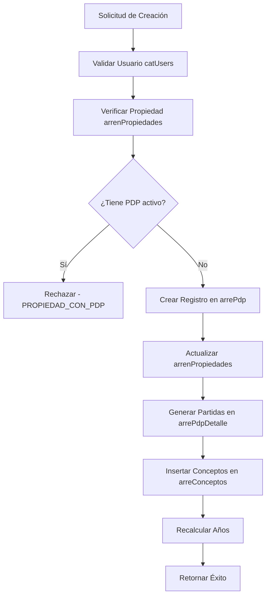
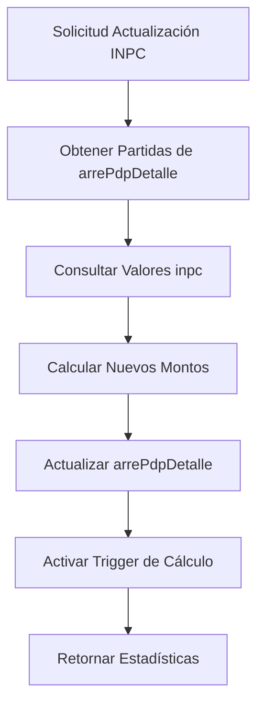

# Análisis de Tablas y sus Interacciones - arrePdp y arrePdpDetalle

## 📋 Overview

Este documento analiza las tablas `arrePdp` (Planes de Pago de Arrendamiento) y `arrePdpDetalle` (Detalle de Planes de Pago) del sistema SPH, identificando todas las tablas con las que interactúan y documentando sus funciones y relaciones.

## 🏗️ Estructura de las Tablas Principales

### Tabla: `arrePdp` (Planes de Pago Principales)

**Propósito**: Almacena la información principal de los planes de pago de arrendamiento.

**Campos Principales**:
- `idArrePdp` (text): Identificador único del plan
- `uid` (uuid): Usuario que crea el registro
- `idArrendador` (text): ID del arrendador/propietario
- `idNavArrend` (text): ID de la nave/propiedad arrendada
- `fecInicio` (date): Fecha de inicio del contrato
- `plazo` (integer): Plazo en meses del contrato
- `deposito` (double precision): Monto del depósito
- `precioM2` (double precision): Precio por metro cuadrado
- `construccionM2` (double precision): Metros cuadrados de construcción
- `rtaBase` (double precision): Valor base calculado automáticamente
- `INPC`, `INPCPlus` (double precision): Valores de INPC
- `pm2Admin`, `pm2Mtto`, `pm2Vig` (double precision): Precios por m2 de servicios

### Tabla: `arrePdpDetalle` (Detalle de Planes de Pago)

**Propósito**: Almacena las partidas mensuales detalladas de cada plan de pago.

**Campos Principales**:
- `idArrePdpDet` (text): Identificador único del detalle
- `idArrePdp` (text): Referencia al plan principal
- `numPartida` (integer): Número de partida/secuencia
- `concepto` (text): Descripción del concepto (Renta, Administración, etc.)
- `fecha` (timestamp): Fecha programada del pago
- `pm2` (numeric): Precio por metro cuadrado
- `constM2` (numeric): Constante de metros cuadrados
- `cantidad` (real): Monto calculado del pago
- `INPC`, `ptsINPC` (real): Valores de INPC aplicados
- `anio` (smallint): Año correspondiente a la partida
- `status` (boolean): Estado del registro

## 🔗 Tablas que Interactúan con arrePdp y arrePdpDetalle

### 1. Tabla: `arrenPropiedades` (Propiedades de Arrendamiento)

**Relación**: Directa con `arrePdp`

**Propósito**: Gestiona las propiedades/arrendamientos y su estado de PDP.

**Interacciones**:
- **Verificación de PDP existente**: Antes de crear un nuevo plan, verifica que la propiedad no tenga ya un PDP activo
- **Actualización de estado**: Al crear un plan, actualiza la propiedad con `tienePdp = true` y `pdpActivo = true`
- **Asignación de ID**: Asigna el `idArrePdp` a la propiedad

**Campos relacionados**:
- `idNavArrend` (text): ID de la nave arrendada (clave foránea)
- `tienePdp` (boolean): Indica si tiene plan de pagos
- `pdpActivo` (boolean): Estado del PDP
- `idArrePdp` (text): Referencia al plan activo

**Funciones que utilizan esta tabla**:
- `arrepdp_crear_plan_completo_rpc()`
- `arrepdp_crear_plan_simple_rpc()`

### 2. Tabla: `arreConceptos` (Conceptos de Arrendamiento)

**Relación**: Directa con `arrePdp`

**Propósito**: Almacena los conceptos de cobro asociados a cada plan de pago.

**Interacciones**:
- **Inserción automática**: Al crear un plan, inserta automáticamente 4 conceptos:
  1. Renta
  2. Servicios (Administración + Mantenimiento)
  3. Vigilancia
  4. Administración

**Campos relacionados**:
- `idArreConcepto` (text): ID único del concepto
- `idArrendador` (text): ID del arrendador
- `idArrePdp` (text): Referencia al plan principal
- `concepto` (text): Descripción del concepto
- `monto` (numeric): Monto del concepto

**Funciones que utilizan esta tabla**:
- `arrepdp_crear_plan_completo_rpc()`

### 3. Tabla: `catUsers` (Catálogo de Usuarios)

**Relación**: Múltiples interacciones con ambas tablas

**Propósito**: Gestiona los usuarios del sistema y sus permisos.

**Interacciones**:
- **Creación de registros**: El `uid` del usuario que crea el plan
- **Control de acceso**: Mediante políticas RLS para controlar quién puede ver/modificar
- **Validaciones**: Verifica existencia de usuarios en operaciones
- **Auditoría**: Registra quién realiza las operaciones

**Campos relacionados**:
- `uid` (uuid): ID único del usuario
- `nomCompleto` (text): Nombre completo del usuario
- `status` (boolean): Estado del usuario

**Funciones que utilizan esta tabla**:
- Todas las funciones RPC y de gestión

### 4. Tabla: `inpc` (Índice Nacional de Precios al Consumidor)

**Relación**: Directa con `arrePdpDetalle`

**Propósito**: Almacena los valores históricos del INPC para cálculos de actualización.

**Interacciones**:
- **Actualización de INPC**: Funciones que actualizan los valores de INPC en las partidas
- **Cálculos automáticos**: Aplica incrementos por INPC en los montos de pago
- **Validación de fechas**: Requiere exactamente 3 meses de antelación para cálculos

**Campos relacionados**:
- `anio` (smallint): Año del registro INPC
- `mes` (smallint): Mes del registro INPC
- `inpc` (real): Valor del INPC
- `id` (text): Identificador único

**Funciones que utilizan esta tabla**:
- `arrepdpdetalle_actualizar_inpc()`
- `arrepdpdetalle_actualizar_inpc_desde_anio()`

### 5. Tabla: `catTipoOperacion` (Tipos de Operación)

**Relación**: Referenciada en `arrePdpDetalle`

**Propósito**: Clasifica los tipos de operaciones en el sistema.

**Interacciones**:
- **Clasificación**: El campo `tipoOperacion` en `arrePdpDetalle` referencia esta tabla
- **Control de operaciones**: Permite diferenciar tipos de movimientos

**Campos relacionados**:
- `tipoOperacion` (integer): Referencia al tipo de operación

### 6. Tabla: `segModulosUsuarios` (Permisos de Usuarios por Módulo)

**Relación**: Indirecta mediante control de acceso

**Propósito**: Gestiona los permisos de los usuarios en diferentes módulos del sistema.

**Interacciones**:
- **Control de acceso**: Políticas RLS que verifican permisos para operaciones
- **Seguridad**: Restringe quién puede crear/modificar planes de pago
- **Validación**: Verifica permisos antes de ejecutar operaciones

**Funciones que utilizan esta tabla**:
- Políticas RLS de todas las tablas del sistema

## 🔄 Flujo de Interacción entre Tablas

### Proceso de Creación de Plan Completo

### Proceso de Actualización de INPC

## 📊 Funciones Principales y sus Relaciones

### Funciones de Creación

#### `arrepdp_crear_plan_completo_rpc()`
- **Parámetros**: 16 parámetros incluyendo UID, arrendador, propiedad, fechas, montos y cortesías
- **Tablas involucradas**: `arrePdp`, `arrenPropiedades`, `arrePdpDetalle`, `arreConceptos`, `catUsers`
- **Propósito**: Creación completa de planes de pago en una sola transacción
- **Relaciones**:
  - Inserta en `arrePdp` el registro principal
  - Actualiza `arrenPropiedades` con `tienePdp = true`
  - Llama a `arrepdpdetalle_generar_plan_completo()` para crear partidas
  - Inserta 4 conceptos automáticos en `arreConceptos`
  - Valida usuario en `catUsers`
- **Retorno**: JSON con estadísticas completas de la operación

#### `arrepdp_crear_plan_simple_rpc()`
- **Parámetros**: 8 parámetros básicos (UID, arrendador, propiedad, fecha, plazo, montos)
- **Tablas involucradas**: `arrePdp`, `arrenPropiedades`, `catUsers`
- **Propósito**: Creación simplificada de planes con validación de superposición
- **Relaciones**:
  - Verifica propiedad sin PDP en `arrenPropiedades`
  - Valida superposición de períodos con planes existentes
  - Inserta registro básico en `arrePdp`
- **Retorno**: JSON con resultado de la operación

#### `arrepdpdetalle_generar_plan_completo()`
- **Parámetros**: 14 parámetros del contrato
- **Tablas involucradas**: `arrePdpDetalle`
- **Propósito**: Genera todas las partidas mensuales del plan
- **Relaciones**: Crea 4 partidas por mes (Renta, Administración, Mantenimiento, Vigilancia)
- **Características**: Maneja cortesías por concepto, calcula años automáticamente

### Funciones de Cálculo Automático

#### `arrepdpdetalle_calcular_cantidad()` + `trigger_arrepdpdetalle_calcular_cantidad`
- **Tipo**: Función trigger (BEFORE INSERT/UPDATE)
- **Tablas involucradas**: `arrePdpDetalle`
- **Propósito**: Calcula automáticamente los montos de pago
- **Lógica**:
  - Si `pm2 > 0`: calcula usando fórmula `((pm2 * constM2) * (1 + (INPC + ptsINPC)/100))`
  - Si `pm2 = 0`: preserva valor manual
- **Relaciones**: Se ejecuta automáticamente en cada operación DML

#### `arrepdpdetalle_recalcular_todas_cantidades()`
- **Parámetros**: Ninguno (opera sobre toda la tabla)
- **Tablas involucradas**: `arrePdpDetalle`
- **Propósito**: Recálculo masivo de todas las cantidades
- **Lógica**: Aplica misma fórmula que el trigger pero a toda la tabla
- **Retorno**: JSON con estadísticas (registros recalculados vs manuales)

### Funciones de Gestión de Años

#### `arrepdpdetalle_recalcular_anos_contrato()`
- **Parámetros**: `id_contrato` (TEXT)
- **Tablas involucradas**: `arrePdpDetalle`
- **Propósito**: Recalcula años del contrato con manejo especial de depósitos
- **Lógica**:
  - Partida 0 (depósito): año = 0
  - Partidas ≥ 1: año = ((numPartida - 1) / 12 + 1)
- **Retorno**: JSON con estadísticas de actualizaciones

#### `arrepdpdetalle_calcular_anio_por_plan()`
- **Parámetros**: `id_arrepdp` (TEXT)
- **Tablas involucradas**: `arrePdpDetalle`
- **Propósito**: Cálculo rápido masivo por plan
- **Lógica**: Aplica fórmula directa sin distinguir depósitos
- **Limitación**: No maneja depósitos (partida 0) correctamente

#### `actualizar_ciclo_plan_pago()`
- **Parámetros**: Ninguno (opera sobre toda la tabla)
- **Tablas involucradas**: `arrePdpDetalle`
- **Propósito**: Calcula y actualiza el campo ciclo para todos los registros
- **Lógica**: `año_inicio + años_completos_transcurridos`
- **Uso**: Principalmente para agrupaciones y reportes por ciclos

### Funciones de Gestión de INPC

#### `arrepdpdetalle_actualizar_inpc()`
- **Parámetros**: `id_arrepdp` (TEXT)
- **Tablas involucradas**: `arrePdpDetalle`, `inpc`
- **Propósito**: Actualiza INPC para años ≥ 2 con lógica acumulativa
- **Lógica**:
  - Obtiene valor INPC de 3 meses antes del primer mes de cada año
  - Aplica acumulativamente a años ≥ actual
- **Retorno**: TABLE con resultados por año procesado

#### `arrepdpdetalle_actualizar_inpc_desde_anio()`
- **Parámetros**: `id_arrepdp` (TEXT), `anio_inicio` (smallint)
- **Tablas involucradas**: `arrePdpDetalle`, `inpc`
- **Propósito**: Actualización parcial de INPC desde año específico
- **Ventaja**: Permite recálculos selectivos sin afectar años anteriores

### Funciones de Mantenimiento y Actualización

#### `arrepdpdetalle_actualizar_campo_manual()`
- **Parámetros**: `id_arre_pdp`, `anio_desde`, `concepto`, `campo`, `valor`
- **Tablas involucradas**: `arrePdpDetalle`
- **Propósito**: Actualización segura de campos específicos
- **Características especiales**:
  - Recálculo automático de pm2 cuando se modifica INPC o ptsINPC
  - Aplicación uniforme de nuevos valores a años ≥ especificado
  - Preservación de valores manuales (pm2 = 0)
- **Retorno**: JSON con detalles del recálculo realizado

#### `arrepdpdetalle_recalcular_anos_contrato()`
- **Parámetros**: `id_contrato` (TEXT)
- **Tablas involucradas**: `arrePdpDetalle`
- **Propósito**: Recalcula años del contrato con manejo de depósitos
- **Relaciones**: Actualiza campo `anio` basado en `numPartida`
- **Retorno**: JSON con estadísticas de la operación

## 🔐 Consideraciones de Seguridad

### Políticas RLS (Row Level Security)

1. **catUsers**: Controla quién puede ver/modificar usuarios
2. **arrenPropiedades**: Restringe acceso a propiedades
3. **arrePdp**: Controla acceso a planes de pago
4. **arrePdpDetalle**: Restringe acceso a detalles de planes
5. **arreConceptos**: Controla acceso a conceptos

### Validaciones Implementadas

- **Verificación de usuarios**: Todas las operaciones validan existencia de usuarios
- **Control de propiedades**: Verifica que no existan PDP duplicados
- **Validación de INPC**: Requiere datos exactos para cálculos
- **Manejo transaccional**: Operaciones atómicas para mantener consistencia

## 📈 Impacto en el Sistema

### Antes de la Implementación
- Múltiples llamadas desde el frontend
- Código Flutter de ~300 líneas
- Riesgo de inconsistencia de datos
- Manejo manual de errores

### Después de la Implementación
- 1 llamada RPC al backend
- Manejo transaccional automático
- Validaciones centralizadas
- Consistencia garantizada
- Reducción significativa de código frontend

## 🎯 Recomendaciones

### Para Mantenimiento
1. **Monitoreo de triggers**: El trigger de cálculo es crítico para la integridad
2. **Actualización de INPC**: Mantener actualizada la tabla `inpc` con valores históricos
3. **Validación de permisos**: Revisar periódicamente las políticas RLS

### Para Rendimiento
1. **Índices recomendados**:
   - `arrePdp(idNavArrend, status)`
   - `arrePdpDetalle(idArrePdp, anio, status)`
   - `arrenPropiedades(idNavArrend, tienePdp)`

2. **Optimizaciones**:
   - Las funciones masivas deben usarse con moderación
   - Considerar particionamiento por año para tablas grandes

## 🗂️ Tablas Adicionales que Interactúan con el Sistema

### Tablas de Configuración y Control

#### `SPHConfiguraciones`
- **Relación**: Indirecta mediante validaciones en CXP
- **Propósito**: Almacena parámetros de configuración del sistema
- **Interacción**:
  - Valida autorización fuera de presupuesto
  - Controla comportamientos especiales del sistema
- **Campos relevantes**:
  - `parametro` (text): Nombre del parámetro
  - `valor` (text): Valor del parámetro
  - `status` (boolean): Estado del parámetro

#### `cxp_fechas_habilitadas`
- **Relación**: Indirecta mediante módulo CXP
- **Propósito**: Controla fechas habilitadas para operaciones CXP
- **Interacción**:
  - Valida fechas para autorizaciones
  - Controla operaciones por día/mes
- **Campos relevantes**:
  - `fecha` (date): Fecha específica
  - `dia_semana` (text): Día de la semana
  - `mes` (integer): Mes del año
  - `anio` (integer): Año

### Tablas de Gestión de Usuarios y Permisos

#### `segModulos`
- **Relación**: Mediante `segModulosUsuarios`
- **Propósito**: Catálogo de módulos del sistema
- **Interacción**:
  - Define estructura de permisos
  - Controla acceso a funcionalidades
- **Campos relevantes**:
  - `idsegModulos` (integer): ID del módulo
  - `modulo` (text): Nombre del módulo
  - `seccion` (text): Sección del módulo
  - `area` (text): Área funcional

#### `perfil`
- **Relación**: Referenciada en `catUsers`
- **Propósito**: Perfiles de usuario con niveles de acceso
- **Interacción**:
  - Define nivel de acceso base
  - Complementa permisos granulares
- **Campos relevantes**:
  - `nivel` (integer): Nivel del perfil
  - `descripcion` (text): Descripción del perfil

### Tablas de Catálogos del Sistema

#### `catProveedores`
- **Relación**: Indirecta mediante módulo CXP
- **Propósito**: Catálogo de proveedores
- **Interacción**:
  - Validación de proveedores en operaciones
  - Consulta de información fiscal
- **Campos relevantes**:
  - `idProveedor` (text): ID del proveedor
  - `razonSocial` (text): Razón social
  - `tipoProveedor` (integer): Tipo de proveedor

#### `PresCategorias`
- **Relación**: Indirecta mediante módulo CXP
- **Propósito**: Categorías presupuestarias
- **Interacción**:
  - Clasificación de gastos
  - Control presupuestario
- **Campos relevantes**:
  - `idCategoria` (text): ID de categoría
  - `descripcion` (text): Descripción
  - `seccion` (text): Sección presupuestaria
  - `presupuestable` (boolean): Indica si es presupuestable

#### `inversionista`
- **Relación**: Indirecta mediante validaciones de proveedores
- **Propósito**: Catálogo de inversionistas
- **Interacción**:
  - Validación alternativa de proveedores
  - Gestión de inversiones
- **Campos relevantes**:
  - `idInversionista` (text): ID del inversionista
  - `nombre` (text): Nombre del inversionista

### Tablas de Gestión de Leads (CRM)

#### `leads`
- **Relación**: Indirecta mediante usuarios y permisos
- **Propósito**: Gestión de leads del CRM
- **Interacción**:
  - Comparte usuarios (`catUsers`)
  - Comparte sistema de permisos (`segModulosUsuarios`)
- **Campos relevantes**:
  - `id` (uuid): ID del lead
  - `uidRC` (uuid): Usuario responsable comercial
  - `status` (boolean): Estado del lead

#### Tablas relacionadas con Leads:
- `catInmobiliarias`: Inmobiliarias asociadas
- `crm_Etapas`: Etapas del proceso de venta
- `crm_Origen`: Origen de los leads
- `crm_tipoCliente`: Tipos de cliente
- `crm_tipoOperaciones`: Tipos de operación
- `crm_tipoVenta`: Tipos de venta
- `activity_history`: Historial de actividades

### Tablas de Presupuestos

#### `presupuestos`
- **Relación**: Indirecta mediante módulo CXP
- **Propósito**: Gestión de presupuestos anuales
- **Interacción**:
  - Control de gastos autorizados
  - Validación presupuestaria
- **Campos relevantes**:
  - `idPresupuesto` (text): ID del presupuesto
  - `anio` (integer): Año presupuestario
  - `status` (boolean): Estado

#### `PresDetalle`
- **Relación**: Indirecta mediante módulo CXP
- **Propósito**: Detalle mensual de presupuestos
- **Interacción**:
  - Control mensual de gastos
  - Acumulación de presupuestos
- **Campos relevantes**:
  - `idPresDetalle` (text): ID del detalle
  - `idCategoria` (text): Categoría presupuestaria
  - `mes` (integer): Mes del año
  - `monto` (double precision): Monto presupuestado

### Tablas de Propiedades

#### `propiedades`
- **Relación**: Indirecta mediante sistema de propiedades
- **Propósito**: Gestión general de propiedades
- **Interacción**:
  - Comparte estructura con `arrenPropiedades`
  - Sistema de eliminación lógica
- **Campos relevantes**:
  - `idPropiedad` (text): ID de propiedad
  - `status` (boolean): Estado

#### `pagos`
- **Relación**: Indirecta mediante propiedades
- **Propósito**: Registro de pagos
- **Interacción**:
  - Validación de propiedades con pagos
  - Control de eliminación
- **Campos relevantes**:
  - `idPropiedad` (text): Referencia a propiedad
  - `status` (boolean): Estado

### Tablas de Asesores Inmobiliarios

#### `catAsesoresInm`
- **Relación**: Indirecta mediante sistema de usuarios
- **Propósito**: Catálogo de asesores inmobiliarios
- **Interacción**:
  - Referencia a usuarios (`catUsers`)
  - Validación de teléfonos únicos
- **Campos relevantes**:
  - `id` (text): ID del asesor
  - `uidr` (uuid): Referencia a usuario
  - `telefono` (text): Teléfono del asesor

## 🔗 Resumen de Interacciones por Módulo

### Módulo de Arrendamiento (Core)
- **Tablas principales**: `arrePdp`, `arrePdpDetalle`
- **Tablas directas**: `arrenPropiedades`, `arreConceptos`
- **Tablas de soporte**: `catUsers`, `inpc`, `catTipoOperacion`

### Módulo de Seguridad
- **Tablas principales**: `segModulosUsuarios`, `segModulos`
- **Tablas relacionadas**: `catUsers`, `perfil`
- **Propósito**: Control de acceso a todas las tablas del sistema

### Módulo CXP (Cuentas por Pagar)
- **Tablas principales**: `cxp`
- **Tablas de soporte**: `catProveedores`, `PresCategorias`, `catUsers`
- **Tablas de control**: `cxp_fechas_habilitadas`, `SPHConfiguraciones`

### Módulo CRM (Leads)
- **Tablas principales**: `leads`
- **Tablas de soporte**: `catUsers`, `segModulosUsuarios`
- **Tablas de catálogos**: Múltiples tablas `crm_*`

### Módulo de Presupuestos
- **Tablas principales**: `presupuestos`, `PresDetalle`
- **Tablas de soporte**: `PresCategorias`, `catUsers`

### Módulo de Propiedades
- **Tablas principales**: `propiedades`, `arrenPropiedades`
- **Tablas de soporte**: `catUsers`, `pagos`

---

**Fecha de análisis**: 19/11/2025
**Estado**: Documentación completa y actualizada
**Versión del sistema**: SPH-QR
**Analista**: Kilo Code