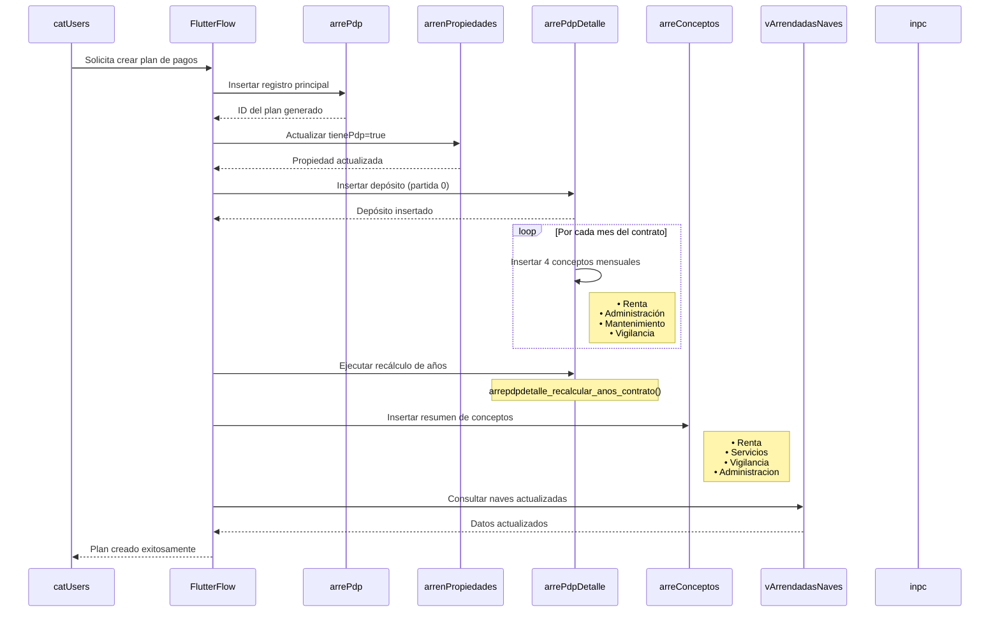

# Análisis de Tablas para Creación de Plan de Pagos - supaSPH-QR

## 📋 Descripción General

Este documento presenta un análisis detallado de todas las tablas que interactúan en el proceso de creación de planes de pagos del sistema supaSPH-QR, con especial énfasis en las tablas `arrePdp` y `arrePdpDetalle`. El análisis se basa en el código FlutterFlow existente y las funciones PostgreSQL implementadas.

## 🏗️ Diagrama de Relaciones

```mermaid
erDiagram
    %% Tablas principales del sistema
    arrePdp {
        text idArrePdp PK
        text idArrendador FK
        uuid uid FK
        text idNavArrend FK
        date fecInicio
        integer plazo
        double precision deposito
        double precision precioM2
        double precision construccionM2
        double precision rtaBase
        double precision INPC
        double precision INPCPlus
        double precision pm2Admin
        double precision pm2Mtto
        double precision pm2Vig
        timestamp fc
        boolean status
    }
    
    arrePdpDetalle {
        text idArrePdpDet PK
        text idArrePdp FK
        integer numPartida
        text concepto
        timestamp fecha
        double precision pm2
        double precision constM2
        double precision cantidad
        double precision INPC
        double precision ptsINPC
        smallint anio
        boolean status
        uuid uidc FK
        timestamp fc
        boolean montoDividido
        boolean UltimoPago
        integer ciclo
        text comprobantePago
        double precision cantidadAplicada
        uuid uidPago FK
        date fecPago
        integer tipoOperacion FK
        double precision inc_x_inpc
    }
    
    catUsers {
        uuid uid PK
        text nombre
        text email
        text telefono
        uuid idPerfil FK
        timestamp fc
        boolean status
        text idArrendador FK
    }
    
    arrenPropiedades {
        text idNavArrend PK
        text idArrendatario FK
        boolean tienePdp
        text idArrePdp FK
        timestamp fc
        boolean status
    }
    
    arreConceptos {
        text idArreConcepto PK
        uuid uid FK
        text idArrendador FK
        text idArrePdp FK
        text concepto
        double precision monto
        timestamp fc
        boolean status
    }
    
    vArrendadasNaves {
        text idNavArrend PK
        text idArrendatario FK
        text nombreNave
        text direccion
        double precision construccion
        boolean tienePdp
        text idArrePdp FK
        timestamp fc
        boolean status
    }
    
    catTipoOperacion {
        integer tipoOperacion PK
        text descripcion
        boolean status
        timestamp fc
    }
    
    inpc {
        text id PK
        smallint anio
        smallint mes
        double precision inpc
        timestamp fc
        boolean status
    }
    
    %% Relaciones principales
    arrePdp ||--o{ arrePdpDetalle : "1 a muchos"
    arrePdp }o--|| catUsers : "creado por"
    arrePdp }o--|| arrenPropiedades : "actualiza propiedad"
    arrePdp }o--|| vArrendadasNaves : "nave arrendada"
    arrePdpDetalle }o--|| catUsers : "creado por"
    arrePdpDetalle }o--|| catUsers : "pago registrado por"
    arrePdpDetalle }o--|| catTipoOperacion : "tipo operación"
    arrePdpDetalle }o--|| inpc : "valores INPC"
    
    %% Relaciones secundarias
    arrePdp ||--o{ arreConceptos : "conceptos del plan"
    arrenPropiedades ||--|| vArrendadasNaves : "propiedad arrendada"
    arrenPropiedades }o--|| arrePdp : "tiene plan de pago"
    
    %% Notas importantes
    note right of arrePdp : "Tabla principal de planes de pago\nCreada desde FlutterFlow\nContiene parámetros financieros"
    
    note right of arrePdpDetalle : "Almacena el detalle de cada plan\n4 conceptos por mes:\n- Renta\n- Administración\n- Mantenimiento\n- Vigilancia"
    
    note right of arrenPropiedades : "Propiedades arrendadas\nSe actualiza con tienePdp=true"
    
    note right of arreConceptos : "Resumen de conceptos\npor plan de pago"
    
    note right of vArrendadasNaves : "Vista de naves\narrendadas activas"
    
    note right of inpc : "Índice Nacional de Precios\nal Consumidor\nPara ajustes anuales"
```

## 📊 Descripción Detallada de Tablas

### 1. 🏠 arrePdp (Plan de Pagos Principal)
**Estado**: Implementada en FlutterFlow

**Propósito**: Almacena la información principal del plan de pagos de arrendamiento.

**Campos Principales** (según código Flutter):
- `idArrePdp`: Identificador único del plan
- `uid`: Usuario que crea el registro
- `idArrendador`: ID del arrendador/propietario
- `idNavArrend`: ID de la nave arrendada
- `fecInicio`: Fecha de inicio del contrato
- `plazo`: Plazo en meses
- `deposito`: Monto del depósito garantía
- `precioM2`: Precio por metro cuadrado
- `construccionM2`: Metros cuadrados de construcción
- `rtaBase`: Renta base calculada
- `INPC`: Valor del INPC inicial
- `INPCPlus`: Puntos adicionales de INPC
- `pm2Admin`: Precio por m2 de administración
- `pm2Mtto`: Precio por m2 de mantenimiento
- `pm2Vig`: Precio por m2 de vigilancia

**Relaciones**:
- 1:N con `arrePdpDetalle`
- 1:N con `arreConceptos`
- N:1 con `catUsers` (creador)
- 1:1 con `arrenPropiedades` (actualización)
- 1:1 con `vArrendadasNaves` (nave arrendada)

### 2. 📋 arrePdpDetalle (Detalle del Plan de Pagos)
**Estado**: Implementada y documentada

**Propósito**: Almacena las partidas mensuales de cada contrato de arrendamiento.

**Campos Principales**:
- `idArrePdpDet`: Identificador único del detalle
- `idArrePdp`: Referencia al plan principal
- `numPartida`: Número secuencial de partida
- `concepto`: Tipo de concepto (Renta, Administración, Mantenimiento, Vigilancia)
- `fecha`: Fecha programada de pago
- `pm2`: Precio por metro cuadrado
- `constM2`: Constante de metros cuadrados
- `cantidad`: Monto calculado del pago
- `INPC`: Índice Nacional de Precios al Consumidor
- `ptsINPC`: Puntos adicionales de INPC
- `anio`: Año correspondiente a la partida

**Relaciones**:
- N:1 con `arrePdp`
- N:1 con `catUsers` (creador y pagador)
- N:1 con `catTipoOperacion`
- N:1 con `inpc`

### 3. 👥 catUsers (Catálogo de Usuarios)
**Estado**: Implementada con políticas RLS

**Propósito**: Catálogo principal de usuarios del sistema.

**Campos Principales**:
- `uid`: Identificador único del usuario
- `nombre`: Nombre completo
- `email`: Correo electrónico
- `telefono`: Teléfono
- `idPerfil`: Perfil de permisos
- `idArrendador`: Relación con arrendador

**Relaciones**:
- 1:N con `arrePdp` (creador)
- 1:N con `arrePdpDetalle` (creador y pagador)
### 4. 🏢 arrenPropiedades (Propiedades Arrendadas)
**Estado**: Referenciada en FlutterFlow

**Propósito**: Controla las propiedades arrendadas y su estado de plan de pago.

**Campos Principales**:
- `idNavArrend`: Identificador único de la propiedad
- `idArrendatario`: ID del arrendatario
- `tienePdp`: Indica si tiene plan de pago
- `idArrePdp`: Referencia al plan de pago
- `fc`: Fecha de creación
- `status`: Estado del registro

**Relaciones**:
- 1:1 con `arrePdp` (actualización)
- 1:1 con `vArrendadasNaves` (propiedad)

### 5. 📋 arreConceptos (Conceptos del Plan)
**Estado**: Referenciada en FlutterFlow

**Propósito**: Almacena el resumen de conceptos por plan de pago.

**Campos Principales**:
- `idArreConcepto`: Identificador único
- `uid`: Usuario que crea el registro
- `idArrendador`: ID del arrendador
- `idArrePdp`: Referencia al plan de pago
- `concepto`: Tipo de concepto (Renta, Servicios, Vigilancia, Administracion)
- `monto`: Monto del concepto
- `fc`: Fecha de creación
- `status`: Estado del registro

**Relaciones**:
- N:1 con `arrePdp`
- N:1 con `catUsers` (creador)

### 6. 🏢 vArrendadasNaves (Vista de Naves Arrendadas)
**Estado**: Referenciada en FlutterFlow

**Propósito**: Vista de naves arrendadas activas.

**Campos Principales**:
- `idNavArrend`: Identificador único
- `idArrendatario`: ID del arrendatario
- `nombreNave`: Nombre de la nave
- `direccion`: Dirección
- `construccion`: Metros cuadrados de construcción
- `tienePdp`: Indica si tiene plan de pago
- `idArrePdp`: Referencia al plan de pago
- `fc`: Fecha de creación
- `status`: Estado del registro

**Relaciones**:
- 1:1 con `arrenPropiedades`
- 1:1 con `arrePdp` (nave arrendada)

### 7. 🏷️ catTipoOperacion (Catálogo de Tipos de Operación)
**Estado**: Referenciada pero no encontrada físicamente

**Propósito**: Clasificación de tipos de operaciones del sistema.

**Campos Principales**:
- `tipoOperacion`: Identificador único
- `descripcion`: Descripción del tipo
- `status`: Estado del registro

**Relaciones**:
- 1:N con `arrePdpDetalle`

### 8. 📈 inpc (Índice Nacional de Precios al Consumidor)
**Estado**: Referenciada en funciones

**Propósito**: Almacena los valores históricos del INPC para ajustes anuales.

**Campos Principales**:
- `id`: Identificador único
- `anio`: Año del registro
- `mes`: Mes del registro
- `inpc`: Valor del índice
- `status`: Estado del registro

**Relaciones**:
- 1:N con `arrePdpDetalle`


## 🔄 Flujo de Creación de Plan de Pagos



## 🎯 Funciones Clave para Creación de Planes

### ✅ **FUNCIÓN PRINCIPAL EXISTENTE**

### 1. `arrepdpdetalle_generar_plan_completo()`
**Estado**: ✅ Implementada y documentada
**Propósito**: Genera un plan completo con depósito y todas las partidas mensuales.

**Características**:
- **Reemplaza ~300 líneas de código FlutterFlow**
- **Manejo automático de cortesías** por concepto independiente
- **Cálculo automático de fechas** y montos
- **Validación completa de parámetros**
- **Transacciones atómicas** para consistencia
- **Retorno JSON estructurado** con estadísticas

**Parámetros**:
- `p_id_arre_pdp`: ID del plan principal
- `p_id_arrendador`: ID del arrendador
- `p_uid`: Usuario que crea
- `p_fec_inicio`: Fecha de inicio
- `p_plazo`: Plazo en meses (1-120)
- `p_deposito`: Monto del depósito
- `p_precio_m2`: Precio por metro cuadrado
- `p_construccion_m2`: Metros cuadrados
- `p_inpc`: Valor INPC inicial
- `p_inpc_plus`: Puntos adicionales INPC
- `p_pm2_admin`, `p_pm2_mtto`, `p_pm2_vig`: Precios por concepto
- `p_cortesia_*`: Meses de cortesía por concepto

**Ejemplo de uso**:
```sql
SELECT * FROM arrepdpdetalle_generar_plan_completo(
    'ID_PLAN', 'ID_ARRENDADOR', 'UUID_USER',
    '2024-01-01', 24, 50000.0, 150.0, 100.0,
    110.5, 2.0, 25.0, 15.0, 10.0,
    0, 1, 2, 0
);
```

### 2. `arrepdpdetalle_calcular_cantidad()`
**Propósito**: Calcula automáticamente el campo `cantidad` cuando `pm2 > 0`.

**Fórmula**: `((pm2 * "constM2") * ((1) + (("INPC" + "ptsINPC") / (100))))`

### 3. `arrepdpdetalle_actualizar_inpc()`
**Propósito**: Actualiza valores de INPC para años >= 2 con lógica acumulativa.

### 4. `arrepdpdetalle_recalcular_anos_contrato()`
**Propósito**: Recálculo completo de años con manejo de depósitos.

## 📋 Consideraciones para Nueva Función de Creación

### 🔍 Análisis de Requisitos

1. **Validación de Datos**:
   - Validar permisos del usuario en `catUsers`
   - Verificar que la propiedad no tenga PDP (`arrenPropiedades.tienePdp = false`)
   - Comprobar disponibilidad de datos INPC

2. **Generación de Estructura**:
   - Crear registro en `arrePdp`
   - Actualizar `arrenPropiedades.tienePdp = true`
   - Generar partidas en `arrePdpDetalle`
   - Aplicar cortesías por concepto
   - Calcular fechas y montos automáticamente
   - Crear resumen en `arreConceptos`

3. **Cálculos Automáticos**:
   - Aplicar fórmula de cantidad automáticamente
   - Calcular años correctamente
   - Actualizar ciclos de pago

4. **Actualizaciones Post-Creación**:
   - Ejecutar `arrepdpdetalle_recalcular_anos_contrato()`
   - Actualizar vista `vArrendadasNaves`
   - Refrescar estado de propiedades

5. **Manejo de Errores**:
   - Transacciones atómicas
   - Validación de parámetros
   - Manejo de duplicados

### 🚀 Recomendaciones de Implementación

1. **Estructura de la Función**:
   ```sql
   CREATE OR REPLACE FUNCTION public.arrepdp_crear_plan_completo(
       -- Parámetros principales
       p_id_arrendador text,
       p_uid uuid,
       p_fec_inicio date,
       p_plazo integer,
       -- Parámetros financieros
       p_deposito double precision,
       p_precio_m2 double precision,
       p_construccion_m2 double precision,
       -- Parámetros de conceptos
       p_pm2_admin double precision,
       p_pm2_mtto double precision,
       p_pm2_vig double precision,
       -- Parámetros de cortesías
       p_cortesia_renta integer DEFAULT 0,
       p_cortesia_admin integer DEFAULT 0,
       p_cortesia_mtto integer DEFAULT 0,
       p_cortesia_vig integer DEFAULT 0
   )
   RETURNS jsonb
   ```

2. **Flujo de Procesamiento**:
   - Validar parámetros de entrada
   - Verificar existencia de arrendador
   - Generar ID único para el plan
   - Crear registro principal en `arrePdp`
   - **Llamar a `arrepdpdetalle_generar_plan_completo()`** ✅
   - Actualizar `arrenPropiedades.tienePdp = true`
   - Crear resumen en `arreConceptos`
   - Actualizar ciclos de pago
   - Retornar resultado estructurado

3. **Manejo de Transacciones**:
   - Usar bloques BEGIN/COMMIT/ROLLBACK
   - Asegurar consistencia entre tablas
   - Manejar excepciones adecuadamente

## 📊 Estado Actual de Implementación

| Tabla | Estado | Documentación | Funciones Asociadas |
|-------|--------|---------------|---------------------|
| `arrePdp` | ✅ FlutterFlow | ⚠️ Referencias | Tabla principal |
| `arrePdpDetalle` | ✅ Completa | ✅ Completa | 9 funciones + 1 trigger |
| `catUsers` | ✅ Implementada | ✅ Completa | Políticas RLS |
| `arrenPropiedades` | ✅ FlutterFlow | ❌ No encontrada | Actualización estado |
| `arreConceptos` | ✅ FlutterFlow | ❌ No encontrada | Resumen conceptos |
| `vArrendadasNaves` | ✅ FlutterFlow | ❌ No encontrada | Vista consultas |
| `catTipoOperacion` | Referenciada | ❌ No encontrada | 0 |
| `inpc` | Referenciada | ⚠️ Referencias | Usada en funciones |

## 🎯 Conclusión

El sistema tiene una estructura bien definida para la gestión de planes de pagos, con `arrePdpDetalle` completamente implementada y documentada. La tabla principal `arrePdp` parece ser referenciada pero no encontrada físicamente, lo que sugiere que podría ser una vista o una tabla por crear.

Para la nueva función de creación de planes de pagos, se recomienda:

1. **Crear función principal que integre todo el flujo**
2. **Aprovechar la función existente `arrepdpdetalle_generar_plan_completo()`** ✅
3. **Integrar actualización de `arrenPropiedades` y `arreConceptos`**
4. **Implementar validaciones cruzadas con `catUsers`**
5. **Integrar cálculos automáticos de INPC**
6. **Mantener consistencia con el patrón de documentación existente**

## 🔍 Análisis del Flujo Actual

### ✅ **Función PostgreSQL Existente**
Ya contamos con la función [`arrepdpdetalle_generar_plan_completo()`](arrePdpDetalle/funciones y trigger/arrepdpdetalle_generar_plan_completo.sql:58) que implementa:

1. **Generación completa del plan** con todos los conceptos
2. **Manejo de cortesías** por concepto independiente
3. **Cálculo automático de fechas** y montos
4. **Validación de parámetros** y manejo de errores
5. **Transacciones atómicas** para consistencia

### 🔄 **Flujo Actual Implementado en FlutterFlow**

El código FlutterFlow realiza las siguientes operaciones:

#### 1. **Creación del Plan Principal**
```sql
INSERT INTO arrePdp (
    idArrePdp, uid, idArrendador, idNavArrend, fecInicio, plazo,
    deposito, precioM2, construccionM2, rtaBase, INPC, INPCPlus,
    pm2Admin, pm2Mtto, pm2Vig
)
```

#### 2. **Actualización de Propiedad**
```sql
UPDATE arrenPropiedades
SET tienePdp = true, idArrePdp = :idArrePdp
WHERE idNavArrend = :idNavArrend
```

#### 3. **Generación de Detalles (Código Flutter)**
El código FlutterFlow actualmente genera manualmente lo que la función PostgreSQL ya hace:
- Depósito (partida 0)
- 4 conceptos por mes con cortesías
- Cálculo de fechas y montos

#### 4. **Recálculo de Años**
```sql
SELECT arrepdpdetalle_recalcular_anos_contrato(:idArrePdp)
```

#### 5. **Creación de Resumen de Conceptos**
```sql
INSERT INTO arreConceptos (idArreConcepto, uid, idArrendador, idArrePdp, concepto, monto)
VALUES ('Renta', ...)
VALUES ('Servicios', ...)
VALUES ('Vigilancia', ...)
VALUES ('Administracion', ...)
```

#### 6. **Actualización de Vista**
```sql
SELECT * FROM vArrendadasNaves WHERE idNavArrend = :idNavArrend
```

### 🎯 **Oportunidad de Optimización**

**Situación Actual**:
- FlutterFlow: ~300 líneas de código para generar detalles
- PostgreSQL: Función completa y optimizada disponible

**Recomendación**:
Crear una función principal que integre:
1. Creación de `arrePdp`
2. Llamada a `arrepdpdetalle_generar_plan_completo()`
3. Actualización de `arrenPropiedades`
4. Creación de `arreConceptos`
5. Actualización de vista

---

**Fecha de creación**: 24/10/2025 03:40:00  
**Autor**: Sistema de Documentación supaSPH-QR  
**Versión**: 1.0  
**Estado**: Análisis Completo ✅