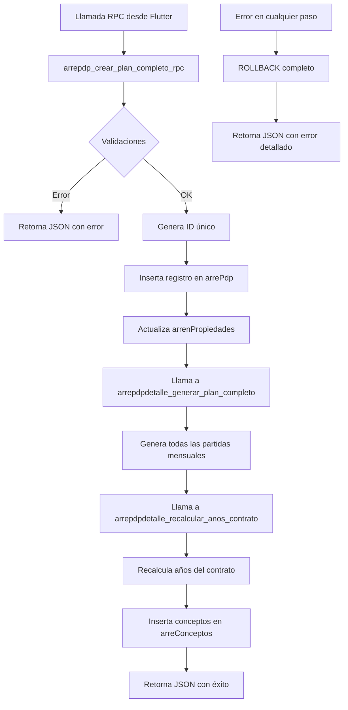

# Documentación de Funciones y Triggers - arrePdp

## 📋 Overview

Este módulo contiene todas las funciones y triggers asociados a la tabla `arrePdp`, que gestiona los planes de pago de arrendamiento principales. Los componentes están diseñados para automatizar la creación completa de planes de pagos, manteniendo la integridad de datos y facilitando operaciones complejas desde el frontend.

## 📁 Estructura de Componentes

### Funciones (5)
1. `arrepdp_crear_plan_completo_rpc.sql` - Función RPC principal para crear planes completos
2. `arrepdp_crear_plan_simple_rpc.sql` - Función RPC simplificada con validación de superposición de períodos
3. `arrepdp_generar_detalle_desde_plan.sql` - Función para generar detalles de plan desde un plan existente
4. `arrepdp_agregar_concepto_financiado.sql` - Función para agregar conceptos financiados a planes existentes (documentada)
5. `arrepdp_eliminar_plan_y_actualizar_estados.sql` - Función para eliminar un plan y actualizar estados de propiedad y nave

### Scripts de Prueba (2)
1. `test_arrepdp_crear_plan_completo_rpc.sql` - Script de prueba para validar la función RPC
2. `test_arrepdp_eliminar_plan_y_actualizar_estados.sql` - Script de prueba para validar la función de eliminación

### Triggers (0)
- No hay triggers asociados directamente a esta tabla

## 🔄 Flujo de Procesamiento



## 📊 Comportamiento Detallado por Componente

### 1. Sistema de Creación de Planes RPC

#### `arrepdp_crear_plan_completo_rpc()`
- **Propósito**: Función RPC que encapsula todo el proceso de creación de planes de pagos
- **Características**:
  - Reemplaza completamente el código Flutter de ~300 líneas
  - Manejo transaccional completo (todo o nada)
  - Generación automática de IDs únicos
  - Validación completa de parámetros
  - Verificación de que la propiedad no tenga PDP previo
- **Parámetros**: 16 parámetros incluyendo todos los datos del contrato
- **Retorno**: JSON completo con estadísticas de toda la operación
- **Activación**: Llamada RPC desde el frontend

**Proceso Interno:**
1. **Validaciones**: Verifica todos los parámetros obligatorios
2. **Verificación**: Confirma que la propiedad no tenga ya un PDP activo
3. **Generación**: Crea ID único para el plan
4. **Cálculo**: Calcula rtaBase automáticamente
5. **Inserción principal**: Inserta registro en `arrePdp`
6. **Actualización**: Marca la propiedad con `tienePdp = true`
7. **Generación de partidas**: Llama a función de generación de plan completo
8. **Recálculo**: Ajusta los años del contrato
9. **Conceptos**: Inserta automáticamente los conceptos en `arreConceptos`
10. **Confirmación**: Commit transaccional completo

## 🔧 Instrucciones de Instalación

1. **Instalar funciones en orden específico**:
   ```sql
   -- Primero instalar las funciones dependientes
   \i ../arrePdpDetalle/funciones y trigger/arrepdpdetalle_generar_plan_completo.sql
   \i ../arrePdpDetalle/funciones y trigger/arrepdpdetalle_recalcular_anos_contrato.sql
   
   -- Luego las funciones principales
   \i arrepdp_crear_plan_completo_rpc.sql
   \i arrepdp_crear_plan_simple_rpc.sql
   \i arrepdp_generar_detalle_desde_plan.sql
   \i arrepdp_agregar_concepto_financiado.sql
   \i arrepdp_eliminar_plan_y_actualizar_estados.sql
   
   -- Opcional: Ejecutar scripts de prueba
   \i test_arrepdp_crear_plan_completo_rpc.sql
   \i test_arrepdp_eliminar_plan_y_actualizar_estados.sql
   ```

2. **Verificar instalación**:
   ```sql
   SELECT routine_name FROM information_schema.routines 
   WHERE routine_name LIKE '%arrepdp%' AND routine_schema = 'public';
   ```

## 📈 Estado Actual de Componentes

- **Total funciones**: 5
- **Total scripts de prueba**: 2
- **Total scripts de mantenimiento**: 1
- **Total triggers**: 0
- **Total vistas**: 0
- **Estado documentación**: Completa ✅
- **Estado implementación**: Lista para instalación ✅
- **Estado pruebas**: Completadas ✅
- **Última actualización**: 27/11/2025 18:06:00

## 🚀 Casos de Uso Recomendados

### Escenario 1: Nuevo Contrato Simple (con validación de superposición)
```sql
-- Crear plan simple con validación automática de períodos
SELECT * FROM arrepdp_crear_plan_simple_rpc(
    'UUID_USUARIO', 'ID_ARRENDADOR', 'ID_NAVE_ARRENDADA',
    '2024-01-01'::date, 24, 50000.0, 150.0, 100.0
);

-- Respuesta esperada:
-- {
--   "exito": true,
--   "codigo": "EXITO",
--   "mensaje": "Plan de pagos creado correctamente (versión simplificada)",
--   "detalles": {
--     "id_plan": "PDP_241201010530_abc12345",
--     "id_nav_arrend": "ID_NAVE_ARRENDADA",
--     "plazo_meses": 24,
--     "fecha_inicio": "2024-01-01",
--     "rta_base": 15000.0,
--     "propiedad_actualizada": true,
--     "timestamp": "2024-12-01T01:05:30.123Z"
--   }
-- }
```

### Escenario 2: Manejo de Superposición de Períodos
```sql
-- Intentar crear plan que se superpone con existente
SELECT * FROM arrepdp_crear_plan_simple_rpc(
    'UUID_USUARIO', 'ID_ARRENDADOR', 'ID_NAVE_CON_PLAN_EXISTENTE',
    '2024-06-01'::date, 12, 30000.0, 120.0, 80.0
);

-- Respuesta esperada si hay superposición:
-- {
--   "exito": false,
--   "codigo": "SUPERPOSICION_PERIODOS",
--   "mensaje": "El período del plan se superpone con un plan existente para esta propiedad",
--   "detalles": {
--     "id_nav_arrend": "ID_NAVE_CON_PLAN_EXISTENTE",
--     "fecha_inicio_propuesto": "2024-06-01",
--     "fecha_fin_propuesto": "2025-05-31",
--     "plazo_meses": 12
--   }
-- }
```

### Escenario 3: Nuevo Contrato Completo (Método RPC Recomendado)
```sql
-- Crear plan completo desde Flutter
SELECT * FROM arrepdp_crear_plan_completo_rpc(
    'UUID_USUARIO', 'ID_ARRENDADOR', 'ID_NAVE_ARRENDADA',
    '2024-01-01'::date, 24, 50000.0, 150.0, 100.0,
    110.5, 2.0, 25.0, 15.0, 10.0,
    0, 1, 2, 0
);

-- Respuesta esperada:
-- {
--   "exito": true,
--   "codigo": "EXITO",
--   "mensaje": "Plan de pagos creado correctamente",
--   "detalles": {
--     "id_plan": "PDP_241201010530_abc12345",
--     "id_nav_arrend": "ID_NAVE_ARRENDADA",
--     "plazo_meses": 24,
--     "fecha_inicio": "2024-01-01",
--     "rta_base": 15000.0,
--     "propiedad_actualizada": true,
--     "conceptos_insertados": 4,
--     "resultado_plan": {...},
--     "resultado_anios": {...},
--     "timestamp": "2024-12-01T01:05:30.123Z"
--   }
-- }
```

### Escenario 2: Manejo de Errores
```sql
-- Intentar crear plan en propiedad con PDP existente
SELECT * FROM arrepdp_crear_plan_completo_rpc(
    'UUID_USUARIO', 'ID_ARRENDADOR', 'ID_NAVE_CON_PDP',
    '2024-01-01'::date, 24, 50000.0, 150.0, 100.0,
    110.5, 2.0, 25.0, 15.0, 10.0,
    0, 1, 2, 0
);

-- Respuesta esperada:
-- {
--   "exito": false,
--   "codigo": "PROPIEDAD_CON_PDP",
--   "mensaje": "La propiedad ya tiene un plan de pagos activo",
--   "detalles": {
--     "id_nav_arrend": "ID_NAVE_CON_PDP"
--   }
-- }
```

### Escenario 4: Generar Detalle desde Plan Existente
```sql
-- Generar detalle del plan desde un plan existente en arrePdp
SELECT * FROM arrepdp_generar_detalle_desde_plan('PDP_241201010530_abc12345');

-- Respuesta esperada:
-- {
--   "exito": true,
--   "codigo": "EXITO",
--   "mensaje": "Detalle del plan generado correctamente",
--   "detalles": {
--     "id_plan": "PDP_241201010530_abc12345",
--     "plazo_meses": 24,
--     "deposito_insertado": true,
--     "partidas_totales": 97,
--     "conceptos_por_mes": 4,
--     "fecha_inicio": "2024-01-01",
--     "datos_plan": {
--       "id_arrendador": "ID_ARRENDADOR",
--       "precio_m2": 150.0,
--       "construccion_m2": 100.0,
--       "pm2_admin": 25.0,
--       "pm2_mtto": 15.0,
--       "pm2_vig": 10.0,
--       "inpc": 110.5,
--       "inpc_plus": 2.0
--     },
--     "timestamp": "2024-12-01T01:05:30.123Z"
--   }
-- }
```

### Escenario 5: Eliminar Plan de Pagos y Actualizar Estados
```sql
-- Eliminar un plan de pagos y actualizar estados de propiedad y nave
SELECT * FROM arrepdp_eliminar_plan_y_actualizar_estados('PDP_241201010530_abc12345', 'UUID_USUARIO');

-- Respuesta esperada:
-- {
--   "exito": true,
--   "codigo": "EXITO",
--   "mensaje": "Plan de pagos eliminado correctamente",
--   "detalles": {
--     "id_plan": "PDP_241201010530_abc12345",
--     "id_nave_arrend": "ID_NAVE_ARRENDADA",
--     "plan_eliminado": true,
--     "propiedad_actualizada": true,
--     "nave_actualizada": true,
--     "propiedad_encontrada": true,
--     "nave_encontrada": true,
--     "timestamp": "2024-12-01T01:05:30.123Z"
--   }
-- }
```

### Escenario 6: Agregar Concepto Financiado a Plan Existente
```sql
-- Agregar concepto financiado dividiendo el monto entre el período
SELECT * FROM arrepdp_agregar_concepto_financiado(
    'PDP_241201010530_abc12345', 'Cuota Extra', 12000.0, 3, 6, true
);

-- Respuesta esperada:
-- {
--   "exito": true,
--   "codigo": "EXITO",
--   "mensaje": "Concepto financiado agregado correctamente",
--   "detalles": {
--     "id_plan": "PDP_241201010530_abc12345",
--     "concepto": "Cuota Extra",
--     "monto_financiar": 12000.0,
--     "mes_inicio": 3,
--     "periodo": 6,
--     "dividir": true,
--     "monto_mensual_calculado": 2000.0,
--     "partidas_insertadas": 6,
--     "resumen_montos": {
--       "monto_total_financiado": 12000.0,
--       "monto_total_aplicado": 12000.0,
--       "diferencia": 0.0,
--       "monto_por_partida": 2000.0
--     },
--     "timestamp": "2024-12-01T01:05:30.123Z"
--   }
-- }
```

### Escenario 7: Manejo de Concepto Duplicado
```sql
-- Intentar agregar el mismo concepto que ya existe en el mismo mes
SELECT * FROM arrepdp_agregar_concepto_financiado(
    'PDP_241201010530_abc12345', 'Cuota Extra', 5000.0, 3, 4, true
);

-- Respuesta esperada si el concepto "Cuota Extra" ya existe en el mes 3:
-- {
--   "exito": false,
--   "codigo": "CONCEPTO_DUPLICADO",
--   "mensaje": "El concepto especificado ya existe en este mes para este plan. No se permiten conceptos duplicados.",
--   "detalles": {
--     "id_plan": "PDP_241201010530_abc12345",
--     "mes": 3,
--     "concepto": "Cuota Extra",
--     "veces_existente": 1
--   }
-- }
```

### Escenario 8: Múltiples Conceptos Diferentes en el Mismo Mes
```sql
-- Agregar primer concepto en marzo
SELECT * FROM arrepdp_agregar_concepto_financiado(
    'PDP_241201010530_abc12345', 'adecuaciones', 43560.0, 3, 1, false
);

-- Agregar segundo concepto diferente en el mismo marzo
SELECT * FROM arrepdp_agregar_concepto_financiado(
    'PDP_241201010530_abc12345', 'ampliacion', 42458.0, 3, 1, false
);

-- Ambas operaciones deberían ser exitosas ya que son conceptos diferentes
```

## ⚠️ Notas Importantes

1. **Transaccionalidad**: La función usa transacciones completas para garantizar consistencia
2. **Dependencias**: Requiere que las funciones de `arrePdpDetalle` estén instaladas previamente
3. **Seguridad**: Usa SECURITY INVOKER por defecto
4. **Rendimiento**: Optimizada para planes de hasta 120 meses (10 años)
5. **IDs únicos**: Genera IDs automáticamente usando timestamp y hash

## 🔗 Relaciones con Otros Módulos

- **Tabla principal**: `public."arrePdp"`
- **Tablas relacionadas**: 
  - `public."arrenPropiedades"` (actualización de estado)
  - `public."arrePdpDetalle"` (generación de partidas)
  - `public."arreConceptos"` (inserción de conceptos)
- **Funciones dependientes**: 
  - `public.arrepdpdetalle_generar_plan_completo()`
  - `public.arrepdpdetalle_recalcular_anos_contrato()`

## 📝 Historial de Cambios

- **27/11/2025 18:06:00**: Documentación completa de `arrepdp_agregar_concepto_financiado()` - Función para agregar conceptos financiados a planes existentes
- **19/11/2025 11:05**: Creación de `arrepdp_eliminar_plan_y_actualizar_estados()` - Función para eliminar planes y actualizar estados
- **27/10/2025 18:15**: Actualización de `arrepdp_crear_plan_simple_rpc()` - Agregada validación de superposición de períodos
- **27/10/2025 01:51**: Creación de la función RPC simple - `arrepdp_crear_plan_simple_rpc()`
- **27/10/2025**: Creación de la función RPC principal - `arrepdp_crear_plan_completo_rpc()`
- **25/09/2025**: Fecha de referencia de las funciones originales de arrePdpDetalle

## 🔄 Impacto en el Sistema

### Antes (Código Flutter)
- ~300 líneas de código en el frontend
- Múltiples llamadas a la base de datos
- Manejo manual de errores y consistencia
- Riesgo de datos inconsistentes

### Después (Función RPC)
- 1 llamada a la base de datos
- Manejo transaccional automático
- Validaciones centralizadas
- Consistencia garantizada
- **NUEVO**: Validación automática de superposición de períodos
- Reducción significativa de código frontend

---

## 📋 Nueva Función Disponible

### `arrepdp_generar_detalle_desde_plan()`

**Propósito**: Genera automáticamente el detalle de un plan de pagos (`arrePdpDetalle`) a partir de los datos de un plan existente en `arrePdp`.

**Características**:
- **Lectura automática**: Lee todos los datos necesarios desde la tabla `arrePdp`
- **Generación completa**: Crea depósito y todas las partidas mensuales con 4 conceptos
- **Validaciones robustas**: Verifica existencia del plan y que no tenga detalles previos
- **Manejo transaccional**: Operación atómica con rollback automático en errores
- **IDs únicos**: Genera identificadores únicos para cada partida usando el ID del plan

**Parámetros**:
- `p_id_arre_pdp` (text): ID del plan de pago principal existente

**Retorno**: JSON completo con estadísticas de la operación y datos del plan procesado

**Casos de uso típicos**:
- Regenerar detalles de un plan existente
- Crear detalles para planes que fueron creados manualmente
- Procesamiento por lotes de planes sin detalles

**Relaciones**:
- Lee desde: `public."arrePdp"`
- Escribe en: `public."arrePdpDetalle"`

**Ventajas sobre funciones existentes**:
- No requiere parámetros adicionales (todo se lee del plan)
- Reutiliza lógica existente de forma optimizada
- Ideal para procesos automáticos y por lotes

---

---

## 📋 Función de Eliminación Disponible

### `arrepdp_eliminar_plan_y_actualizar_estados()`

**Propósito**: Elimina un plan de pagos (`arrePdp`) y actualiza el estado de la propiedad y la nave asociada.

**Características**:
- **Eliminación completa**: Elimina el plan principal y todos sus detalles en cascada
- **Actualización automática**: Marca `tienePdp = false` en `arrenPropiedades` y `Arrendada = false` en `naves`
- **Validaciones robustas**: Verifica existencia del plan y permisos del usuario
- **Manejo transaccional**: Operación atómica con rollback automático en errores
- **Seguridad**: Usa SECURITY INVOKER y validaciones completas

**Parámetros**:
- `p_id_arre_pdp` (text): ID del plan de pago a eliminar
- `p_uid` (text): UID del usuario que realiza la eliminación

**Retorno**: JSON completo con estadísticas de la operación y estados actualizados

**Casos de uso típicos**:
- Cancelación de contratos de arrendamiento
- Eliminación de planes erróneos o duplicados
- Liberación de propiedades para nuevos contratos

**Relaciones**:
- Elimina de: `public."arrePdp"` (con cascada a `arrePdpDetalle` y `arreConceptos`)
- Actualiza: `public."arrenPropiedades"` y `public."naves"`

**Ventajas sobre eliminación manual**:
- Garantiza consistencia de datos entre tablas relacionadas
- Manejo transaccional completo
- Validaciones de seguridad
- Registro detallado de la operación

---

## 📋 Función de Conceptos Financiados Disponible

### `arrepdp_agregar_concepto_financiado()`

**Propósito**: Agrega conceptos financiados a planes de pagos existentes con flexibilidad en la forma de aplicar los montos.

**Características**:
- **Flexibilidad**: Permite agregar conceptos con montos personalizados a planes existentes
- **Opción de división**: Puede dividir el monto entre el período o aplicarlo completo cada mes
- **Validación automática**: Verifica existencia y validez del plan
- **Manejo de errores robusto**: Validación completa en cada paso
- **IDs únicos**: Genera identificadores únicos para cada partida
- **Seguridad**: Usa SECURITY INVOKER y validaciones completas

**Parámetros**:
- `p_id_arre_pdp` (text): ID del plan de pagos existente
- `p_concepto` (text): Nombre/descripción del concepto a agregar
- `p_monto_financiar` (double precision): Monto total a financiar
- `p_mes_inicio` (integer): Mes de inicio (1-12)
- `p_periodo` (integer): Número de meses que durará el financiamiento
- `p_dividir` (boolean): true = divide el monto entre el período, false = aplica el monto completo cada mes

**Retorno**: JSON completo con estadísticas de la operación y detalles del concepto agregado

**Casos de uso típicos**:
- **Cuotas extras**: Agregar cargos adicionales por mantenimiento o mejoras
- **Seguros**: Incorporar primas de seguros mensuales o anuales
- **Servicios adicionales**: Agregar servicios no contemplados en el contrato original
- **Ajustes contractuales**: Modificar montos por acuerdos especiales
- **Cargos únicos**: Aplicar cargos especiales en meses específicos

**Relaciones**:
- Lee desde: `public."arrePdp"` (datos del plan)
- Escribe en: `public."arrePdpDetalle"` (partidas del concepto)

**Ventajas sobre métodos manuales**:
- Automatización completa del proceso de inserción
- Validaciones robustas para evitar errores
- Generación automática de IDs únicos
- Manejo transaccional implícito
- Flexibilidad en la aplicación de montos

---

**Estas funciones RPC representan una optimización completa del proceso de gestión de planes de pagos, mejorando el rendimiento, la consistencia de datos y la mantenibilidad del sistema. Incluyen capacidades completas de creación, generación de detalles, agregación de conceptos financiados y eliminación segura con actualización automática de estados, con la ventaja adicional de prevenir conflictos de períodos automáticamente.**