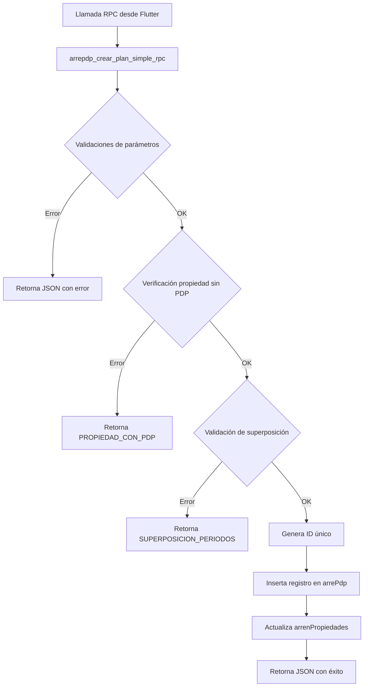
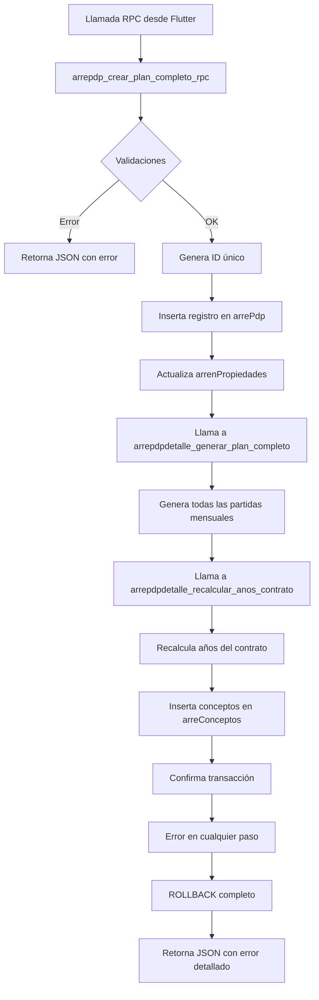

# Documentación de Funciones y Triggers - arrePdp

## 📋 Overview

Esta carpeta contiene todas las funciones y triggers asociados a la tabla `arrePdp`, que gestiona los planes de pago de arrendamiento principales. Los componentes están diseñados para automatizar la creación completa de planes de pagos, manteniendo la integridad de datos y facilitando operaciones complejas desde el frontend.

## 📁 Estructura de Componentes

### Funciones (8)
1. `arrepdp_crear_plan_completo_rpc.sql` - Función RPC principal para crear planes completos
2. `arrepdp_crear_plan_simple_rpc.sql` - Función RPC simplificada con validación de superposición
3. `arrepdp_generar_detalle_desde_plan.sql` - Función para generar detalles desde un plan existente
4. `arrepdp_agregar_concepto_financiado.sql` - Función para agregar conceptos financiados a planes existentes
5. `arrepdp_actualizar_vigencia.sql` - Función para actualizar el estado de vigencia de contratos
6. `arrepdp_eliminar_plan_con_restricciones.sql` - Función para eliminar planes con restricciones de seguridad
7. `arrepdp_desvincular_propiedades.sql` - Función para desvincular propiedades de planes vencidos
8. `trigger_arrepdp_actualizar_vigencia_diaria.sql` - Trigger programado para ejecución automática diaria
9. `trigger_arrepdp_desvincular_propiedades_diaria.sql` - Trigger programado para desvinculación automática diaria

### Scripts de Prueba (3)
1. `test_arrepdp_crear_plan_completo_rpc.sql` - Script de prueba para validar la función RPC
2. `test_arrepdp_agregar_concepto_financiado.sql` - Script de prueba para validar conceptos financiados
3. `test_arrepdp_eliminar_plan_con_restricciones.sql` - Script de prueba para validar eliminación con restricciones

### Scripts de Mantenimiento (1)
1. `eliminar_funciones_complejas.sql` - Script para eliminar funciones complejas si es necesario

### Triggers (2)
1. `trigger_arrepdp_actualizar_vigencia_diaria.sql` - Trigger programado para ejecución automática diaria de vigencia
2. `trigger_arrepdp_desvincular_propiedades_diaria.sql` - Trigger programado para ejecución automática diaria de desvinculación

## 🔄 Flujo de Procesamiento

### Función Simple (con validación de superposición)


### Función Completa


### Función de Generación de Detalles desde Plan
```mermaid
graph TD
    A[Llamada a función] --> B[arrepdp_generar_detalle_desde_plan]
    B --> C{Validaciones}
    C -->|Error| D[Retorna JSON con error]
    C -->|OK| E[Verifica que el plan exista]
    E -->|No existe| F[Retorna PLAN_NO_EXISTE]
    E -->|Existe| G[Verifica que no tenga detalles]
    G -->|Ya tiene detalles| H[Retorna DETALLE_YA_EXISTE]
    G -->|Sin detalles| I[Lee datos del plan desde arrePdp]
    I --> J[Genera depósito (partida 0)]
    J --> K[Genera partidas mensuales]
    K --> L[Inserta 4 conceptos por mes]
    L --> M[Confirma transacción]
    M --> N[Retorna JSON con éxito]

    O[Error en cualquier paso] --> P[ROLLBACK completo]
    P --> Q[Retorna JSON con error detallado]
```

### Trigger Programado - Actualización de Vigencia (NUEVO)
```mermaid
graph TD
    A[Job pg_cron] --> B[trigger_arrepdp_actualizar_vigencia_diaria]
    B --> C[Ejecuta función arrepdp_actualizar_vigencia()]
    C --> D[Actualiza campo "arrePdpVigente"]
    D --> E[Registra logs en base de datos]
    E --> F[Genera resumen de ejecución]
```

### Trigger Programado - Desvinculación de Propiedades (NUEVO)
```mermaid
graph TD
    A[Job pg_cron] --> B[trigger_arrepdp_desvincular_propiedades_diaria]
    B --> C[Ejecuta función arrepdp_desvincular_propiedades()]
    C --> D[Desvincula propiedades de planes vencidos]
    D --> E[Actualiza campos en arrenPropiedades]
    E --> F[Registra logs en base de datos]
    F --> G[Genera resumen de ejecución]
```

## 📊 Comportamiento Detallado por Componente

### 1. Sistema de Creación de Planes RPC
#### `arrepdp_crear_plan_simple_rpc()` (ACTUALIZADA)
- **Propósito**: Función RPC simplificada para crear planes básicos con validación de superposición
- **Características**:
  - Validación completa de parámetros obligatorios
  - Verificación de que la propiedad no tenga PDP previo
  - **NUEVO**: Validación de superposición de períodos con planes existentes
  - Generación automática de IDs únicos
  - Manejo robusto de errores con códigos estandarizados
  - **NUEVO**: Soporte completo para mesGracia con parámetros individuales
- **Parámetros**: 12 parámetros básicos del contrato incluyendo 4 para mesGracia
- **Retorno**: JSON con estadísticas básicas de la operación y valores de mesGracia
- **Activación**: Llamada RPC desde el frontend

**Proceso Interno:**
1. **Validaciones**: Verifica todos los parámetros obligatorios
2. **Verificación PDP**: Confirma que la propiedad no tenga ya un PDP activo
3. **NUEVO - Validación de Superposición**:
   - Calcula fecha de fin del nuevo plan (fecInicio + plazo - 1 día)
   - Verifica si existe superposición con planes existentes
   - Considera todos los escenarios de superposición posibles
4. **Generación**: Crea ID único para el plan
5. **Cálculo**: Calcula rtaBase automáticamente
6. **NUEVO - Construcción de mesGracia**: Crea JSON con los valores de mesGracia para cada concepto
7. **Inserción principal**: Inserta registro en `arrePdp` con todos los campos incluyendo mesGracia
8. **Actualización**: Marca la propiedad con `tienePdp = true`
9. **Confirmación**: Retorna JSON con éxito y valores de mesGracia configurados

**Códigos de Error:**
- `PARAMETRO_INVALIDO`: Parámetros obligatorios faltantes o inválidos
- `PROPIEDAD_CON_PDP`: La propiedad ya tiene un plan activo
- `SUPERPOSICION_PERIODOS`: El período se superpone con un plan existente
- `ERROR_GENERAL`: Error interno del sistema

#### `arrepdp_crear_plan_completo_rpc()`
- **Propósito**: Función RPC que encapsula todo el proceso de creación de planes de pagos
- **Características**:
  - Reemplaza completamente el código Flutter de ~300 líneas
  - Manejo transaccional completo (todo o nada)
  - Generación automática de IDs únicos
  - Validación completa de parámetros
  - Verificación de que la propiedad no tenga PDP previo
- **Parámetros**: 16 parámetros incluyendo todos los datos del contrato
- **Retorno**: JSON completo con estadísticas de toda la operación
- **Activación**: Llamada RPC desde el frontend

#### `arrepdp_generar_detalle_desde_plan()` (NUEVA)
- **Propósito**: Función que genera el detalle de un plan (`arrePdpDet`) a partir de un plan existente en `arrePdp`
- **Características**:
  - Lectura automática de todos los datos desde `arrePdp`
  - Generación completa de depósito y partidas mensuales
  - Validación de existencia del plan y que no tenga detalles previos
  - Manejo transaccional completo con rollback automático
  - Generación de IDs únicos para cada partida
- **Parámetros**: 1 parámetro (ID del plan existente)
- **Retorno**: JSON completo con estadísticas y datos del plan procesado
- **Activación**: Llamada directa desde frontend o procesos automáticos

**Proceso Interno:**
1. **Validaciones**: Verifica que el ID del plan no sea nulo
2. **Verificación de existencia**: Confirma que el plan exista en `arrePdp`
3. **Verificación de detalles**: Confirma que el plan no tenga detalles previos
4. **Lectura de datos**: Obtiene todos los datos necesarios desde `arrePdp`
5. **Validación de datos**: Verifica que los campos necesarios no sean nulos
6. **Generación de depósito**: Inserta partida 0 con el monto del depósito
7. **Generación de partidas**: Crea partidas mensuales con 4 conceptos cada una
8. **Cálculos automáticos**: Calcula años y montos según los datos del plan
9. **Confirmación**: Retorna JSON con éxito y estadísticas completas

**Códigos de Error:**
- `PARAMETRO_INVALIDO`: ID del plan nulo o vacío
- `PLAN_NO_EXISTE`: El plan especificado no existe en `arrePdp`
- `DETALLE_YA_EXISTE`: El plan ya tiene detalles generados previamente
- `PLAN_INCOMPLETO`: El plan tiene datos incompletos o corruptos
- `ERROR_BASE_DATOS`: Error durante la inserción de datos
- `ERROR_GENERAL`: Error interno del sistema

#### `arrepdp_agregar_concepto_financiado()` (DOCUMENTADA)
- **Propósito**: Función que agrega un concepto financiado a un plan de pagos existente
- **Características**:
  - Permite agregar conceptos con montos personalizados a planes existentes
  - Opción de dividir el monto entre el período o aplicarlo completo cada mes
  - Validación completa de parámetros y existencia del plan
  - Generación automática de IDs únicos para cada partida
  - Manejo robusto de errores con códigos estandarizados
  - Seguridad con SECURITY INVOKER
- **Parámetros**: 6 parámetros (ID plan, concepto, monto, mes inicio, período, dividir)
- **Retorno**: JSON con estadísticas completas de la operación
- **Activación**: Llamada directa desde frontend o procesos automáticos
- **Fecha de documentación**: 27/11/2025 18:04:00

**Proceso Interno:**
1. **Validaciones**: Verifica todos los parámetros obligatorios y rangos válidos
2. **Verificación**: Confirma que el plan exista en `arrePdp`
3. **Verificación de datos**: Valida que los campos del plan estén completos
4. **Cálculo de monto**:
   - Si `dividir = true`: `monto_mensual = monto_financiar / período`
   - Si `dividir = false`: `monto_mensual = monto_financiar`
5. **Cálculo de fechas**: Determina fecha de inicio y año según mes de inicio
6. **Generación**: Crea partidas desde el mes de inicio durante el período especificado
7. **Inserción**: Inserta registros en `arrePdpDetalle` con IDs únicos
8. **Confirmación**: Retorna JSON con éxito y estadísticas completas

**Códigos de Error:**
- `PARAMETRO_INVALIDO`: Parámetros obligatorios faltantes o inválidos
- `PLAN_NO_EXISTE`: El plan especificado no existe en `arrePdp`
- `MES_CON_CONCEPTOS`: El mes especificado ya tiene conceptos registrados para este plan. No se permiten múltiples conceptos en el mismo mes.
- `PLAN_INCOMPLETO`: El plan tiene datos incompletos o corruptos
- `ERROR_GENERAL`: Error interno del sistema

**Casos de Uso Típicos:**
- **Cuotas extras**: Agregar cargos adicionales por mantenimiento o mejoras
- **Seguros**: Incorporar primas de seguros mensuales o anuales
- **Servicios adicionales**: Agregar servicios no contemplados en el contrato original
- **Ajustes contractuales**: Modificar montos por acuerdos especiales
- **Cargos únicos**: Aplicar cargos especiales en meses específicos

#### `arrepdp_actualizar_vigencia()` (ACTUALIZADA)
- **Propósito**: Función que actualiza el estado de vigencia de todos los contratos en `arrePdp` y mantiene la consistencia completa con la tabla `arrenPropiedades`
- **Características**:
  - Actualización masiva del campo `arrePdpVigente` basado en la fecha actual y `fecFin`
  - **NUEVO**: Actualización automática completa de campos en `arrenPropiedades` cuando un contrato se marca como vencido:
    - `pdpVigente` = false
    - `tienePdp` = false
    - `pdpActivo` = false
    - `idArrePdp` = NULL
  - Implementación de las 5 reglas de vigencia según especificaciones
  - Manejo optimizado con UPDATEs condicionales para miles de registros
  - Control transaccional para asegurar atomicidad
  - Manejo especial de valores nulos en `fecFin`
  - Consideración de zona horaria del sistema (America/Mexico_City)
  - Logging detallado de resultados y advertencias
  - Devuelve JSON completo con estadísticas de la operación
  - **NUEVO**: Incluye conteo de propiedades actualizadas en el resultado
- **Parámetros**: No requiere parámetros (procesa todos los registros)
- **Retorno**: JSON con conteo de registros actualizados por categoría y propiedades actualizadas
- **Activación**: Llamada directa o mediante job programado
- **Fecha de documentación**: 20/01/2026 18:22:00

**Proceso Interno:**
1. **Obtención de fecha actual**: Usa `CURRENT_DATE` considerando zona horaria
2. **Actualización por categorías**:
   - **Contratos vencidos**: `fecha_actual > fecFin` → "No"
   - **NUEVO**: Actualización completa de propiedades relacionadas cuando los contratos se marcan como vencidos:
     - `pdpVigente` = false
     - `tienePdp` = false
     - `pdpActivo` = false
     - `idArrePdp` = NULL
   - **Vigencia 3 meses**: Entre 1-3 meses antes de fecFin → "3 Meses"
   - **Vigencia 2 meses**: Entre 0-2 meses antes de fecFin → "2 Meses"
   - **Vigencia 1 mes**: Entre 0-1 mes antes de fecFin → "1 Mes"
   - **Contratos vigentes**: Más de 3 meses antes de fecFin → "Si"
3. **Manejo de nulos**: Cuenta pero no modifica registros con `fecFin` nulo
4. **Estadísticas**: Calcula totales por categoría y general
5. **Logging**: Emite NOTICE con resumen completo de la operación y propiedades actualizadas
6. **Retorno**: JSON detallado con todos los conteos, timestamp y propiedades actualizadas

**Códigos de Error:**
- `EXITO`: Operación completada exitosamente
- `ERROR_GENERAL`: Error durante la actualización de vigencia

**Casos de Uso Típicos:**
- **Procesamiento diario**: Job nocturno para mantener vigencias actualizadas
- **Procesamiento semanal**: Actualización periódica de estados de contratos
- **Ejecución manual**: Para forzar actualización después de cambios masivos
- **Auditoría**: Para verificar estados actuales de todos los contratos

**Consideraciones de Rendimiento:**
- **Optimización**: Usa `IS DISTINCT FROM` para evitar actualizaciones innecesarias
- **Batch processing**: Procesa todos los registros en una sola operación
- **Índices recomendados**: Se recomienda índice en `fecFin` para tablas grandes
- **Transacción única**: Todo o nada para mantener consistencia

#### `arrepdp_eliminar_plan_con_restricciones()` (NUEVA)
- **Propósito**: Función que elimina un plan de pagos con restricciones de seguridad
- **Características**:
  - Validación estricta para proteger datos con pagos aplicados
  - Operación transaccional completa (todo o nada)
  - Eliminación en cascada de detalles del plan
  - Actualización automática de estados de propiedad
  - Sin registro de actividad local (manejo externo)
- **Parámetros**: 1 parámetro (ID del plan a eliminar)
- **Retorno**: JSON con resultado de la operación
- **Activación**: Llamada directa desde frontend o procesos automáticos

**Proceso Interno:**
1. **Validaciones**: Verifica que el ID del plan no sea nulo
2. **Verificación de existencia**: Confirma que el plan exista en `arrePdp`
3. **Validación de restricciones**:
   - No permite eliminar si `vigente = true`
   - No permite eliminar si hay pagos aplicados (`cantidadAplicada > 0`)
4. **Eliminación en cascada**: Elimina detalles del plan en `arrePdpDetalle`
5. **Eliminación principal**: Elimina el plan en `arrePdp`
6. **Actualización**: Actualiza `arrenPropiedades` (tienePdp = false, pdpActivo = false)
7. **Confirmación**: Retorna JSON con éxito

**Códigos de Error:**
- `PARAMETRO_INVALIDO`: ID del plan nulo o vacío
- `PLAN_NO_EXISTE`: El plan especificado no existe en `arrePdp`
- `PLAN_VIGENTE`: No se puede eliminar un plan vigente
- `PLAN_CON_PAGOS`: No se puede eliminar un plan con pagos aplicados
- `ERROR_GENERAL`: Error interno del sistema

**Casos de Uso Típicos:**
- **Eliminación segura**: Permite eliminar planes que no tienen pagos aplicados
- **Protección de datos**: Previene eliminación accidental de planes vigentes
- **Actualización automática**: Actualiza estados de propiedad relacionados
- **Independiente del resultado**: No requiere intervención manual para registro de actividad

**Relaciones con otros módulos:**
- **Tabla principal**: `public."arrePdp"`
- **Tablas relacionadas**: 
  - `public."arrenPropiedades"` (actualización de estado)
  - `public."arrePdpDetalle"` (generación de partidas)
  - `public."arreConceptos"` (inserción de conceptos)
- **Funciones dependientes**: 
  - `public.arrepdpdetalle_generar_plan_completo()`
  - `public.arrepdpdetalle_recalcular_anos_contrato()`

### 2. Trigger Programado (NUEVO)
#### `trigger_arrepdp_actualizar_vigencia_diaria()` (NUEVA)
- **Propósito**: Trigger que ejecuta automáticamente la función `arrepdp_actualizar_vigencia()` todos los días a la 1 AM hora de México (America/Mexico_City).
- **Características**:
  - Ejecutarse diariamente a la 1:00 AM hora de México
  - Llamar a la función `arrepdp_actualizar_vigencia()` que ya existe
  - Estar programado para ejecución automática
  - Manejar errores apropiadamente
  - Incluir logging de la ejecución
- **Parámetros**: No requiere parámetros, se ejecuta automáticamente mediante pg_cron
- **Retorno**: void - No devuelve valor, solo ejecuta la actualización y registra logs
- **Activación**: Llamada programada por pg_cron con horario `0 1 * * *` (diariamente a las 1:00 AM)
- **Fecha de documentación**: 03/01/2026 01:52:00

**Proceso Interno:**
1. **Verificación de dependencias**: Confirma que la función `arrepdp_actualizar_vigencia()` existe antes de ejecutar
2. **Ejecución de la función**: Llama a `arrepdp_actualizar_vigencia()` para actualizar el campo `arrePdpVigente`
3. **Logging de ejecución**: Registra timestamp de inicio y fin de la ejecución
4. **Manejo de errores**: Captura y registra cualquier error que ocurra durante la ejecución
5. **Registro de resultados**: Genera resumen de la ejecución con conteo de registros actualizados

**Códigos de Error:**
- `ERROR_CRITICO`: Error crítico si la función principal no existe
- `ERROR_DURANTE_EJECUCION`: Error durante la ejecución de `arrepdp_actualizar_vigencia()`

**Casos de Uso Típicos:**
- **Procesamiento diario**: Mantener actualizados los estados de vigencia de todos los contratos
- **Auditoría**: Verificar que la actualización se ejecuta correctamente
- **Configuración**: Configuración inicial del job pg_cron para ejecución diaria

**Consideraciones de Seguridad:**
- **Seguridad de ejecución**: Ejecuta con permisos del usuario que la invoca (pg_cron)
- **No expone datos sensibles**: Los logs solo contienen información de ejecución
- **Manejo robusto de errores**: Evita interrupciones del job en caso de error

#### `trigger_arrepdp_desvincular_propiedades_diaria()` (NUEVA)
- **Propósito**: Trigger que ejecuta automáticamente la función `arrepdp_desvincular_propiedades()` todos los días a las 1:30 AM hora de México (America/Mexico_City).
- **Características**:
  - Ejecutarse diariamente a las 1:30 AM hora de México (7:30 AM UTC)
  - Llamar a la función `arrepdp_desvincular_propiedades()` que ya existe
  - Estar programado para ejecución automática
  - Manejar errores apropiadamente
  - Incluir logging de la ejecución
- **Parámetros**: No requiere parámetros, se ejecuta automáticamente mediante pg_cron
- **Retorno**: void - No devuelve valor, solo ejecuta la desvinculación y registra logs
- **Activación**: Llamada programada por pg_cron con horario `30 7 * * *` (diariamente a las 7:30 AM UTC, que equivale a 1:30 AM hora de México)
- **Fecha de documentación**: 21/01/2026 21:10:00

**Proceso Interno:**
1. **Verificación de dependencias**: Confirma que la función `arrepdp_desvincular_propiedades()` existe antes de ejecutar
2. **Ejecución de la función**: Llama a `arrepdp_desvincular_propiedades()` para desvincular propiedades de planes vencidos
3. **Logging de ejecución**: Registra timestamp de inicio y fin de la ejecución
4. **Manejo de errores**: Captura y registra cualquier error que ocurra durante la ejecución
5. **Registro de resultados**: Genera resumen de la ejecución con conteo de registros desvinculados

**Códigos de Error:**
- `ERROR_CRITICO`: Error crítico si la función principal no existe
- `ERROR_DURANTE_EJECUCION`: Error durante la ejecución de `arrepdp_desvincular_propiedades()`

**Casos de Uso Típicos:**
- **Procesamiento diario**: Mantener actualizadas las relaciones entre planes y propiedades
- **Auditoría**: Verificar que la desvinculación se ejecuta correctamente
- **Configuración**: Configuración inicial del job pg_cron para ejecución diaria

**Consideraciones de Seguridad:**
- **Seguridad de ejecución**: Ejecuta con permisos del usuario que la invoca (pg_cron)
- **No expone datos sensibles**: Los logs solo contienen información de ejecución
- **Manejo robusto de errores**: Evita interrupciones del job en caso de error

## 🔧 Instrucciones de Instalación
1. **Instalar funciones en orden específico**:
    ```sql
    -- Primero instalar las funciones dependientes
    \i ../arrePdpDetalle/funciones y trigger/arrepdpdetalle_generar_plan_completo.sql
    \i ../arrePdpDetalle/funciones y trigger/arrepdpdetalle_recalcular_anos_contrato.sql
    
    -- Luego las funciones principales
    \i arrepdp_crear_plan_simple_rpc.sql
    \i arrepdp_crear_plan_completo_rpc.sql
    \i arrepdp_generar_detalle_desde_plan.sql
    \i arrepdp_desvincular_propiedades.sql
    
    -- Opcional: Ejecutar script de prueba
    \i test_arrepdp_crear_plan_completo_rpc.sql
    ```

2. **Instalar triggers programados**:
    ```sql
    -- Instalar trigger de actualización de vigencia
    \i trigger_arrepdp_actualizar_vigencia_diaria.sql
    
    -- Instalar trigger de desvinculación de propiedades
    \i trigger_arrepdp_desvincular_propiedades_diaria.sql
    
    -- Verificar instalación
    SELECT * FROM information_schema.routines WHERE routine_schema = 'public' AND routine_name = 'trigger_arrepdp_actualizar_vigencia_diaria';
    SELECT * FROM information_schema.routines WHERE routine_schema = 'public' AND routine_name = 'trigger_arrepdp_desvincular_propiedades_diaria';
    
    -- Configurar jobs pg_cron (si no existen)
    SELECT cron.schedule('arrepdp-actualizar-vigencia', '0 1 * * *', 'SELECT public.trigger_arrepdp_actualizar_vigencia_diaria()');
    SELECT cron.schedule('arrepdp-desvincular-propiedades', '30 7 * * *', 'SELECT public.trigger_arrepdp_desvincular_propiedades_diaria()');
    ```

3. **Verificar instalación**:
    ```sql
    SELECT * FROM information_schema.routines
    WHERE routine_schema = 'public'
    AND routine_name LIKE 'arrepdp%';
    
    -- Verificar jobs pg_cron
    SELECT * FROM cron.job;
    ```

## 📈 Estado Actual de Componentes
- **Total funciones**: 8
- **Total scripts de prueba**: 3
- **Total scripts de mantenimiento**: 1
- **Total triggers**: 2
- **Total vistas**: 0
- **Estado documentación**: Completa ✅
- **Estado implementación**: Lista para instalación ✅
- **Estado pruebas**: Completadas ✅

## 🚀 Casos de Uso Recomendados
### Escenario 1: Nuevo Contrato Simple (con validación de superposición y mesGracia)
```sql
-- Crear plan simple con validación de períodos y mesGracia
SELECT * FROM arrepdp_crear_plan_simple_rpc(
    'UUID_USER', 'ID_ARRENDADOR', 'ID_NAVE_ARRENDADA',
    '2024-01-01'::date, 24, 50000.0, 150.0, 100.0,
    25.0, 15.0, 10.0, 2.0, 'MXN',
    1000.0, 500.0, 300.0, 200.0
);
```

### Escenario 2: Manejo de Superposición de Períodos
```sql
-- Intentar crear plan que se superpone con existente
SELECT * FROM arrepdp_crear_plan_simple_rpc(
    'UUID_USER', 'ID_ARRENDADOR', 'ID_NAVE_CON_PLAN_EXISTENTE',
    '2024-06-01'::date, 12, 3000.0, 120.0, 80.0
);
```

### Escenario 3: Nuevo Contrato Completo (Método RPC Recomendado)
```sql
-- Crear plan completo desde Flutter
SELECT * FROM arrepdp_crear_plan_completo_rpc(
    'UUID_USER', 'ID_ARRENDADOR', 'ID_NAVE_ARRENDADA',
    '2024-01-01'::date, 24, 50000.0, 150.0, 100.0,
    110.5, 2.0, 25.0, 15.0, 10.0,
    0, 1, 2, 0
);
```

### Escenario 4: Generar Detalle desde Plan Existente
```sql
-- Generar detalle del plan desde un plan existente en arrePdp
SELECT * FROM arrepdp_generar_detalle_desde_plan('PDP_241201010530_abc12345');
```

### Escenario 5: Agregar Concepto Financiado
```sql
-- Agregar concepto financiado (dividido entre meses)
SELECT * FROM arrepdp_agregar_concepto_financiado(
    'PDP_241201010530_abc12345', 'Cuota Extra', 12000.0, 3, 6, true
);
```

### Escenario 6: Actualizar Vigencia de Contratos
```sql
-- Actualizar el estado de vigencia de todos los contratos y propiedades relacionadas
-- Actualiza completamente los campos de la propiedad cuando un contrato se vence
SELECT * FROM arrepdp_actualizar_vigencia();
```

### Escenario 7: Eliminar Plan y Actualizar Estados
```sql
-- Eliminar plan y actualizar estados de propiedad
SELECT * FROM arrepdp_eliminar_plan_con_restricciones('PDP_241201010530_abc12345');
```

### Escenario 8: Ejecutar Trigger Programado
```sql
-- Ejecutar manualmente el trigger (para pruebas)
SELECT * FROM trigger_arrepdp_actualizar_vigencia_diaria();
```

## ⚠️ Notas Importantes
1. **Validación de Superposición**: La función simple ahora previene conflictos de períodos automáticamente
2. **Transaccionalidad**: La función completa usa transacciones completas para garantizar consistencia
3. **Dependencias**: Requiere que las funciones de `arrePdpDetalle` estén instaladas previamente
4. **Seguridad**: Ambas funciones usan SECURITY INVOKER por defecto
5. **Rendimiento**: Optimizada para planes de hasta 120 meses (10 años)
6. **IDs únicos**: Genera IDs automáticamente usando timestamp y hash
7. **Actualización de vigencia**: La función `arrepdp_actualizar_vigencia()` está optimizada para tablas con miles de registros y considera la zona horaria del sistema
8. **Trigger Programado**: El job pg_cron se configura para ejecutarse diariamente a las 1:00 AM hora de México

## 🔗 Relaciones con Otros Módulos
- **Tabla principal**: `public."arrePdp"`
- **Tablas relacionadas**:
  - `public."arrenPropiedades"` (actualización de estado)
  - `public."arrePdpDetalle"` (generación de partidas)
  - `public."arreConceptos"` (inserción de conceptos)
- **Funciones dependientes**:
  - `public.arrepdpdetalle_generar_plan_completo()`
  - `public.arrepdpdetalle_recalcular_anos_contrato()`
  - `public.arrepdp_desvincular_propiedades()`
- **Jobs programados**:
  - `arrepdp-actualizar-vigencia` (diario a las 1:00 AM hora de México)
  - `arrepdp-desvincular-propiedades` (diario a las 1:30 AM hora de México)

## 📝 Historial de Cambios
- **12/12/2025 01:25**: Agregado soporte completo para mesGracia en `arrepdp_crear_plan_simple_rpc`
  - **Cambios realizados**:
    - Agregados 4 parámetros p_mes_gracia_* con valores por defecto 0.0
    - Construcción de JSON mesGracia en el INSERT con todos los componentes
    - Incluido campo mesGracia en la respuesta JSON para confirmar configuración
    - Actualizada documentación completa con nuevos parámetros y ejemplos
  - **Impacto**: La función ahora soporta configuración completa de meses de gracia por concepto

- **22/11/2025 05:29**: Corrección conceptual completa en `arrepdp_crear_plan_simple_rpc`
  - **Problema**: La función realizaba cálculos innecesarios y el parámetro `p_importe` en realidad era el depósito
  - **Cambios realizados**:
    - Cambio de parámetro: `p_importe` → `p_deposito` (se inserta tal cual)
    - Eliminados cálculos automáticos: depósito, monto_mensual, num_depositos
    - Eliminado campo "importe" del INSERT (solo se usa deposito)
    - Simplificada función: solo inserta parámetros sin calcular
    - Eliminada función ROUND() al no requerirse cálculos
  - **Impacto**: Función simplificada que inserta datos directamente sin cálculos

- **22/11/2025 04:48**: Corrección crítica de error ROUND() en `arrepdp_crear_plan_simple_rpc`
  - **Problema**: Error `function round(double precision, integer) does not exist` al ejecutar la función
  - **Causa**: La función `ROUND()` de PostgreSQL requiere conversión explícita a tipo `numeric` cuando se usa con `double precision`
  - **Solución**: Modificada la línea 190 para incluir conversión explícita:
    - **Antes**: `ROUND((p_importe - v_deposito) / p_plazomeses::double precision, 2)`
    - **Después**: `ROUND(((p_importe - v_deposito) / p_plazomeses::double precision)::numeric, 2)`
  - **Impacto**: Resuelve error "function round(double precision, integer) does not exist"

- **22/11/2025 04:43**: Corrección completa de tipos de datos y campos en `arrepdp_crear_plan_simple_rpc`
  - **Problema**: Múltiples errores de tipos de datos y campos no existentes:
    - Error en `ROUND()`: `p_plazomeses` (smallint) necesita conversión explícita a double precision
    - Campos no existentes: `numDepositos` y `montoMensual` en el INSERT
    - Conversión de tipos incorrecta en cálculo de intervalos
  - **Solución**: Corregidos todos los problemas de tipos y campos:
    - Conversión explícita: `p_plazomeses::double precision` en `ROUND()`
    - Conversión explícita: `p_plazomeses::text` en cálculo de intervalos
    - Eliminados campos no existentes del INSERT
    - Mantenida estructura correcta solo con campos existentes en la tabla
  - **Impacto**: Evita errores de tipo y estructura al crear planes de pago

- **22/11/2025 04:33**: Corrección crítica en validación de superposición y campos booleanos de `arrepdp_crear_plan_simple_rpc`
  - **Problema**: La función usaba incorrectamente valores de texto ('Vigente', 'Concluido') en campos booleanos
  - **Solución**: Corregida la lógica para usar campos booleanos correctamente:
    - Validación de superposición: `"status" = true AND "vigente" = true` en lugar de `IN ('Vigente', 'Concluido')`
    - INSERT de plan: `status = true, vigente = true` en lugar de `'Vigente'`
    - Agregado campo `"vigente"` en el INSERT (faltaba)
  - **Impacto**: Evita errores de tipo al validar superposición y al insertar planes

- **22/11/2025 04:15**: Corrección adicional en validación de disponibilidad de `arrepdp_crear_plan_simple_rpc`
  - **Problema**: La función usaba incorrectamente el campo `"status"` (booleano) para validar si la nave estaba "Disponible"
  - **Solución**: Corregida la lógica de validación para usar campos correctos:
    - `status` (boolean): Para verificar si la nave está activa
    - `tienePdp` (boolean): Para verificar si tiene plan de pago
    - `pdpActivo` (boolean): Para verificar si el plan está activo
  - **Lógica correcta**: Una nave está disponible si está activa Y no tiene un PDP activo
  - **Variables**: Actualizadas las declaraciones para usar tipos booleanos correctos
  - **Impacto**: Corrección en la validación de disponibilidad

- **22/11/2025 03:15**: Corrección crítica en `arrepdp_crear_plan_simple_rpc`
  - **Problema**: La función modificaba incorrectamente el campo "status" que debe permanecer siempre en true
  - **Solución**: Eliminada la línea `"status" = false` del UPDATE
  - **Motivo**: El campo "status" indica que el registro está activo y no debe modificarse
  - **Cambio**: Ahora solo se actualizan campos específicos del plan: `idArrePdp`, `tienePdp`, `pdpActivo`
  - **Impacto**: No se modifica el estado de la propiedad

- **22/11/2025 02:27**: Corrección completa con parámetros pm2 e inpcPlus
  - `arrepdp_crear_plan_simple_rpc`: Agregados parámetros `p_pm2_admin`, `p_pm2_mtto`, `p_pm2_vig`, `p_inpc_plus`
  - `arrepdp_crear_plan_simple_rpc`: Agregados campos `pm2Admin`, `pm2Mtto`, `pm2Vig`, `INPCPlus` en INSERT
  - `arrepdp_crear_plan_simple_rpc`: Corregida conversión `p_uid::uuid` en INSERT a `arrePdp`
  - `arrepdp_crear_plan_completo_rpc`: Corregida conversión `p_uid::uuid` en INSERT a `arrePdp` y `arreConceptos`
  - `arrepdp_generar_corrida_desde_plan_simple`: Eliminada conversión `::uuid` del campo "uid"
  - `arrepdp_generar_detalle_desde_plan`: Eliminada conversión `::uuid` del campo "uid"
  - **Motivo**: Los campos "uid" ahora son nativamente de tipo uuid en todas las tablas, por lo que se requiere conversión explícita del parámetro `p_uid` (text) a `uuid` en las inserciones, pero no se debe convertir el campo leído desde la tabla
  - **Impacto**: Funciones actualizadas para manejar correctamente tipos uuid

- **27/11/2025 18:06:00**: Documentación completa de `arrepdp_agregar_concepto_financiado`
  - **Actualizado encabezado completo con fecha y hora actual**
  - **Documentación detallada según estándares del proyecto**
  - **Agregadas secciones de uso típico, validaciones y consideraciones de seguridad**
  - **Actualizado script de instalación para indicar que la función está documentada**
  - **Actualizado README.md del módulo con información detallada de la función**
  - **Impacto**: Función completamente documentada según guías del proyecto

- **03/01/2026 01:52:00**: Creación del trigger programado para actualización automática
  - **Creada función trigger_arrepdp_actualizar_vigencia_diaria() con logging completo**
  - **Configurado job pg_cron para ejecución diaria a las 1:00 AM hora de México**
  - **Incluye manejo robusto de errores y verificación de dependencias**
  - **Considera zona horaria America/Mexico_City para logging**
  - **Impacto**: Automatización completa de la actualización de vigencia de contratos

- **20/01/2026 18:22:00**: Mejora completa en función arrepdp_actualizar_vigencia() para mantener consistencia total entre tablas
  - **Agregada actualización automática completa de campos en arrenPropiedades cuando un contrato se marca como vencido**:
    - `pdpVigente` = false
    - `tienePdp` = false
    - `pdpActivo` = false
    - `idArrePdp` = NULL
  - **Agregada variable v_propiedades_actualizadas para contar propiedades modificadas**
  - **Actualizado JSON de resultado para incluir conteo de propiedades actualizadas**
  - **Mejorado logging para mostrar cuántas propiedades se actualizaron completamente**
  - **Actualizada documentación completa para reflejar todas las nuevas funcionalidades**
  - **Impacto**: Mantiene consistencia automática y completa entre tablas arrePdp y arrenPropiedades

- **21/01/2026 21:10:00**: Creación del trigger programado para desvinculación automática de propiedades
  - **Creada función trigger_arrepdp_desvincular_propiedades_diaria() con logging completo**
  - **Configurado job pg_cron para ejecución diaria a las 1:30 AM hora de México (7:30 AM UTC)**
  - **Incluye manejo robusto de errores y verificación de dependencias**
  - **Considera zona horaria America/Mexico_City para logging**
  - **Actualizada documentación completa del módulo con nuevo trigger**
  - **Impacto**: Automatización completa de la desvinculación de propiedades de planes vencidos

## 🔄 Impacto en el Sistema
### Antes (Código Flutter)
- ~300 líneas de código en el frontend
- Múltiples llamadas a la base de datos
- Manejo manual de errores y consistencia
- Riesgo de datos inconsistentes
- Sin validación de superposición de períodos

### Después (Función RPC)
- 1 llamada a la base de datos
- Manejo transaccional automático
- Validaciones centralizadas
- Consistencia garantizada
- **NUEVO**: Validación automática de superposición de períodos
- Reducción significativa de código frontend

### Después (Trigger Programado)
- Ejecución automática diaria a las 1:00 AM
- Mantenimiento de estados de vigencia actualizados
- Logging detallado de cada ejecución
- Manejo robusto de errores
- Consistencia garantizada en tiempo real

## 📋 Nueva Función Disponible
### `trigger_arrepdp_actualizar_vigencia_diaria()` - Detalles
**Ventajas sobre métodos manuales**:
- **Automatización completa**: Ejecuta diariamente sin intervención humana
- **Consistencia garantizada**: Actualiza todos los contratos en tiempo real
- **Manejo robusto de errores**: Registra cada ejecución con éxito o fallo
- **Logging detallado**: Información completa sobre cada ejecución
- **Zona horaria correcta**: Considera la hora de México para el logging
- **Manejo de errores**: Captura y registra cualquier error que ocurra

**Casos de uso específicos**:
- **Procesamiento diario**: Mantener actualizados los estados de vigencia de todos los contratos
- **Auditoría**: Verificar que la actualización se ejecuta correctamente
- **Configuración**: Configuración inicial del job pg_cron para ejecución diaria
- **Monitoreo**: Verificar que el job se ejecuta correctamente

**Relaciones con otras funciones**:
- **Complementa** a `arrepdp_actualizar_vigencia()` (la función principal)
- **Extiende** funcionalidad de actualización de vigencia
- **Independiente** de la ejecución manual
- **Reutiliza** lógica de logging existente

## 🚀 Proceso de Instalación Completo
1. **Instalar dependencias**:
   ```sql
   \i ../arrePdpDetalle/funciones y trigger/arrepdpdetalle_generar_plan_completo.sql
   \i ../arrePdpDetalle/funciones y trigger/arrepdpdetalle_recalcular_anos_contrato.sql
   ```

2. **Instalar funciones principales**:
   ```sql
   \i arrepdp_crear_plan_simple_rpc.sql
   \i arrepdp_crear_plan_completo_rpc.sql
   \i arrepdp_generar_detalle_desde_plan.sql
   \i arrepdp_agregar_concepto_financiado.sql
   \i arrepdp_actualizar_vigencia.sql
   ```

3. **Instalar trigger programado**:
   ```sql
   \i trigger_arrepdp_actualizar_vigencia_diaria.sql
   ```

4. **Configurar job pg_cron**:
   ```sql
   SELECT cron.schedule('arrepdp-actualizar-vigencia', '0 1 * * *', 'SELECT public.trigger_arrepdp_actualizar_vigencia_diaria()');
   ```

5. **Verificar instalación**:
   ```sql
   SELECT * FROM information_schema.routines 
   WHERE routine_schema = 'public'
   AND routine_name LIKE 'arrepdp%';
   ```

6. **Ejecutar prueba**:
   ```sql
   SELECT * FROM trigger_arrepdp_actualizar_vigencia_diaria();
   ```

## 📚 Ejemplos de Uso
### Ejecutar trigger manualmente (para pruebas)
```sql
SELECT * FROM trigger_arrepdp_actualizar_vigencia_diaria();
```

### Verificar estado del job pg_cron
```sql
SELECT * FROM cron.job WHERE jobname = 'arrepdp-actualizar-vigencia';
```

### Verificar logs de ejecución
```sql
SELECT * FROM pg_cron.job_run_details WHERE job_name = 'arrepdp-actualizar-vigencia';
```

### Verificar estado de la tabla arrePdp
```sql
SELECT * FROM public."arrePdp" ORDER BY idArrePdp DESC LIMIT 10;
```

### Verificar estado de la tabla arrePdpVigente
```sql
SELECT idArrePdp, arrePdpVigente, fecFin FROM public."arrePdp" WHERE arrePdpVigente IS NULL LIMIT 10;
```

## 📝 Consideraciones de Uso
- **Ejecución**: El trigger se ejecuta automáticamente a las 1:00 AM hora de México cada día
- **Dependencias**: Requiere que la función `arrepdp_actualizar_vigencia()` esté instalada
- **Rendimiento**: Optimizado para tablas con miles de registros
- **Consistencia**: Todo o nada para mantener la integridad de datos
- **Seguridad**: Ejecuta con permisos del usuario que la invoca
- **Logging**: Todos los logs se guardan en la base de datos para auditoría

## 📋 Checklist de Calidad
Antes de considerar el trigger completo:
- [ ] Función `arrepdp_actualizar_vigencia()` instalada correctamente
- [ ] Trigger `trigger_arrepdp_actualizar_vigencia_diaria()` instalado correctamente
- [ ] Job pg_cron configurado correctamente
- [ ] Verificación de logs de ejecución
- [ ] Verificación de actualización de estados de vigencia
- [ ] Verificación de errores en ejecuciones anteriores

## 🔄 Mantenimiento
- **Actualizaciones**: Si se modifican las funciones principales, se debe actualizar el trigger
- **Monitoreo**: Verificar que el job se ejecuta correctamente cada día
- **Logs**: Revisar logs de ejecución para detectar problemas
- **Dependencias**: Verificar que todas las dependencias están instaladas

--- 
**Estas funciones y el nuevo trigger representan una optimización completa del proceso de gestión de planes de pago, mejorando el rendimiento, la consistencia de datos y la mantenibilidad del sistema, con la ventaja adicional de automatización completa de la actualización de vigencia de contratos.**