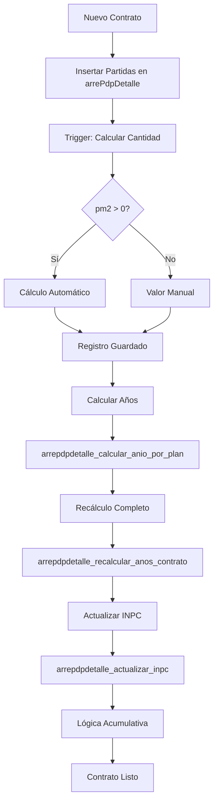

# Documentación de la Tabla arrePdpDetalle

## 📋 Descripción General

La tabla `arrePdpDetalle` almacena el detalle de los planes de pago de arrendamiento del sistema SPH. Contiene las partidas mensuales de cada contrato de arrendamiento con información detallada sobre montos, conceptos, fechas y cálculos automáticos basados en índices como el INPC.

## 🏗️ Estructura de la Tabla

### Campos Principales

| Campo | Tipo | Descripción |
|-------|------|-------------|
| `idArrePdpDet` | text | Identificador único del detalle del plan |
| `idArrePdp` | text | Identificador del plan de pago principal |
| `numPartida` | integer | Número de partida/secuencia del pago |
| `concepto` | text | Descripción del concepto de pago |
| `fecha` | timestamp | Fecha programada del pago |
| `pm2` | numeric | Precio por metro cuadrado |
| `constM2` | numeric | Constante de metros cuadrados |
| `cantidad` | real | Monto calculado del pago |
| `INPC` | real | Índice Nacional de Precios al Consumidor |
| `ptsINPC` | real | Puntos adicionales de INPC |
| `anio` | smallint | Año correspondiente a la partida |
| `status` | boolean | Estado del registro (activo/inactivo) |

### Campos de Control

| Campo | Tipo | Descripción |
|-------|------|-------------|
| `fc` | timestamp | Fecha de creación |
| `uidc` | uuid | Usuario que creó el registro |
| `montoDividido` | boolean | Indica si el monto fue dividido entre meses |
| `UltimoPago` | boolean | Marca si es el último pago |
| `ciclo` | integer | Ciclo de pago (año de inicio) |

### Campos de Pago

| Campo | Tipo | Descripción |
|-------|------|-------------|
| `comprobantePago` | text | Referencia del comprobante de pago |
| `cantidadAplicada` | double precision | Monto realmente pagado |
| `uidPago` | uuid | Usuario que registró el pago |
| `fecPago` | date | Fecha del pago realizado |

## 🔗 Relaciones con Otras Tablas

### Relaciones Principales
- **`arrePdp`** (`idArrePdp`) - Plan de pago principal
- **`catUsers`** (`uidc`) - Usuario que crea el registro
- **`catTipoOperacion`** (`tipoOperacion`) - Tipo de operación

### Relaciones Secundarias
- **`inpc`** - Para obtener valores del índice INPC

## 📁 Estructura de Carpetas

```
arrePdpDetalle/
├── funciones y trigger/          # Funciones y triggers asociados
│   ├── README.md               # Documentación detallada de componentes
│   ├── instalar_todo.sql       # Script de instalación completa
│   ├── arrepdpdetalle_actualizar_campo_manual.sql
│   ├── arrepdpdetalle_actualizar_inpc.sql
│   ├── arrepdpdetalle_actualizar_inpc_desde_anio.sql
│   ├── arrepdpdetalle_calcular_anio_por_plan.sql
│   ├── arrepdpdetalle_calcular_cantidad.sql
│   ├── arrepdpdetalle_recalcular_anos_contrato.sql
│   ├── arrepdpdetalle_recalcular_todas_cantidades.sql
│   └── trigger_arrepdpdetalle_calcular_cantidad.sql
└── vistas/                     # Vistas asociadas (vacío - no hay vistas)
```

## 🔄 Flujo de Procesamiento



## 🔧 Componentes Disponibles

### Funciones (9)

#### 1. Funciones de Generación
- **`arrepdpdetalle_generar_plan_completo()`** - Generación completa de planes (NUEVA)

#### 2. Funciones de Cálculo
- **`arrepdpdetalle_calcular_cantidad()`** - Función trigger para cálculo automático
- **`arrepdpdetalle_calcular_anio_por_plan()`** - Cálculo masivo de años
- **`actualizar_ciclo_plan_pago()`** - Cálculo y actualización del campo ciclo

#### 3. Funciones de Actualización
- **`arrepdpdetalle_actualizar_campo_manual()`** - Actualización manual segura
- **`arrepdpdetalle_actualizar_inpc()`** - Actualización INPC completa
- **`arrepdpdetalle_actualizar_inpc_desde_anio()`** - Actualización INPC parcial

#### 4. Funciones de Recálculo
- **`arrepdpdetalle_recalcular_anos_contrato()`** - Recálculo completo de años
- **`arrepdpdetalle_recalcular_todas_cantidades()`** - Recálculo masivo total

### Triggers (1)

- **`trigger_arrepdpdetalle_calcular_cantidad`** - Automatiza cálculo de cantidades

## 📊 Estado Actual

- **Total funciones**: 9 ✅
- **Total triggers**: 1 ✅
- **Total vistas**: 0 ❌
- **Documentación**: Completa ✅
- **Scripts de instalación**: Disponibles ✅

## 🚀 Instalación

### Instalación Completa
```sql
-- Desde la carpeta funciones y trigger/
\i instalar_todo.sql
```

### Instalación Individual
```sql
-- Instalar funciones en orden
\i arrepdpdetalle_calcular_cantidad.sql
\i arrepdpdetalle_calcular_anio_por_plan.sql
\i arrepdpdetalle_recalcular_anos_contrato.sql
\i arrepdpdetalle_actualizar_campo_manual.sql
\i arrepdpdetalle_actualizar_inpc.sql
\i arrepdpdetalle_actualizar_inpc_desde_anio.sql
\i arrepdpdetalle_recalcular_todas_cantidades.sql
\i actualizar_ciclo_plan_pago.sql
\i arrepdpdetalle_generar_plan_completo.sql

-- Instalar trigger al final
\i trigger_arrepdpdetalle_calcular_cantidad.sql
```

## 💡 Casos de Uso Típicos

### 1. Crear Nuevo Contrato
```sql
-- Insertar partidas manualmente
INSERT INTO "arrePdpDetalle" (idArrePdpDet, idArrePdp, numPartida, concepto, fecha, pm2, constM2, ...)
VALUES (...);

-- Calcular años automáticamente
SELECT arrepdpdetalle_calcular_anio_por_plan('ID_CONTRATO');

-- Recalcular con manejo de depósitos
SELECT arrepdpdetalle_recalcular_anos_contrato('ID_CONTRATO');

-- Actualizar INPC
SELECT * FROM arrepdpdetalle_actualizar_inpc('ID_CONTRATO');

-- Actualizar ciclos
SELECT actualizar_ciclo_plan_pago();
```

### 2. Ajuste Manual de Montos
```sql
-- Actualizar campo específico de forma segura
SELECT arrepdpdetalle_actualizar_campo_manual(
    'ID_CONTRATO', 3, 'Renta', 'pm2', 5.2
);
```

### 3. Recálculo Masivo
```sql
-- Recalcular todas las cantidades del sistema
SELECT arrepdpdetalle_recalcular_todas_cantidades();
```

### 4. Actualización Parcial de INPC
```sql
-- Actualizar INPC desde año específico
SELECT * FROM arrepdpdetalle_actualizar_inpc_desde_anio('ID_CONTRATO', 3);
```

### 5. Actualización de Ciclos
```sql
-- Actualizar ciclos para todos los contratos
SELECT actualizar_ciclo_plan_pago();
```

### 6. Generación de Plan Completo
```sql
-- Generar plan completo con todos los conceptos
SELECT * FROM arrepdpdetalle_generar_plan_completo(
    'ID_PLAN', 'ID_ARRENDADOR', 'UUID_USER',
    '2024-01-01', 24, 50000.0, 150.0, 100.0,
    110.5, 2.0, 25.0, 15.0, 10.0,
    0, 1, 2, 0
);
```

## ⚠️ Consideraciones Importantes

1. **Orden de Instalación**: Los triggers deben instalarse después de sus funciones
2. **Rendimiento**: Las funciones masivas afectan a toda la tabla
3. **Seguridad**: Todas las funciones usan SECURITY INVOKER
4. **Dependencias**: Las funciones de INPC requieren datos en tabla `inpc`
5. **Cálculo Automático**: El trigger garantiza consistencia en cantidades

## 🔗 Políticas RLS

La tabla tiene Row Level Security (RLS) habilitado. Las funciones heredan los permisos del usuario que las ejecuta (SECURITY INVOKER).

## 📝 Historial de Cambios

- **21/10/2025**: Creación completa de documentación y estructura de carpetas
- **25/09/2025**: Fecha de referencia de las funciones originales
- **Documentación estándar**: Aplicación completa de guía de documentación

## 📚 Documentación Adicional

- **Documentación detallada de componentes**: [`funciones y trigger/README.md`](funciones%20y%20trigger/README.md)
- **Script de instalación**: [`funciones y trigger/instalar_todo.sql`](funciones%20y%20trigger/instalar_todo.sql)
- **Guía de documentación**: [`/.kilocode/rules/GUIA_DE_DOCUMENTACION.md`](../.kilocode/rules/GUIA_DE_DOCUMENTACION.md)

---

**Última actualización**: 22/10/2025 05:24:00
**Estado**: Documentación completa ✅
**Componentes listos para instalación**: 10/10 ✅