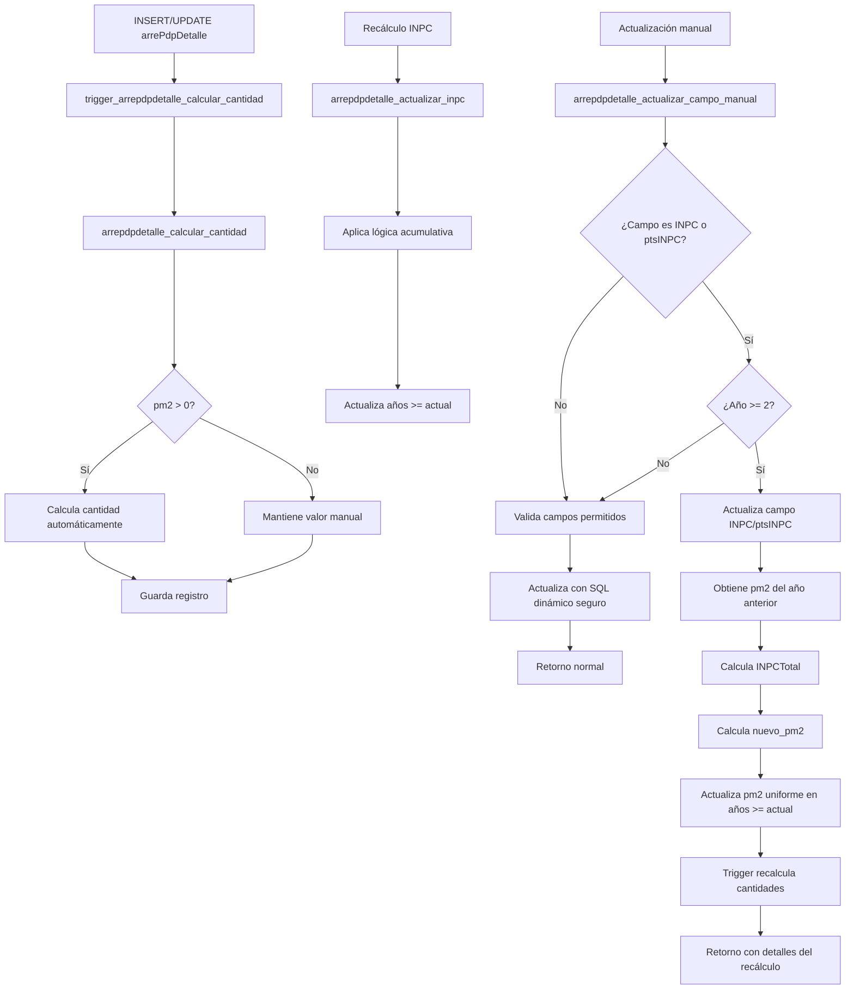

# Documentación de Funciones y Triggers - arrePdpDetalle

## 📋 Overview

Este módulo contiene todas las funciones y triggers asociados a la tabla `arrePdpDetalle`, que gestiona el detalle de los planes de pago de arrendamiento. Los componentes están diseñados para automatizar cálculos, mantener la integridad de datos y facilitar operaciones masivas sobre los contratos de arrendamiento.

## 📁 Estructura de Componentes

### Funciones (11)
1. `arrepdpdetalle_actualizar_campo_manual.sql` - Actualización manual de campos específicos
2. `arrepdpdetalle_actualizar_inpc.sql` - Actualización automática de INPC con lógica acumulativa
3. `arrepdpdetalle_actualizar_inpc_desde_anio.sql` - Actualización de INPC desde año específico
4. `arrepdpdetalle_aplicar_meses_gracia.sql` - Aplica descuentos de cortesía basados en configuración JSON (NUEVA)
5. `arrepdpdetalle_calcular_anio_por_plan.sql` - Cálculo masivo de años por plan
6. `arrepdpdetalle_calcular_cantidad.sql` - Función trigger para cálculo de cantidades
7. `arrepdpdetalle_generar_plan_completo.sql` - Generación completa de planes de pago
8. `arrepdpdetalle_obtener_resumen_por_plan.sql` - Obtiene resumen agrupado por partida de un plan (NUEVA)
9. `arrepdpdetalle_recalcular_anos_contrato.sql` - Recálculo completo de años de contrato
10. `arrepdpdetalle_recalcular_todas_cantidades.sql` - Recálculo masivo de todas las cantidades
11. `actualizar_ciclo_plan_pago.sql` - Cálculo y actualización del campo ciclo para todos los planes

### Triggers (1)
1. `trigger_arrepdpdetalle_calcular_cantidad.sql` - Trigger automático para cálculo de cantidades

## 🔄 Flujo de Procesamiento



## 📊 Comportamiento Detallado por Componente

### 1. Sistema de Cálculo de Ciclos

#### `actualizar_ciclo_plan_pago()`
- **Propósito**: Calcular y actualizar el campo ciclo para todos los registros
- **Lógica**:
  - Obtiene fecha de inicio de cada plan
  - Calcula ciclo como año_inicio + años_transcurridos
  - Usa cálculo preciso basado en timestamps
- **Fórmula**: `EXTRACT(YEAR FROM fecha_inicio_plan) + FLOOR(años_transcurridos)`
- **Activación**: Manual (función masiva)

### 2. Sistema de Generación de Planes

#### `arrepdpdetalle_generar_plan_completo()`
- **Propósito**: Generar plan completo con depósito y partidas mensuales
- **Características**:
  - Inserta depósito (partida 0, año 0)
  - Genera 4 conceptos por mes (renta, admin, mtto, vigilancia)
  - Maneja cortesías por concepto
  - Calcula años correctamente desde el inicio
- **Parámetros**: 14 parámetros incluyendo ID, montos, plazos y cortesías
- **Retorno**: JSON con estadísticas de la operación
- **Activación**: Manual (función de creación)

### 3. Sistema de Cálculo Automático

#### `arrepdpdetalle_calcular_cantidad()` + `trigger_arrepdpdetalle_calcular_cantidad`
- **Propósito**: Calcular automáticamente el campo `cantidad`
- **Lógica**: 
  - Si `pm2 > 0`: calcula usando fórmula estándar
  - Si `pm2 = 0`: preserva valor manual
- **Fórmula**: `((pm2 * "constM2") * ((1) + (("INPC" + "ptsINPC") / (100))))`
- **Activación**: Automática en INSERT/UPDATE

### 4. Sistema de Gestión de INPC

#### `arrepdpdetalle_actualizar_inpc()`
- **Propósito**: Actualizar INPC para todos los años >= 2
- **Característica**: Implementa lógica acumulativa
- **Requerimiento**: Datos INPC de 3 meses anteriores
- **Retorno**: Tabla con resultados por año

#### `arrepdpdetalle_actualizar_inpc_desde_anio()`
- **Propósito**: Actualizar INPC desde año específico
- **Ventaja**: Permite recálculos parciales
- **Validaciones**: Año >= 2, existencia de registros

### 5. Sistema de Aplicación de Meses de Gracia

#### `arrepdpdetalle_aplicar_meses_gracia()`
- **Propósito**: Aplica descuentos de cortesía basados en configuración JSON del plan
- **Características**:
  - Lee configuración desde campo `mesGracia` de la tabla `arrePdp`
  - Procesa valores enteros y decimales para diferentes tipos de descuento
  - Maneja descuentos del 100% (pm2 = 0) y 50% (pm2 = pm2/2)
  - Actualiza campo `tieneMesGratis` con valores 'Si', 'Medio' o NULL
  - **CORRECCIÓN IMPORTANTE**: Mapeo explícito de conceptos JSON a conceptos de BD para manejar acentos
- **Lógica de procesamiento**:
  - Valor entero N: Aplica 100% de descuento para los primeros N meses
  - Valor decimal X.Y:
    * Primeros meses (parte entera): 100% descuento
    * Siguiente mes si existe parte decimal: 50% descuento
- **Mapeo de conceptos implementado**:
  - "administracion" (JSON) → "Administración" (BD)
  - "mantenimiento" → "Mantenimiento"
  - "vigilancia" → "Vigilancia"
  - "renta" → "Renta"
- **Retorno**: VOID (procesamiento con logs via RAISE NOTICE)
- **Activación**: Manual después de generar detalles del plan

### 6. Sistema de Gestión de Años

#### `arrepdpdetalle_calcular_anio_por_plan()`
- **Propósito**: Cálculo rápido masivo por plan
- **Fórmula**: `((numPartida - 1) / 12 + 1)`
- **Limitación**: No distingue depósitos

#### `arrepdpdetalle_recalcular_anos_contrato()`
- **Propósito**: Recálculo completo con manejo de depósitos
- **Características**:
  - Partida 0 (depósito): año = 0
  - Partidas >= 1: fórmula matemática
- **Retorno**: JSON con estadísticas detalladas

### 7. Sistema de Actualizaciones Manuales

#### `arrepdpdetalle_actualizar_campo_manual()`
- **Propósito**: Actualización segura de campos específicos con recálculo automático de pm2
- **Campos permitidos**: INPC, ptsINPC, constM2, pm2
- **Seguridad**: SQL dinámico con whitelist
- **Retorno**: JSON con detalles de la operación
- **Funcionalidad implementada (23/10/2025)**: Recálculo automático de pm2 cuando se modifica INPC o ptsINPC en años >= 2

**Comportamiento mejorado:**
- **Detección automática**: Cuando se modifica `INPC` o `ptsINPC` y `p_anio_desde >= 2`
- **Cálculo inteligente**:
  - Obtiene el pm2 del año anterior
  - Calcula `INPCTotal = INPC + ptsINPC`
  - Aplica fórmula: `nuevo_pm2 = pm2_anterior + (pm2_anterior * INPCTotal / 100)`
- **Actualización uniforme**: Aplica el mismo pm2 a todos los años >= `p_anio_desde`
- **Aplicación uniforme de INPC/ptsINPC**: Se aplican igual para todos los años >= 2
- **Preservación de valores manuales**: No sobreescribe registros con `pm2 = 0`

**Códigos de respuesta adicionales:**
- `EXITO_CON_RECALCULO`: Cuando se actualiza campo y se recalcula pm2
- `ERROR_VALIDACION`: Cuando no se encuentra pm2 válido en año anterior

**Ejemplo práctico:**
```sql
-- Si modifico en el año 2 el INPC a 3 y ptsINPC es 1
-- El inpcTotal ahora será 4
-- Para el cálculo en el año 1 el pm2 es de 75
-- En el año 2 en adelante el pm2 sería: 75 + 4% = 78.00
-- El pm2=78.00 se aplica igual para todos los años >= 2
SELECT arrepdpdetalle_actualizar_campo_manual('Plan123', 2::smallint, 'Renta', 'INPC', 3::real);
```

**Nota importante**: Para uso correcto, especificar tipos de datos explícitamente:
- `anio_desde::smallint`
- `valor::real`

### 8. Sistema de Consultas y Reportes

#### `arrepdpdetalle_obtener_resumen_por_plan()`
- **Propósito**: Obtener un resumen agrupado por número de partida de un plan específico con validación opcional de pdpActivo
- **Características**:
  - Devuelve valores máximos, mínimos y sumas agrupados por partida
  - Extrae valores del concepto 'Renta' para pm2, constM2, INPC, ptsINPC, totalINPC
  - Suma cantidades de todos los conceptos
  - Filtra por status = true y idArrePdp específico
  - **NUEVO**: Parámetro p_validar (boolean, default true) para validar pdpActivo en arrenPropiedades
  - **NUEVO**: Si p_validar = true, valida que pdpActivo = true en arrenPropiedades antes de mostrar resultados
  - **NUEVO**: Si la validación falla, devuelve conjunto vacío
  - **NUEVO**: Si p_validar = false, muestra la consulta sin validación
  - **ACTUALIZACIÓN**: Ahora incluye la columna pdpActivo en el retorno, obtenida mediante JOIN con arrenPropiedades
- **Retorno**: TABLE con estructura detallada de resumen por partida incluyendo pdpActivo
- **Activación**: Manual (función de consulta)
- **Uso**: Ideal para reportes y visualizaciones resumidas de planes de pago con seguridad adicional

### 9. Sistema de Recálculo Masivo

#### `arrepdpdetalle_recalcular_todas_cantidades()`
- **Propósito**: Recálculo masivo de todas las cantidades
- **Alcance**: Toda la tabla (status = true)
- **Retorno**: JSON con estadísticas del proceso

## 🔧 Instrucciones de Instalación

1. **Instalar funciones en orden específico**:
   ```sql
   -- Primero las funciones independientes
   \i arrepdpdetalle_calcular_cantidad.sql
   \i arrepdpdetalle_calcular_anio_por_plan.sql
   \i arrepdpdetalle_recalcular_anos_contrato.sql
   \i arrepdpdetalle_recalcular_todas_cantidades.sql
   \i arrepdpdetalle_actualizar_campo_manual.sql
   \i arrepdpdetalle_actualizar_inpc.sql
   \i arrepdpdetalle_actualizar_inpc_desde_anio.sql
   \i arrepdpdetalle_aplicar_meses_gracia.sql
   \i arrepdpdetalle_generar_plan_completo.sql
   \i arrepdpdetalle_obtener_resumen_por_plan.sql
   \i actualizar_ciclo_plan_pago.sql
   
   -- Finalmente el trigger
   \i trigger_arrepdpdetalle_calcular_cantidad.sql
   ```

2. **Verificar instalación**:
   ```sql
   SELECT routine_name FROM information_schema.routines 
   WHERE routine_name LIKE '%arrepdpdetalle%' AND routine_schema = 'public';
   
   SELECT trigger_name FROM information_schema.triggers 
   WHERE trigger_name LIKE '%arrepdpdetalle%' AND trigger_schema = 'public';
   ```

## 📈 Estado Actual de Componentes

- **Total funciones**: 11
- **Total triggers**: 1
- **Total vistas**: 0
- **Estado documentación**: Completa ✅
- **Estado implementación**: Lista para instalación ✅

## 🚀 Casos de Uso Recomendados

### Escenario 1: Nuevo Contrato (Método Recomendado)
```sql
-- Generar plan completo (reemplaza todo el proceso anterior)
SELECT * FROM arrepdpdetalle_generar_plan_completo(
    'ID_PLAN', 'ID_ARRENDADOR', 'UUID_USER',
    '2024-01-01', 24, 50000.0, 150.0, 100.0,
    110.5, 2.0, 25.0, 15.0, 10.0,
    0, 1, 2, 0
);

-- Actualizar ciclos
SELECT actualizar_ciclo_plan_pago();
```

### Escenario 2: Nuevo Contrato (Método Anterior)
```sql
-- Insertar partidas
-- Calcular años
SELECT arrepdpdetalle_calcular_anio_por_plan('ID_CONTRATO');

-- Recalcular con manejo de depósitos
SELECT arrepdpdetalle_recalcular_anos_contrato('ID_CONTRATO');

-- Actualizar INPC
SELECT * FROM arrepdpdetalle_actualizar_inpc('ID_CONTRATO');

-- Actualizar ciclos
SELECT actualizar_ciclo_plan_pago();
```

### Escenario 2: Ajuste Manual con Recálculo Automático
```sql
-- Actualizar campo específico con recálculo automático de pm2
SELECT * FROM arrepdpdetalle_actualizar_campo_manual(
    'ID_CONTRATO', 2::smallint, 'Renta', 'INPC', 3::real
);

-- Respuesta esperada:
-- {
--   "exito": true,
--   "codigo": "EXITO_CON_RECALCULO",
--   "mensaje": "Campo INPC actualizado y pm2 recalculado para el concepto Renta",
--   "detalles": {
--     "pm2_anterior": 75.0,
--     "inpc_total": 4.0,
--     "nuevo_pm2": 78.0,
--     "registros_pm2_actualizados": 108
--   }
-- }

-- Actualización normal (sin recálculo)
SELECT arrepdpdetalle_actualizar_campo_manual(
    'ID_CONTRATO', 3::smallint, 'Renta', 'pm2', 5.2::real
);
```

### Escenario 3: Recálculo Masivo
```sql
-- Recalcular todas las cantidades
SELECT arrepdpdetalle_recalcular_todas_cantidades();
```

### Escenario 4: Aplicar Meses de Gracia
```sql
-- Aplicar meses de gracia según configuración JSON del plan
SELECT arrePdpDetalle_aplicar_meses_gracia('ID_CONTRATO');

-- Ejemplo con JSON {"renta": 1, "vigilancia": 6, "mantenimiento": 5.5, "administracion": 0}:
-- - Renta: Mes 1 → pm2 = 0, tieneMesGratis = 'Si'
-- - Vigilancia: Meses 1-6 → pm2 = 0, tieneMesGratis = 'Si'
-- - Mantenimiento: Meses 1-5 → pm2 = 0, tieneMesGratis = 'Si'; Mes 6 → pm2 = pm2/2, tieneMesGratis = 'Medio'
-- - Administración: Sin descuentos aplicados
```

### Escenario 5: Obtener Resumen de Plan
```sql
-- Obtener resumen agrupado por partida de un plan específico (con validación por defecto)
SELECT * FROM arrepdpdetalle_obtener_resumen_por_plan('ID_CONTRATO');

-- Obtener resumen SIN validación de pdpActivo
SELECT * FROM arrepdpdetalle_obtener_resumen_por_plan('ID_CONTRATO', false);

-- Resultado esperado: tabla con:
-- - numPartida: número de partida agrupado
-- - anio: año máximo de la partida
-- - fecha: fecha mínima de la partida
-- - pm2, constM2, INPC, ptsINPC, totalINPC: valores del concepto 'Renta'
-- - ciclo: ciclo máximo de la partida
-- - total_cantidad: suma de cantidades de todos los conceptos
-- - idArrePdp: ID del plan
-- - pdpActivo: estado activo del plan en arrenPropiedades

-- Nota: Si p_validar = true (default) y pdpActivo != true en arrenPropiedades,
--       la función devuelve un conjunto vacío
```

## ⚠️ Notas Importantes

1. **Orden de instalación**: El trigger debe instalarse después de su función asociada
2. **Rendimiento**: Las funciones masivas deben usarse con moderación
3. **Seguridad**: Las funciones usan SECURITY INVOKER por defecto
4. **Dependencias**: Algunas funciones requieren datos en tabla `inpc`

## 🔗 Relaciones con Otros Módulos

- **Tabla principal**: `public."arrePdpDetalle"`
- **Tabla de referencia**: `public.inpc` (para funciones de INPC)
- **No hay vistas asociadas** a esta tabla

## 📝 Historial de Cambios

- **20/01/2026 21:48**: Mejora en `arrepdpdetalle_obtener_resumen_por_plan()` - Agregada columna pdpActivo al retorno de la función. La función ahora hace JOIN con las tablas arrePdp y arrenPropiedades para obtener el valor de pdpActivo y retornarlo en la consulta. Actualizada documentación del encabezado y README.md.
- **20/01/2026 15:35**: Corrección CRÍTICA en `arrepdpdetalle_obtener_resumen_por_plan()` - Corregida referencia a columna pdpActivo: ahora selecciona de arrenPropiedades (arp) en lugar de arrePdp (ap). Resuelve error "column ap.pdpActivo does not exist". Función ahora valida correctamente que pdpActivo = true en arrenPropiedades.
- **20/01/2026 15:15**: Mejora en `arrepdpdetalle_obtener_resumen_por_plan()` - Agregado parámetro p_validar con valor por defecto true para validar pdpActivo en arrenPropiedades. Si p_validar = true, valida que pdpActivo = true; si la validación falla, devuelve conjunto vacío. Si p_validar = false, muestra la consulta sin validación.
- **20/01/2026**: Creación de `arrepdpdetalle_obtener_resumen_por_plan()` - Función para obtener resumen agrupado por partida de un plan específico, extrayendo valores del concepto 'Renta' y sumando cantidades de todos los conceptos
- **12/12/2025 10:19**: Corrección CRÍTICA de `arrepdpdetalle_aplicar_meses_gracia()` - Se implementó mapeo explícito de conceptos JSON a conceptos de BD para resolver problema con acentos. El concepto "administracion" (sin acento) ahora se mapea correctamente a "Administración" (con acento) en la base de datos, resolviendo el problema donde no se aplicaban los meses de gracia para administración.
- **12/12/2025 09:51**: Corrección de `arrepdpdetalle_aplicar_meses_gracia()` - Se eliminó el control explícito de transacciones (BEGIN/COMMIT/ROLLBACK) que causaba error "invalid transaction termination" y se corrigió el casteo del tipo ENUM "mesGratis" para el campo "tieneMesGratis"
- **12/12/2025 09:32**: Creación de `arrepdpdetalle_aplicar_meses_gracia()` - Función para aplicar descuentos de cortesía basados en configuración JSON
- **23/10/2025**: Mejora significativa en `arrepdpdetalle_actualizar_campo_manual()` - Implementación de recálculo automático de pm2 cuando se modifica INPC o ptsINPC en años > 1
- **21/10/2025**: Creación de documentación completa de todos los componentes
- **25/09/2025**: Fecha de referencia de las funciones originales

## 🔄 Actualización Importante - Comportamiento Mejorado (23/10/2025)

### Nueva Funcionalidad en `arrepdpdetalle_actualizar_campo_manual`

La función ahora incluye **recálculo automático de pm2** cuando se modifican los campos `INPC` o `ptsINPC` en años mayores a 1.

#### Flujo del Proceso Mejorado:

1. **Detección automática**: Cuando se modifica `INPC` o `ptsINPC` y `p_anio_desde > 1`
2. **Cálculo inteligente**:
   - Obtiene el pm2 del año anterior
   - Calcula `INPCTotal = INPC + ptsINPC`
   - Aplica fórmula: `nuevo_pm2 = pm2_anterior + (pm2_anterior * INPCTotal / 100)`
3. **Actualización en cascada**: Aplica el nuevo pm2 a todos los años >= `p_anio_desde`
4. **Preservación de valores manuales**: No sobreescribe registros con `pm2 = 0`

#### Validaciones Implementadas:
- Verifica existencia de pm2 válido en año anterior
- Solo activa recálculo para INPC o ptsINPC
- Preserva valores manuales (pm2 = 0)
- Operación transaccional (todo o nada)

#### Impacto en el Sistema:
- **Trigger automático**: El recálculo de pm2 activa automáticamente el trigger de cálculo de cantidades
- **Consistencia**: Asegura que los valores de pm2 sean consistentes con los ajustes de INPC
- **Eficiencia**: Reduce la necesidad de cálculos manuales posteriores

---

**Esta mejora representa una evolución significativa en la automatización de cálculos de contratos de arrendamiento, manteniendo la flexibilidad y seguridad del sistema original.**