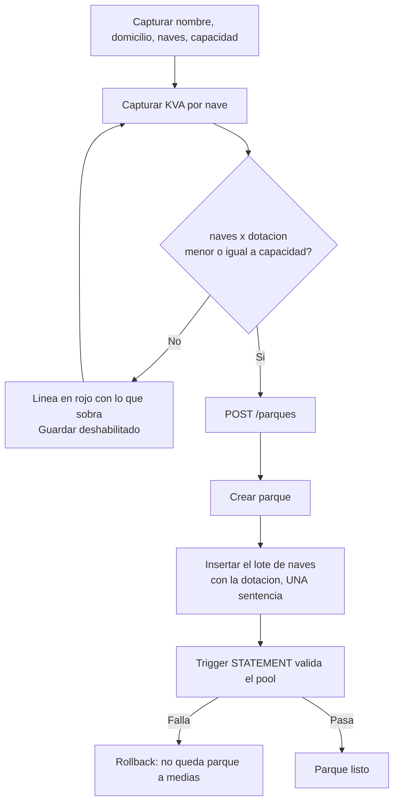
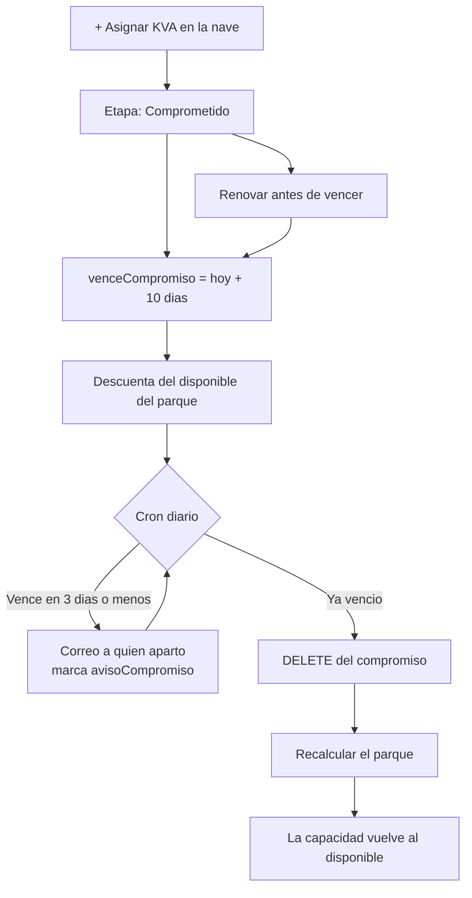

# 04 · Flujos end-to-end — Dotación de KVA por nave

> Anclado a `00-brief-conceptual.md`.

## F-1 · Dar de alta un parque con dotación

**Precondición:** permiso 701.

**Errores:** si el trigger rechaza, la transacción completa se deshace — no puede quedar un
parque sin naves ni naves sin parque.

## F-2 · Editar la dotación de una nave

**Precondición:** permiso 721.

1. Abrir la nave desde el tablero → pestaña **KVA** → lápiz en Dotación.
2. Capturar el valor nuevo → `PATCH /parques/naves/:idNave/dotacion`.
3. El servicio valida que **no quede por debajo de lo ya asignado + comprometido en esa nave**.
4. El trigger valida que **el pool no se exceda**.
5. Se refresca el tablero: cambian «Dotado a naves», «Sin dotar» y «Por asignar».

**Casos alternos**

| Situación | Respuesta |
|---|---|
| Baja la dotación por debajo de lo entregado | **400** — «La nave ya tiene 10 KVA asignados: la dotación no puede quedar en 5.» |
| La suma excede la capacidad del pool | **409** — «La dotación de baja (940) supera la capacidad (935). Sobran 5 KVA.» |
| Sin permiso 721 | **403**; el lápiz ni siquiera se pinta |

## F-3 · Apartar KVA (comprometer) y su vencimiento

**Precondiciones del cron:** corre diario, se registra en `v2_cron_ejecuciones`, es disparable
a mano desde la pantalla Cron y **aísla el error por parque**.

**Por qué se borra y no se marca:** decisión de Jereff — «para que la suma nos dé correcto».
El rastro no se pierde: `trg_auditoria` guarda el DELETE con la fila completa, así que se puede
responder «quién apartó qué y no lo concretó» consultando `auditoria`.

## F-4 · Asignar a una nave arrendada

1. El usuario abre `+ Asignar KVA` en una nave que tiene arrendamiento vivo.
2. El front consulta el ocupante (ya lo trae el tablero) y **fija la figura en Rentado**.
3. Aunque el front se saltara, el backend revalida: si hay `arrenPropiedades` viva para esa
   nave y la figura es `VENTA` → **400**: «Esta nave está arrendada: a un arrendatario solo se
   le renta.»

📌 **Caso borde a decidir con el negocio:** una nave con arrendamiento vivo que además tiene
KVA **vendidos históricos** (cargados antes de esta regla). La validación aplica solo a
altas y ediciones; lo histórico se respeta y no se toca.

## F-5 · Migración de los datos actuales

Se corre **una vez**, en una transacción, con el API detenido o fuera de horario:

1. Crear las columnas (`naves.dotacion*`, `parques.dotacion*Nave`, `venceCompromiso`).
2. Sembrar la dotación de cada nave con la suma de sus asignaciones vivas.
3. Borrar las filas `POR_ASIGNAR`.
4. Reducir el CHECK de `etapa` a dos valores.
5. Reemplazar `kva_consumo` y `kva_recalcular_disponibles`.
6. Recalcular todos los parques.
7. **Verificar**: Spartek I & II debe dar dotación 935, asignado 790, por asignar 145,
   disponibles 227. Si no da eso, **rollback**.
