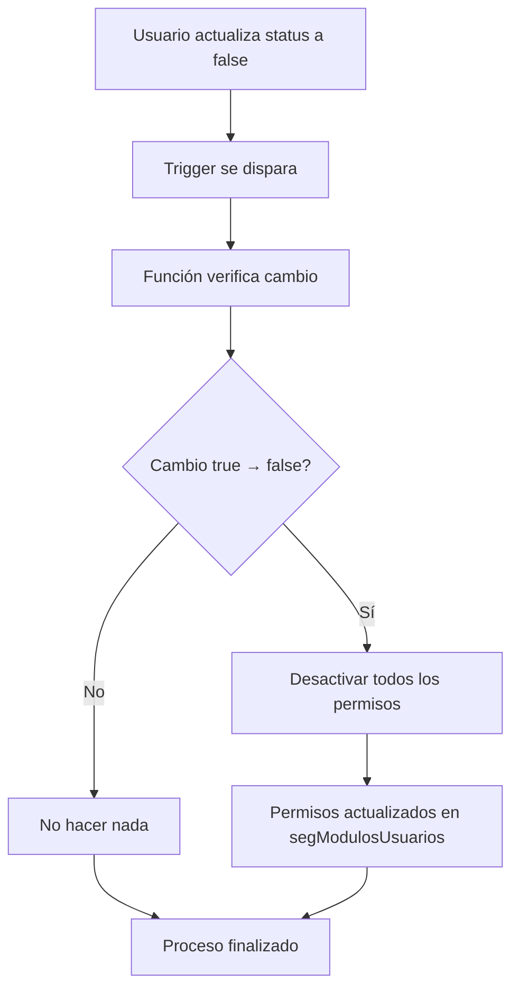

# CatUsers - Catálogo de Usuarios

## Descripción

Carpeta que contiene todos los componentes relacionados con la tabla `catUsers`, incluyendo políticas RLS, funciones, triggers y documentación asociada.

## Componentes Principales

### 1. Políticas RLS
- **Archivo**: [`Politicas_RLS_catUsers.sql`](Politicas_RLS_catUsers.sql:1)
- **Documentación**: [`Politicas_RLS_catUsers.md`](Politicas_RLS_catUsers.md:1)
- **Propósito**: Definir políticas de seguridad a nivel de fila para la tabla de usuarios

### 2. Sistema de Desactivación Automática de Permisos
- **Ubicación**: [`funciones y trigger/`](funciones y trigger/)
- **Propósito**: Desactivar automáticamente los permisos de un usuario cuando su status cambia a false
- **Componentes**:
  - Función: [`catusers_desactivar_permisos_al_cambiar_status()`](funciones y trigger/catusers_desactivar_permisos_al_cambiar_status.sql:1)
  - Trigger: [`trigger_catusers_desactivar_permisos`](funciones y trigger/trigger_catusers_desactivar_permisos.sql:1)

## Estructura de Archivos

```
catUsers/
├── README.md                                    # Este archivo
├── instalar_todo.sql                            # Script de instalación general
├── Politicas_RLS_catUsers.sql                   # Políticas RLS
├── Politicas_RLS_catUsers.md                    # Documentación de políticas
└── funciones y trigger/                         # Funciones y triggers
    ├── README.md                                # Documentación de funciones
    ├── instalar_desactivacion_permisos.sql       # Instalación específica
    ├── test_desactivacion_permisos.sql          # Script de pruebas
    ├── catusers_desactivar_permisos_al_cambiar_status.sql  # Función principal
    └── trigger_catusers_desactivar_permisos.sql # Trigger asociado
```

## Instalación

### Instalación Completa (Recomendado)
Para instalar todos los componentes de catUsers:

```sql
\i catUsers/instalar_todo.sql
```

### Instalación Individual
1. **Políticas RLS**:
```sql
\i catUsers/Politicas_RLS_catUsers.sql
```

2. **Sistema de Desactivación Automática**:
```sql
\i catUsers/funciones y trigger/instalar_desactivacion_permisos.sql
```

## Funcionalidades Implementadas

### 1. Gestión de Usuarios
- Mantenimiento de catálogo de usuarios
- Control de status (activo/inactivo)
- Gestión de perfiles y permisos

### 2. Seguridad (RLS)
- Políticas de acceso a nivel de fila
- Restricciones basadas en roles
- Filtrado de datos sensibles

### 3. Automatización de Permisos ⭐ **NUEVO**
- **Desactivación automática** de permisos al cambiar status a false
- **Prevención de accesos no autorizados** de usuarios inactivos
- **Gestión transparente** sin intervención manual

## Flujo de Procesamiento - Sistema Automático



## Problemas Resueltos

### Problema de Seguridad Identificado
- **Situación**: Usuarios con `status = false` mantenían permisos activos
- **Riesgo**: Acceso no autorizado a módulos críticos del sistema
- **Impacto**: 10 usuarios inactivos con 152 permisos activos

### Solución Implementada
- **Automatización**: Desactivación inmediata de permisos al cambiar status
- **Cobertura**: Todos los módulos y secciones del usuario afectado
- **Seguridad**: Eliminación de accesos no autorizados

## Pruebas y Validación

### Script de Pruebas
- **Archivo**: [`funciones y trigger/test_desactivacion_permisos.sql`](funciones y trigger/test_desactivacion_permisos.sql:1)
- **Propósito**: Verificar el funcionamiento correcto del sistema
- **Características**:
  - Usa transacciones con ROLLBACK
  - No afecta datos reales
  - Prueba completa del flujo

### Ejecución de Pruebas
```sql
\i catUsers/funciones y trigger/test_desactivacion_permisos.sql
```

## Mantenimiento

### Verificación de Instalación
```sql
-- Verificar función
SELECT proname FROM pg_proc 
WHERE proname = 'catusers_desactivar_permisos_al_cambiar_status';

-- Verificar trigger
SELECT tgname FROM pg_trigger 
WHERE tgname = 'trigger_catusers_desactivar_permisos';
```

### Monitoreo Recomendado
1. **Revisión periódica** de usuarios inactivos con permisos
2. **Auditoría** de cambios de status
3. **Validación** del funcionamiento automático

## Consideraciones de Seguridad

### Nivel de Acceso
- Las funciones utilizan `SECURITY DEFINER` para modificar permisos
- El trigger se ejecuta con privilegios elevados solo para la operación específica

### Auditoría
- Se recomienda implementar tabla de logs para registrar desactivaciones
- El código incluye ejemplos de cómo implementar logging

## Registro de Cambios

### 16/11/2025 - Versión 2.0
- ✨ **NUEVA FUNCIONALIDAD**: Sistema de desactivación automática de permisos
- 🔧 Implementación de función y trigger para gestión automática
- 📋 Creación de scripts de instalación y pruebas
- 📚 Documentación completa del nuevo sistema
- 🛡️ **Mejora de seguridad**: Eliminación de accesos no autorizados

### Versiones Anteriores
- Implementación de políticas RLS
- Gestión básica de usuarios

## Estado Actual

- **Componentes totales**: 8 archivos
- **Funciones**: 1 (desactivación automática)
- **Triggers**: 1 (monitoreo de status)
- **Políticas RLS**: Implementadas
- **Pruebas**: Incluidas y verificadas
- **Documentación**: Completa y actualizada

## Recomendaciones de Uso

### Para Administradores
1. **Instalar el sistema completo** usando el script general
2. **Realizar pruebas** en entorno de desarrollo primero
3. **Monitorear** el funcionamiento inicial
4. **Documentar** cualquier incidencia

### Para Desarrolladores
1. **Revisar la documentación** antes de modificar componentes
2. **Ejecutar pruebas** después de cambios
3. **Mantener actualizada** la documentación
4. **Seguir las convenciones** establecidas

## Soporte y Contacto

Para dudas, sugerencias o reporte de incidencias:
- Revisar la documentación específica de cada componente
- Ejecutar scripts de prueba para diagnóstico
- Contactar al equipo de desarrollo de base de datos

---

**Última actualización**: 16/11/2025 05:00:52 UTC
**Versión**: 2.0
**Estado**: Activo y funcional