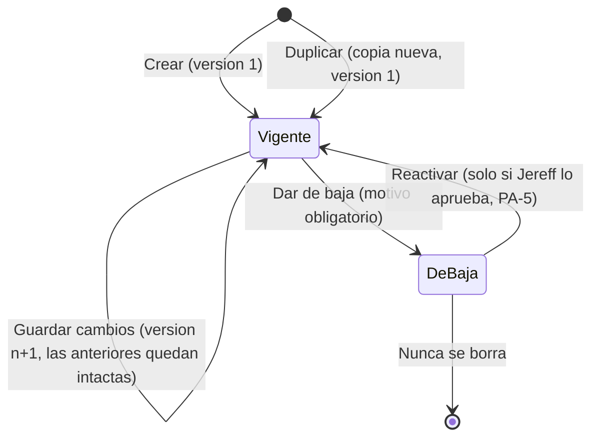
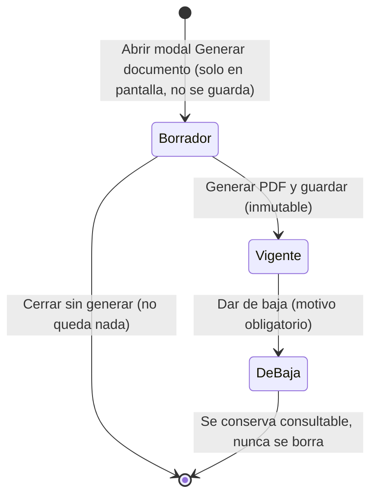

# 04 · Flujos end-to-end — Plantillas de documentos de KVA's

> Anclado a `00-brief-conceptual.md` y a `01-PRD.md`. Sin endpoints ni tablas: eso es del TRD/BACKEND.
> Las cosas no decididas se remiten a las preguntas abiertas (PA-n) del PRD y a la §10 de este documento.

## 0. Estados

### 0.1 Plantilla (`kvaPlantillas`)

Una plantilla **de baja** no se ofrece para generar; sus documentos ya emitidos no cambian.

### 0.2 Documento generado (`kvaDocGenerados`)

«Borrador» es solo el estado del modal en pantalla: **no existe borrador persistido**.
No hay transición «Vigente → Editado»: el documento es inmutable. Corregir = generar otro + dar de baja el anterior.

---

## F-1 · Crear una plantilla

**Precondición:** permiso de editar plantillas. Pantallas: 01 listado y 02 editor.

1. **Parques → Plantillas** → «Nueva plantilla».
2. Capturar el nombre y **elegir el tipo** de la lista fija (`ASIGNACION_CARGA` / `DEVOLUCION`).
3. En el editor, escribir el texto; **insertar campos automáticos** (se pintan en verde) desde el catálogo
   del tipo, y **escribir los datos fijos** (apoderado, domicilio, destinatario, oficio, solicitud CFE; en azul).
4. Guardar → se crea la plantilla en **versión 1**, vigente, auditada con el actor.
5. Regresa al listado con la plantilla visible.

**Alternos y errores**

| Situación | Respuesta |
|---|---|
| Nombre vacío o repetido (regla en PA-3) | Se rechaza y se indica el campo a corregir; el editor conserva lo escrito |
| Sin permiso de editar | El botón no se pinta; el intento directo devuelve 403 |
| Contenido con elementos fuera de lo permitido (pegado desde Word, scripts, etc.) | Se **sanea con lista permitida**; lo no permitido se descarta y se avisa que se limpió el formato |
| Campo que no pertenece al catálogo del tipo | No se puede insertar; si llega por otra vía, el servidor lo rechaza |
| Se cierra el editor sin guardar | Pide confirmar; si descarta, no queda nada |
| Falla de red al guardar | Mensaje de error; el texto se conserva en pantalla para reintentar |

## F-2 · Editar una plantilla (versión nueva)

1. En el listado, abrir la plantilla vigente → editor.
2. Cambiar texto, campos o datos fijos.
3. Guardar.
   - **Con cambios reales:** se crea la versión *n+1*; la *n* queda intacta; el listado muestra la nueva.
   - **Sin cambios:** no se crea versión; se avisa «sin cambios».
4. Los **documentos ya generados no se tocan**.

**Alternos y errores**

| Situación | Respuesta |
|---|---|
| Plantilla dada de baja | Se abre en solo lectura (editar requiere reactivar, PA-5) |
| Dato fijo vaciado | Se permite guardar; al generar se advierte (PA-6) |
| Otra persona guardó antes | Ver F-7 |
| Consultar versiones anteriores | Solo lectura; indica quién y cuándo guardó cada una |

**Duplicar** (variante del flujo): desde el listado → «Duplicar» → se crea una plantilla nueva del mismo tipo
con el mismo contenido en versión 1 y nombre de copia; se abre para renombrar/editar. La original no cambia.

**Dar de baja una plantilla:** listado → «Dar de baja» → motivo obligatorio + confirmación → pasa a de baja,
deja de ofrecerse en «Generar documento», se conserva en el listado con filtro de estado. Sin motivo no avanza.

## F-3 · Generar un documento (flujo feliz)

**Precondición:** permiso de usar plantilla al asignar (brief §6) y al menos una plantilla vigente del tipo.
Pantalla: 03.

1. **Parques → KVA's** → «Generar documento» (abre modal en portal).
2. Elegir **empresa** (selector con búsqueda; el nombre mostrado es la razón social).
3. Elegir **plantilla** (solo vigentes del tipo aplicable).
4. El modal lista **las naves de esa empresa** con casilla: las que tiene como **dueña o arrendataria** (D12),
   de **uno o varios parques** (D13). Ninguna nave se deshabilita por falta de dotación (D10).
5. Marcar **todas** o **solo algunas** (D4). Por cada nave marcada aparece su **cantidad de KVA**:
   prellenada desde la dotación si existe; si es 0 o no hay, el usuario la **teclea** (D10).
6. La **vista previa** se prellena: campos automáticos desde la BD, cantidades capturadas, datos fijos de la
   plantilla, fecha de hoy. Se actualiza al marcar/desmarcar naves o cambiar cantidades.
7. *(Opcional)* **Ajustar el texto** en la vista previa (incluida la fecha y los datos fijos). **No** toca la plantilla.
8. «Generar PDF y guardar».
9. El **servidor** valida pertenencia y permisos, vuelve a sustituir los campos desde la BD, arma el PDF **con logo y membrete de la plataforma** (D11) y lo
   guarda en el expediente de **cada nave marcada**, auditado con el actor, la plantilla, su versión y el
   contenido final usado.
10. Confirmación en pantalla con acceso directo al PDF.

**Alternos y errores**

| Situación | Respuesta |
|---|---|
| Ninguna nave marcada | «Generar» deshabilitado con la indicación «Marca al menos una nave» |
| Una nave marcada no pertenece a la empresa (ni como dueña ni como arrendataria; manipulación o dato que cambió) | El servidor **rechaza todo el documento**; mensaje que nombra la nave; no se genera documento parcial |
| Cantidad de KVA vacía o no válida en una nave marcada | «Generar» deshabilitado / el servidor rechaza; indica la nave |
| Los datos cambiaron entre la vista previa y la confirmación (p. ej., se modificó una asignación) | El servidor sustituye con datos **actuales**; si el texto resultante difiere de la vista previa en los campos automáticos, se **avisa y se pide reconfirmar** (FL-1, TRD) |
| Datos fijos requeridos vacíos | Se **advierte** qué falta y se **permite** generar (propuesta pendiente de confirmar: PA-6) |
| La plantilla se dio de baja mientras el modal estaba abierto | El servidor rechaza y pide elegir otra |
| Falla la generación del PDF | Mensaje de error; **no queda registro a medias** (ni documento ni entradas en expedientes); el modal conserva lo ajustado |
| Se cierra el modal sin generar | No queda nada guardado |
| Sin permiso | El botón no se pinta; 403 si se fuerza |
| La empresa ya tiene un documento vigente del mismo tipo para alguna de las naves | Posible aviso de duplicado (pendiente: PA-11) |

## F-4 · Casos de redacción según los datos de las naves

Los campos `kvas_por_nave` y `nivel` redactan según las **cantidades capturadas** (D10) y el nivel de las naves
**marcadas**. El texto de cada caso es el propuesto por el TRD, aprobado por Jereff (PA-12); aquí se fija el
**comportamiento** esperado.

### F-4a · Naves con cantidades iguales entre sí
Ejemplo del cliente: naves 107-110 y 119-122, todas con 5 KVA en baja tensión.
- `naves` agrupa en rangos («107 a 110 y 119 a 122»).
- `kvas_por_nave` redacta **un solo valor**: «5 KVAS» cada una.
- `nivel` dice «baja tensión».

### F-4b · Naves con cantidades distintas entre sí
Ejemplo: 107 con 5 KVA, 108 con 10, 109 con 5.
1. El servidor detecta que no hay un valor único.
2. `kvas_por_nave` redacta **la lista por nave** (o agrupada por valor igual); **nunca** afirma «5 KVAS cada una».
3. La vista previa muestra el texto resultante; el usuario puede ajustarlo (F-3 paso 7).
4. Si el texto de la plantilla dice «cada una» fijo fuera del campo, el usuario lo corrige en la vista previa
   (la plantilla no cambia). *Recomendación al editor de plantillas: dejar la redacción de cantidades dentro del campo.*

### F-4c · Mezcla de baja y media tensión
Ejemplo: naves 107-110 en baja, 119 en media.
1. `nivel` **agrupa por nivel** nombrando qué naves van en cada uno (no escribe un solo nivel).
2. `kvas_por_nave` presenta la cantidad por grupo de nivel.
3. La redacción sigue en la vista previa editable.
4. Si una misma nave tiene baja **y** media (paquete mixto), se redacta ambas cifras para esa nave.

### F-4d · Nave sin KVA (dotación 0 o inexistente) — ya no es error (D10)
1. La nave aparece **seleccionable**; su cantidad de KVA viene vacía.
2. El usuario **teclea la cantidad** al marcarla; no hay bloqueo por falta de dotación.
3. Sin cantidad válida en una nave marcada no se puede generar; la validación señala esa nave.
4. El servidor valida la cantidad capturada (número entero positivo dentro de un máximo razonable) y que la
   nave pertenezca a la empresa; no depende de la dotación.

## F-5 · Empresa sin naves

1. La empresa **aparece** en el selector (la lista incluye dueños y arrendatarios, D12), pero al elegirla el
   modal informa «Esta empresa no tiene naves disponibles para generar el documento» y «Generar» queda
   deshabilitado (confirmado con D12).
2. No se genera ningún documento; no se crea nada vacío.
3. «Naves de la empresa» = las que tiene como **dueña o arrendataria**, de cualquier parque (D12, D13). Si
   tiene ambas figuras, aparecen todas.
4. Naves de varios parques en un mismo documento: permitido; el campo `parque` se redacta con todos los
   nombres (D13).

## F-6 · Ver el documento en el expediente

1. Abrir la nave → expediente de documentos.
2. El PDF aparece con título (tipo y empresa), fecha, quién lo generó y **plantilla y versión** de origen.
3. Abrir en el visor o descargar.
4. Un documento de varias naves aparece **en cada una**.
5. Sin permiso del expediente: no se lista ni se descarga.

## F-7 · Dos usuarios editando la misma plantilla a la vez

Política final: la fija el TRD (PA-4). Comportamiento **mínimo obligatorio** (no se pierde trabajo en silencio):

1. A y B abren la plantilla en versión *n*.
2. A guarda → se crea la versión *n+1*.
3. B intenta guardar sus cambios, partiendo de la versión *n*.
4. El sistema detecta que la versión vigente ya no es la que B abrió y **no sobrescribe**.
5. B ve un aviso: «Esta plantilla cambió mientras la editabas (versión n+1, por A, hora)» con opciones:
   - **Ver los cambios de A** (solo lectura) y reaplicar a mano los suyos sobre *n+1*;
   - **Guardar como plantilla nueva** (duplica con su texto);
   - **Descartar** sus cambios.
6. El texto de B **se conserva en pantalla** mientras decide; nada se pierde.
7. Si B reaplica y guarda sobre *n+1* → se crea *n+2*.
8. Ninguna versión anterior se altera en ningún caso.

**Variante:** se da de baja la plantilla mientras alguien la edita → al guardar se rechaza con el motivo de la
baja y se ofrece guardar el texto como plantilla nueva.

## F-8 · Baja de un documento generado (corregir)

**Precondición:** permiso para dar de baja documentos (permiso que fija el TRD, PA-8). Un documento no se edita.

1. En el expediente de la nave, abrir el documento vigente → «Dar de baja».
2. Capturar el **motivo** (obligatorio) y confirmar.
3. El documento pasa a **de baja**: queda consultable, marcado con motivo, quién y cuándo; el archivo no se borra.
4. Si abarcaba varias naves, la baja se refleja en el expediente de **todas** (pendiente: PA-7).
5. Para entregar la versión correcta: **Parques → KVA's → Generar documento** (F-3) con el dato corregido.

**Orden de la corrección (aprobado por Jereff):** primero **generar el nuevo** y **después dar de baja** el anterior,
así la nave nunca queda sin carta vigente.

**Alternos y errores**

| Situación | Respuesta |
|---|---|
| Sin motivo | No avanza |
| Documento ya de baja | La acción no se ofrece |
| Sin permiso | Botón oculto; 403 si se fuerza |
| Se da de baja y el nuevo falla al generarse | El anterior queda de baja de todos modos; se avisa que la nave quedó sin carta vigente (motivo para preferir generar primero) |

## 9. Resumen de reglas que atraviesan todos los flujos

- El servidor arma el PDF y sustituye desde la BD; el cliente nunca manda los datos finales.
- El texto del editor y el de la vista previa son entrada no confiable: se sanea y valida.
- Toda mutación se audita con el actor del JWT.
- Documento generado inmutable; plantilla versionada; baja siempre con motivo y sin borrado.
- Ajustar al generar no modifica la plantilla.

## 10. Decisiones cerradas que afectan a estos flujos

D10 (cantidad capturada, nave sin KVA ya no es error) · D11 (logo y membrete) · D12 (dueño o arrendatario) ·
D13 (varios parques) · D14 (`figura` fuera de v1; `DEVOLUCION` sin campos propios) · PA-12 (texto aprobado) ·
orden «generar primero, dar de baja después» · rechazo total si una nave no es de la empresa.
Cerradas por ello: PA-1, PA-2, PA-9, PA-10, PA-12, FL-2, FL-3, FL-4, FL-5.

## 11. Preguntas abiertas

| # | Pregunta | Dueño |
|---|---|---|
| PA-5 | ¿Una plantilla dada de baja se puede reactivar? (el estado «reactivar» del diagrama queda condicionado) | Jereff |
| PA-6 | Datos fijos vacíos al generar: propuesta «advertir y permitir» | Jereff (confirmar) |
| PA-7 | Baja de documento de varias naves: ¿completo o también por nave? | Jereff |
| PA-11 | Aviso de duplicado si la nave ya tiene un documento vigente del mismo tipo | Jereff |
| FL-1 | Si cambian datos de la BD entre vista previa y confirmación: ¿avisar y reconfirmar? (propuesta en F-3) | Toribio (TRD) |

Decisiones técnicas del TRD: PA-3, PA-4 (mínimo en F-7), PA-8, PA-13 (ver PRD §8).
