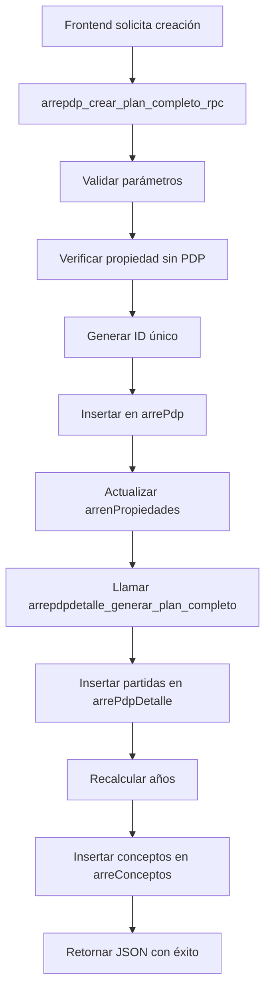
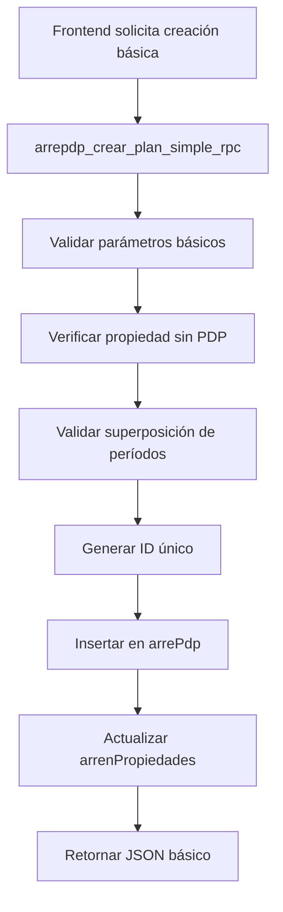
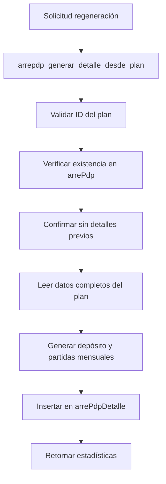

# Documentación Completa de Funciones arrepdp - Sistema SPH

## 📋 Overview

Este documento presenta una análisis completo de todas las funciones `arrepdp` del sistema SPH, detallando su propósito, parámetros, tablas involucradas, lógica de procesamiento y relaciones con otros componentes del sistema.

## 🏗️ Funciones arrepdp Disponibles

### 1. `arrepdp_crear_plan_completo_rpc()`

**Propósito**: Función RPC principal que crea un plan de pagos completo de arrendamiento, reemplazando todo el proceso del código Flutter en una sola transacción.

**Firma**:
```sql
CREATE OR REPLACE FUNCTION public.arrepdp_crear_plan_completo_rpc(
    p_uid text,
    p_id_arrendador text,
    p_id_nav_arrend text,
    p_fec_inicio date,
    p_plazo integer,
    p_deposito double precision,
    p_precio_m2 double precision,
    p_construccion_m2 double precision,
    p_inpc double precision DEFAULT 0.0,
    p_inpc_plus double precision DEFAULT 0.0,
    p_pm2_admin double precision DEFAULT 0.0,
    p_pm2_mtto double precision DEFAULT 0.0,
    p_pm2_vig double precision DEFAULT 0.0,
    p_cortesia_renta integer DEFAULT 0,
    p_cortesia_admin integer DEFAULT 0,
    p_cortesia_mtto integer DEFAULT 0,
    p_cortesia_vig integer DEFAULT 0
)
RETURNS jsonb
```

**Tablas involucradas**:
- **`arrePdp`**: Inserta el registro principal del plan
- **`arrenPropiedades`**: Actualiza estado de la propiedad
- **`arrePdpDetalle`**: Genera partidas mediante llamada a función
- **`arreConceptos`**: Inserta 4 conceptos automáticos
- **`catUsers`**: Validación de usuario (implícita)

**Proceso Interno**:
1. **Validaciones**: Parámetros obligatorios y propiedad sin PDP previo
2. **Generación ID**: Crea ID único usando timestamp y hash
3. **Cálculo rtaBase**: `precio_m2 * construccion_m2`
4. **Inserción principal**: Inserta registro en `arrePdp`
5. **Actualización propiedad**: Marca `tienePdp = true` en `arrenPropiedades`
6. **Generación partidas**: Llama a `arrepdpdetalle_generar_plan_completo()`
7. **Recálculo años**: Llama a `arrepdpdetalle_recalcular_anos_contrato()`
8. **Inserción conceptos**: Crea 4 conceptos en `arreConceptos`

**Retorno**: JSON completo con estadísticas de toda la operación

**Códigos de error**:
- `PARAMETRO_INVALIDO`: Parámetros faltantes o inválidos
- `PROPIEDAD_CON_PDP`: La propiedad ya tiene plan activo
- `ERROR_GENERAL`: Error interno del sistema

---

### 2. `arrepdp_crear_plan_simple_rpc()`

**Propósito**: Función RPC simplificada para crear planes básicos con validación de superposición de períodos.

**Firma**:
```sql
CREATE OR REPLACE FUNCTION public.arrepdp_crear_plan_simple_rpc(
    p_uid text,
    p_id_arrendador text,
    p_id_nav_arrend text,
    p_fec_inicio date,
    p_plazo integer,
    p_deposito double precision,
    p_precio_m2 double precision,
    p_construccion_m2 double precision
)
RETURNS jsonb
```

**Tablas involucradas**:
- **`arrePdp`**: Inserta el registro del plan
- **`arrenPropiedades`**: Verificación y actualización de estado
- **`catUsers`**: Validación de usuario (implícita)

**Proceso Interno**:
1. **Validaciones básicas**: Parámetros obligatorios
2. **Verificación PDP**: Confirma que la propiedad no tenga PDP activo
3. **Validación superposición**: Calcula fecha fin y verifica conflictos
4. **Generación ID**: Crea ID único
5. **Cálculo rtaBase**: `precio_m2 * construccion_m2`
6. **Inserción**: Inserta registro básico en `arrePdp`
7. **Actualización propiedad**: Marca `tienePdp = true`

**Característica especial**: Validación de superposición de períodos con planes existentes

**Retorno**: JSON con resultado básico de la operación

**Códigos de error**:
- `PARAMETRO_INVALIDO`: Parámetros inválidos
- `PROPIEDAD_CON_PDP`: Propiedad ya tiene PDP
- `SUPERPOSICION_PERIODOS`: Conflicto de fechas con plan existente
- `ERROR_GENERAL`: Error interno

---

### 3. `arrepdp_generar_detalle_desde_plan()`

**Propósito**: Genera el plan de arrendatarios `arrePdpDet` basado en los datos de un plan existente en `arrePdp`.

**Firma**:
```sql
CREATE OR REPLACE FUNCTION public.arrepdp_generar_detalle_desde_plan(
    p_id_arre_pdp text
)
RETURNS jsonb
```

**Tablas involucradas**:
- **`arrePdp`**: Lee datos del plan principal
- **`arrePdpDetalle`**: Inserta todas las partidas generadas

**Proceso Interno**:
1. **Validaciones**: ID del plan no nulo, existencia del plan
2. **Verificación detalles**: Confirma que no existan detalles previos
3. **Lectura datos**: Obtiene todos los campos del plan desde `arrePdp`
4. **Generación depósito**: Inserta partida 0 con monto del depósito
5. **Generación partidas mensuales**: Crea 4 conceptos por mes:
   - Renta: usa `precioM2` y `construccionM2`
   - Administración: usa `pm2Admin` y `construccionM2`
   - Mantenimiento: usa `pm2Mtto` y `construccionM2`
   - Vigilancia: usa `pm2Vig` y `construccionM2`
6. **Cálculo años**: `((numPartida-1)/12)+1` para cada partida
7. **Aplicación INPC**: Usa valores `INPC` e `INPCPlus` del plan

**Características especiales**:
- Usa transacción completa para consistencia
- Genera IDs únicos para cada partida
- Manejo automático de fechas (incremento mensual)
- Preserva todos los valores del plan original

**Retorno**: JSON con estadísticas detalladas de la generación

**Códigos de error**:
- `PARAMETRO_INVALIDO`: ID del plan inválido
- `PLAN_NO_EXISTE`: El plan no existe en `arrePdp`
- `DETALLE_YA_EXISTE`: El plan ya tiene detalles
- `PLAN_INCOMPLETO`: Datos del plan incompletos
- `ERROR_BASE_DATOS`: Error en inserción masiva

---

## 📊 Comparación de Funciones arrepdp

| Característica | `arrepdp_crear_plan_completo_rpc()` | `arrepdp_crear_plan_simple_rpc()` | `arrepdp_generar_detalle_desde_plan()` |
|---------------|--------------------------------------|-----------------------------------|--------------------------------------|
| **Parámetros** | 16 (completo) | 8 (básico) | 1 (ID del plan) |
| **Propósito** | Creación completa con partidas | Creación básica simplificada | Generar partidas desde plan existente |
| **Tablas afectadas** | 4 tablas | 2 tablas | 2 tablas |
| **Genera partidas** | Sí (automático) | No | Sí (automático) |
| **Inserta conceptos** | Sí (4 automáticos) | No | No |
| **Validación superposición** | No | Sí | No |
| **Manejo de cortesías** | Sí (por concepto) | No | No |
| **Complejidad** | Alta | Media | Media |
| **Caso de uso** | Creación completa desde frontend | Creación rápida básica | Regeneración de partidas |

## 🔗 Relaciones con Otras Tablas del Sistema

### Relaciones Directas

#### `arrenPropiedades`
- **Verificación**: Confirma que la propiedad no tenga PDP activo
- **Actualización**: Marca `tienePdp = true` al crear planes
- **Campo clave**: `idNavArrend` como relación principal

#### `arrePdpDetalle`
- **Generación**: Creada por funciones completas
- **Dependencia**: Requiere plan principal en `arrePdp`
- **Campo clave**: `idArrePdp` como FK

#### `arreConceptos`
- **Inserción automática**: Solo en función completa
- **Relación**: 4 conceptos por plan creado
- **Campo clave**: `idArrePdp` como FK

#### `catUsers`
- **Validación implícita**: Todas las funciones validan usuario
- **Auditoría**: Registra quién crea los planes
- **Campo clave**: `uid` como FK

### Relaciones Indirectas

#### `inpc`
- **Cálculos**: Usado por funciones de `arrePdpDetalle`
- **Actualización**: Afecta montos de partidas existentes

#### `segModulosUsuarios`
- **Seguridad**: Controla quién puede ejecutar las funciones
- **Permisos**: Mediante políticas RLS

## 🔄 Flujo de Ejecución Típico

### Escenario 1: Creación Completa de Nuevo Plan



### Escenario 2: Creación Básica con Validación



### Escenario 3: Generación de Partidas desde Plan Existente



## 🔐 Consideraciones de Seguridad

### Políticas RLS Aplicables
1. **`arrePdp`**: Control de acceso a planes de pago
2. **`arrenPropiedades`**: Restricción por propiedad
3. **`arrePdpDetalle`**: Acceso controlado a detalles
4. **`arreConceptos`**: Control de conceptos de arrendamiento

### Validaciones Implementadas
- **Existencia de usuarios**: Todas las funciones validan `uid`
- **Integridad de propiedades**: Verifican existencia y estado
- **Unicidad de planes**: Evitan PDP duplicados
- **Consistencia de datos**: Manejo transaccional completo

### Manejo de Errores
- **Códigos estandarizados**: Facilitan manejo en frontend
- **Mensajes descriptivos**: Información detallada del error
- **Rollback automático**: En caso de errores transaccionales
- **Logging implícito**: Mediante retornos JSON estructurados

## 📈 Impacto en el Sistema

### Optimizaciones Implementadas
- **Reducción de código**: ~300 líneas de Flutter → 1 llamada RPC
- **Manejo transaccional**: Consistencia garantizada
- **Validaciones centralizadas**: Reducción de errores
- **Generación automática**: IDs únicos y cálculos consistentes

### Mejoras de Rendimiento
- **Menos llamadas**: 1 llamada vs múltiples llamadas separadas
- **Procesamiento en servidor**: Reducción de tráfico de red
- **Cálculos optimizados**: Fórmulas centralizadas y eficientes
- **Índices recomendados**: Para consultas frecuentes

## 🎯 Recomendaciones de Uso

### Cuándo Usar Cada Función

#### `arrepdp_crear_plan_completo_rpc()`
- **Nuevo contrato completo**: Con todos los detalles y cortesías
- **Proceso automatizado**: Cuando se requiere creación completa
- **Integración frontend**: Para reemplazar lógica compleja del cliente

#### `arrepdp_crear_plan_simple_rpc()`
- **Contratos básicos**: Sin cortesías ni conceptos complejos
- **Validación rápida**: Cuando se necesita verificar superposición
- **Procesos simplificados**: Para creación rápida de planes

#### `arrepdp_generar_detalle_desde_plan()`
- **Regeneración**: Cuando se necesitan recrear partidas
- **Migración**: Para planes existentes sin detalles
- **Corrección**: Cuando las partidas están corruptas o incompletas

### Buenas Prácticas
1. **Validar parámetros**: Siempre validar antes de llamar
2. **Manejar errores**: Implementar manejo de códigos de error
3. **Transacciones**: Usar las funciones que incluyen manejo transaccional
4. **Monitoreo**: Registrar las operaciones para auditoría
5. **Testing**: Probar con datos de prueba antes de producción

## 📝 Historial de Cambios

- **19/11/2025**: Creación de `arrepdp_generar_detalle_desde_plan()`
- **27/10/2025**: Actualización de `arrepdp_crear_plan_simple_rpc()` con validación de superposición
- **27/10/2025**: Creación de función RPC principal `arrepdp_crear_plan_completo_rpc()`
- **25/09/2025**: Fecha base de las funciones originales del sistema

---

**Fecha de documentación**: 19/11/2025  
**Estado**: Documentación completa y actualizada  
**Versión del sistema**: SPH-QR  
**Analista**: Kilo Code