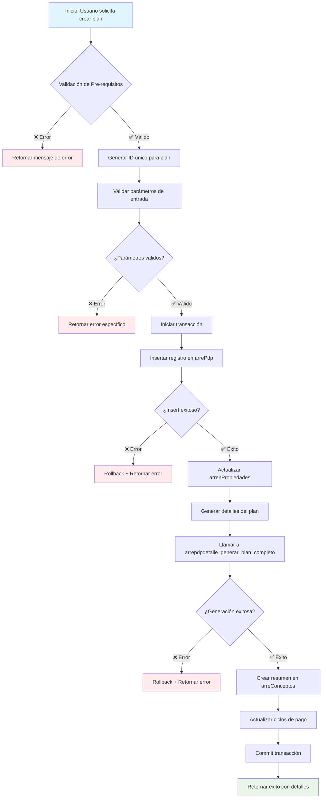

# Flujo y Validaciones para Creación de arrePdp - supaSPH-QR

## 📋 Descripción General

Este documento explica detalladamente el flujo completo y las validaciones necesarias para crear un registro en la tabla `arrePdp` (Plan de Pagos Principal) en el sistema supaSPH-QR, basado en el código FlutterFlow existente y las funciones PostgreSQL implementadas.

## 🔄 Flujo Completo de Creación



## 🔍 Validaciones Necesarias

### 1. **Validaciones de Pre-requisitos**

#### 1.1. Validación de Usuario
```sql
-- Verificar que el usuario exista y tenga permisos
SELECT uid, nombre, status 
FROM public."catUsers" 
WHERE uid = p_uid AND status = true;
```

**Campos requeridos**:
- `p_uid`: UUID del usuario que crea el plan

**Validaciones**:
- El usuario debe existir en `catUsers`
- El usuario debe tener `status = true`
- El usuario debe tener permisos para crear planes

#### 1.2. Validación de Arrendador
```sql
-- Verificar que el arrendador exista
SELECT idArrendatario, nombre, status
FROM public."catArrendatarios"  -- u tabla correspondiente
WHERE idArrendatario = p_id_arrendador AND status = true;
```

**Campos requeridos**:
- `p_id_arrendador`: ID del arrendador/propietario

**Validaciones**:
- El arrendador debe existir
- El arrendador debe estar activo

#### 1.3. Validación de Propiedad
```sql
-- Verificar que la propiedad exista y no tenga PDP
SELECT idNavArrend, nombreNave, tienePdp, status
FROM public."arrenPropiedades"
WHERE idNavArrend = p_id_nav_arrend AND status = true;
```

**Campos requeridos**:
- `p_id_nav_arrend`: ID de la nave/propiedad

**Validaciones**:
- La propiedad debe existir
- La propiedad debe estar activa
- **CRÍTICO**: La propiedad NO debe tener PDP (`tienePdp = false`)

### 2. **Validaciones de Parámetros de Entrada**

#### 2.1. Parámetros Obligatorios
```sql
-- Validación de nulos y vacíos
IF p_id_arre_pdp IS NULL OR TRIM(p_id_arre_pdp) = '' THEN
    RETURN jsonb_build_object(
        'exito', false,
        'codigo', 'PARAMETRO_INVALIDO',
        'mensaje', 'El ID del plan es obligatorio'
    );
END IF;

IF p_id_arrendador IS NULL OR TRIM(p_id_arrendador) = '' THEN
    RETURN jsonb_build_object(
        'exito', false,
        'codigo', 'PARAMETRO_INVALIDO',
        'mensaje', 'El ID del arrendador es obligatorio'
    );
END IF;

IF p_uid IS NULL THEN
    RETURN jsonb_build_object(
        'exito', false,
        'codigo', 'PARAMETRO_INVALIDO',
        'mensaje', 'El ID del usuario es obligatorio'
    );
END IF;

IF p_fec_inicio IS NULL THEN
    RETURN jsonb_build_object(
        'exito', false,
        'codigo', 'PARAMETRO_INVALIDO',
        'mensaje', 'La fecha de inicio es obligatoria'
    );
END IF;
```

#### 2.2. Validaciones de Rango
```sql
-- Validación de plazo
IF p_plazo IS NULL OR p_plazo <= 0 OR p_plazo > 120 THEN
    RETURN jsonb_build_object(
        'exito', false,
        'codigo', 'PARAMETRO_INVALIDO',
        'mensaje', 'El plazo debe ser un número entre 1 y 120 meses'
    );
END IF;

-- Validación de montos
IF p_deposito < 0 THEN
    RETURN jsonb_build_object(
        'exito', false,
        'codigo', 'PARAMETRO_INVALIDO',
        'mensaje', 'El depósito no puede ser negativo'
    );
END IF;

IF p_precio_m2 <= 0 THEN
    RETURN jsonb_build_object(
        'exito', false,
        'codigo', 'PARAMETRO_INVALIDO',
        'mensaje', 'El precio por m2 debe ser mayor a 0'
    );
END IF;

IF p_construccion_m2 <= 0 THEN
    RETURN jsonb_build_object(
        'exito', false,
        'codigo', 'PARAMETRO_INVALIDO',
        'mensaje', 'Los metros cuadrados de construcción deben ser mayores a 0'
    );
END IF;
```

#### 2.3. Validaciones de Lógica de Negocio
```sql
-- Validación de fecha de inicio
IF p_fec_inicio < CURRENT_DATE THEN
    RETURN jsonb_build_object(
        'exito', false,
        'codigo', 'FECHA_INVALIDA',
        'mensaje', 'La fecha de inicio no puede ser anterior a hoy'
    );
END IF;

-- Validación de cortesías
IF p_cortesia_renta < 0 OR p_cortesia_renta >= p_plazo THEN
    RETURN jsonb_build_object(
        'exito', false,
        'codigo', 'CORTESIA_INVALIDA',
        'mensaje', 'Las cortesías de renta deben estar entre 0 y el plazo-1'
    );
END IF;

-- Validación similar para otras cortesías
IF p_cortesia_admin < 0 OR p_cortesia_admin >= p_plazo OR
   p_cortesia_mtto < 0 OR p_cortesia_mtto >= p_plazo OR
   p_cortesia_vig < 0 OR p_cortesia_vig >= p_plazo THEN
    RETURN jsonb_build_object(
        'exito', false,
        'codigo', 'CORTESIA_INVALIDA',
        'mensaje', 'Las cortesías deben estar entre 0 y el plazo-1'
    );
END IF;
```

### 3. **Validaciones de Integridad**

#### 3.1. Verificación de Duplicados
```sql
-- Verificar que el plan no exista previamente
IF EXISTS (SELECT 1 FROM public."arrePdp" WHERE "idArrePdp" = p_id_arre_pdp) THEN
    RETURN jsonb_build_object(
        'exito', false,
        'codigo', 'REGISTRO_DUPLICADO',
        'mensaje', 'El plan ya existe en la base de datos',
        'detalles', jsonb_build_object('id_plan', p_id_arre_pdp)
    );
END IF;
```

#### 3.2. Verificación de Disponibilidad de INPC
```sql
-- Verificar que existan datos de INPC para el período
SELECT COUNT(*) INTO v_inpc_count
FROM public.inpc 
WHERE anio >= EXTRACT(YEAR FROM p_fec_inicio)::smallint 
  AND anio <= EXTRACT(YEAR FROM p_fec_inicio + INTERVAL '1 month' * p_plazo)::smallint;

IF v_inpc_count = 0 THEN
    RETURN jsonb_build_object(
        'exito', false,
        'codigo', 'INPC_NO_DISPONIBLE',
        'mensaje', 'No hay datos de INPC disponibles para el período solicitado'
    );
END IF;
```

## 📝 Estructura del Registro arrePdp

### Campos Principales

```sql
CREATE TABLE public."arrePdp" (
    "idArrePdp" text PRIMARY KEY,
    "uid" uuid NOT NULL,                    -- Usuario que crea
    "idArrendador" text NOT NULL,           -- ID del arrendador
    "idNavArrend" text NOT NULL,            -- ID de la propiedad
    "fecInicio" date NOT NULL,              -- Fecha de inicio
    "plazo" integer NOT NULL,               -- Plazo en meses
    "deposito" double precision,            -- Monto del depósito
    "precioM2" double precision NOT NULL,   -- Precio por m2
    "construccionM2" double precision NOT NULL, -- m2 de construcción
    "rtaBase" double precision,             -- Renta base calculada
    "INPC" double precision DEFAULT 0.0,    -- INPC inicial
    "INPCPlus" double precision DEFAULT 0.0, -- Puntos adicionales INPC
    "pm2Admin" double precision DEFAULT 0.0, -- Precio m2 administración
    "pm2Mtto" double precision DEFAULT 0.0,  -- Precio m2 mantenimiento
    "pm2Vig" double precision DEFAULT 0.0,   -- Precio m2 vigilancia
    "fc" timestamp DEFAULT NOW(),           -- Fecha de creación
    "status" boolean DEFAULT true           -- Estado del registro
);
```

### Campos Calculados

```sql
-- Cálculo de renta base
rtaBase = precioM2 * construccionM2

-- Ejemplo:
-- precioM2 = 150.0
-- construccionM2 = 100.0
-- rtaBase = 150.0 * 100.0 = 15,000.0
```

## 🚀 Flujo de Implementación

### Paso 1: Generación de ID Único
```sql
-- Generar ID único para el plan
p_id_arre_pdp := 'ARREPDP_' || 
                 EXTRACT(YEAR FROM NOW())::text ||
                 LPAD(EXTRACT(MONTH FROM NOW())::text, 2, '0') ||
                 LPAD(EXTRACT(DAY FROM NOW())::text, 2, '0') ||
                 '_' ||
                 substr(md5(random()::text), 1, 8);
```

### Paso 2: Inserción del Registro Principal
```sql
INSERT INTO public."arrePdp" (
    "idArrePdp", "uid", "idArrendador", "idNavArrend", "fecInicio", "plazo",
    "deposito", "precioM2", "construccionM2", "rtaBase", "INPC", "INPCPlus",
    "pm2Admin", "pm2Mtto", "pm2Vig", "fc", "status"
) VALUES (
    p_id_arre_pdp, p_uid, p_id_arrendador, p_id_nav_arrend, 
    p_fec_inicio, p_plazo, p_deposito, p_precio_m2, p_construccion_m2,
    (p_precio_m2 * p_construccion_m2), p_inpc, p_inpc_plus,
    p_pm2_admin, p_pm2_mtto, p_pm2_vig, NOW(), true
);
```

### Paso 3: Actualización de Propiedad
```sql
-- Marcar la propiedad como con PDP
UPDATE public."arrenPropiedades"
SET "tienePdp" = true,
    "idArrePdp" = p_id_arre_pdp,
    "fc" = NOW()
WHERE "idNavArrend" = p_id_nav_arrend;
```

### Paso 4: Generación de Detalles del Plan
```sql
-- Llamar a la función existente para generar detalles
SELECT * INTO v_resultado_detalle
FROM arrepdpdetalle_generar_plan_completo(
    p_id_arre_pdp, p_id_arrendador, p_uid, p_fec_inicio, p_plazo,
    p_deposito, p_precio_m2, p_construccion_m2, p_inpc, p_inpc_plus,
    p_pm2_admin, p_pm2_mtto, p_pm2_vig,
    p_cortesia_renta, p_cortesia_admin, p_cortesia_mtto, p_cortesia_vig
);

IF NOT (v_resultado_detalle->>'exito')::boolean THEN
    RETURN v_resultado_detalle; -- Error en generación de detalles
END IF;
```

### Paso 5: Creación de Resumen de Conceptos
```sql
-- Insertar resumen de conceptos
INSERT INTO public."arreConceptos" (
    "idArreConcepto", "uid", "idArrendador", "idArrePdp", "concepto", "monto", "fc", "status"
) VALUES 
    (p_id_arre_pdp || '_CONC_RENTA', p_uid, p_id_arrendador, p_id_arre_pdp, 'Renta', (p_precio_m2 * p_construccion_m2), NOW(), true),
    (p_id_arre_pdp || '_CONC_SERV', p_uid, p_id_arrendador, p_id_arre_pdp, 'Servicios', (p_pm2_admin * p_construccion_m2), NOW(), true),
    (p_id_arre_pdp || '_CONC_VIG', p_uid, p_id_arrendador, p_id_arre_pdp, 'Vigilancia', (p_pm2_vig * p_construccion_m2), NOW(), true),
    (p_id_arre_pdp || '_CONC_ADMIN', p_uid, p_id_arrendador, p_id_arre_pdp, 'Administracion', (p_pm2_admin * p_construccion_m2), NOW(), true);
```

### Paso 6: Actualización de Ciclos
```sql
-- Actualizar ciclos de pago
PERFORM actualizar_ciclo_plan_pago();
```

## 📊 Retorno de Resultados

### Estructura JSON de Respuesta

#### Caso de Éxito
```json
{
    "exito": true,
    "codigo": "EXITO",
    "mensaje": "Plan de pagos creado correctamente",
    "detalles": {
        "id_plan": "ARREPDP_20251024_ABC12345",
        "id_arrendador": "ARREND_001",
        "id_propiedad": "PROP_001",
        "plazo_meses": 24,
        "deposito": 50000.0,
        "renta_base": 15000.0,
        "fecha_inicio": "2025-01-01",
        "detalles_generados": {
            "partidas_totales": 97,
            "deposito_insertado": true,
            "conceptos_por_mes": 4,
            "conceptos_creados": 4
        },
        "timestamp": "2025-10-24T04:00:00.000Z"
    }
}
```

#### Caso de Error
```json
{
    "exito": false,
    "codigo": "PARAMETRO_INVALIDO",
    "mensaje": "El plazo debe ser un número entre 1 y 120 meses",
    "detalles": {
        "parametro": "plazo",
        "valor_recibido": 0,
        "valor_esperado": "1-120",
        "timestamp": "2025-10-24T04:00:00.000Z"
    }
}
```

## ⚠️ Consideraciones Importantes

### 1. **Manejo de Transacciones**
- Todas las operaciones deben estar dentro de una transacción
- Usar `BEGIN/COMMIT/ROLLBACK` para asegurar consistencia
- Si cualquier paso falla, hacer rollback completo

### 2. **Seguridad**
- La función debe usar `SECURITY INVOKER`
- Validar permisos del usuario antes de ejecutar
- Registrar quién y cuándo se creó el plan

### 3. **Performance**
- La función `arrepdpdetalle_generar_plan_completo` ya está optimizada
- Evitar consultas innecesarias en bucles
- Usar índices adecuados en las tablas

### 4. **Logging**
- Registrar eventos importantes en tabla de logs
- Incluir ID del plan, usuario y timestamp
- Registrar errores con detalles para depuración

## 🧪 Ejemplo de Uso Completo

```sql
-- Ejemplo de llamada a la función principal
SELECT * FROM arrepdp_crear_plan_completo(
    -- Parámetros principales
    'ARREND_001',                    -- id_arrendador
    '123e4567-e89b-12d3-a456-426614174000', -- uid
    'PROP_001',                      -- id_nav_arrend
    '2025-01-01'::date,              -- fec_inicio
    24,                              -- plazo (meses)
    
    -- Parámetros financieros
    50000.0,                         -- deposito
    150.0,                           -- precio_m2
    100.0,                           -- construccion_m2
    
    -- Parámetros de conceptos
    25.0,                            -- pm2_admin
    15.0,                            -- pm2_mtto
    10.0,                            -- pm2_vig
    
    -- Parámetros de INPC
    110.5,                           -- inpc
    2.0,                             -- inpc_plus
    
    -- Parámetros de cortesías
    0,                               -- cortesia_renta
    1,                               -- cortesia_admin
    2,                               -- cortesia_mtto
    0                                -- cortesia_vig
);
```

---

**Fecha de creación**: 24/10/2025 04:05:00  
**Autor**: Sistema de Documentación supaSPH-QR  
**Versión**: 1.0  
**Estado**: Documentación Completa ✅