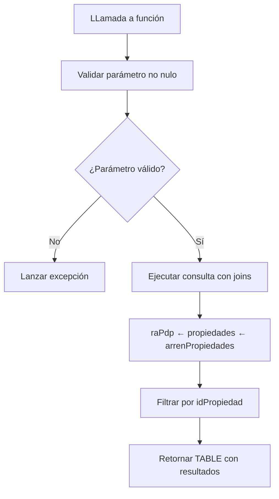
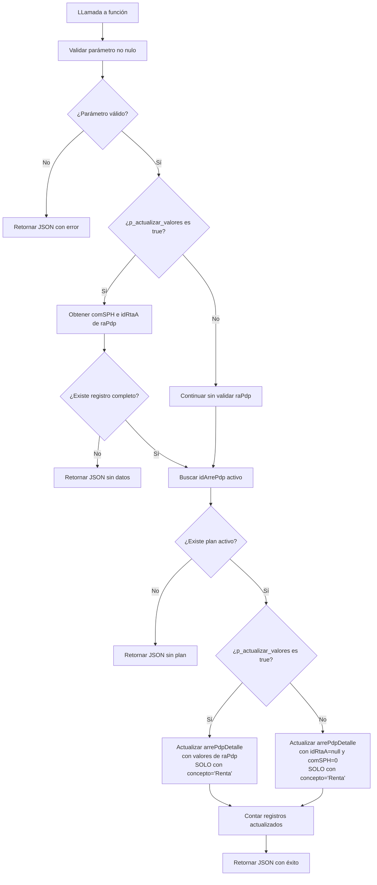

# Funciones y Triggers - raPdp

## Overview

Esta carpeta contiene las funciones y triggers asociados a la tabla `raPdp` (Respuestas de Planes de Pago), que gestionan la obtención y procesamiento de datos relacionados con propiedades y arrendamientos.

## Componentes Actuales

### 1. `rapdp_obtener_datos_propiedad.sql`

**Tipo**: Función SQL
**Fecha de creación**: 17/12/2025 16:41:00
**Seguridad**: SECURITY INVOKER

**Propósito**: Obtiene los campos `idNavArrend`, `comSPH` y `idRtaA` para una propiedad específica mediante joins entre las tablas `raPdp`, `propiedades` y `arrenPropiedades`.

**Parámetros**:
- `p_idpropiedad` (text): ID de la propiedad a consultar

**Retorno**: TABLE con los campos:
- `idNavArrend` (text): ID de la nave arrendada
- `comSPH` (text): Comisión SPH
- `idRtaA` (text): ID de respuesta A

**Validaciones implementadas**:
- Verifica que el parámetro `p_idpropiedad` no sea nulo
- Retorna registros vacíos si no encuentra coincidencias

### 2. `rapdp_Actualizar.sql`

**Tipo**: Función SQL
**Fecha de creación**: 17/12/2025 16:48:00
**Última actualización**: 17/12/2025 17:44:00
**Seguridad**: SECURITY INVOKER

**Propósito**: Actualiza los campos `comSPH` y `idRtaA` en la tabla `arrePdpDetalle` para una propiedad específica. Realiza el proceso completo:
1. Obtiene `idNavArrend` desde `raPdp` usando `idPropiedad`
2. Busca `idArrePdp` en `arrePdp` usando `idNavArrend`
3. Actualiza `arrePdpDetalle` con los valores de `comSPH` e `idRtaA` o los limpia según el parámetro
   - **IMPORTANTE**: Solo actualiza registros donde `concepto = 'Renta'`

**Parámetros**:
- `p_idpropiedad` (text): ID de la propiedad a procesar
- `p_actualizar_valores` (boolean, opcional): Si es true (default), usa los valores de raPdp. Si es false, establece `idRtaA = null` y `comSPH = 0`

**Retorno**: JSONB con objeto que contiene:
- `exito` (boolean): Indica si la operación fue exitosa
- `codigo` (text): Código de resultado
- `mensaje` (text): Descripción del resultado
- `detalles` (jsonb): Objeto con detalles de la operación incluyendo el valor del parámetro `actualizar_valores`

**Validaciones implementadas**:
- Verifica que el parámetro `p_idpropiedad` no sea nulo
- Si `p_actualizar_valores` es true, verifica que existan datos completos en `raPdp` (`comSPH` e `idRtaA` no nulos)
- Verifica que exista `idNavArrend` en `arrenPropiedades`
- Verifica que exista plan activo en `arrePdp`
- Filtra actualizaciones solo para registros con `concepto = 'Renta'`
- Maneja casos donde no hay registros para actualizar
- Manejo de errores con captura de excepciones

## Flujo de Procesamiento

### Flujo para `rapdp_obtener_datos_propiedad`



### Flujo para `rapdp_Actualizar`



## Comportamiento Detallado

### `rapdp_obtener_datos_propiedad`

1. **Validación de entrada**: Verifica que el `idPropiedad` proporcionado no sea nulo
2. **Ejecución de consulta**: Realiza joins entre tres tablas:
   - `raPdp`: Tabla principal que contiene los datos básicos
   - `propiedades`: Relacionada mediante `idPropiedad`
   - `arrenPropiedades`: Relacionada mediante `idNave`
3. **Filtrado**: Aplica filtro WHERE para el `idPropiedad` específico
4. **Retorno**: Devuelve una tabla estructurada con los tres campos solicitados

### `rapdp_Actualizar`

1. **Validación de entrada**: Verifica que el `idPropiedad` proporcionado no sea nulo o vacío
2. **Obtención de idNavArrend**: Siempre consulta en `raPdp` con joins a `propiedades` y `arrenPropiedades` para obtener `idNavArrend`
3. **Obtención condicional de datos**: Si `p_actualizar_valores` es true, también obtiene:
   - `comSPH`: Comisión SPH
   - `idRtaA`: ID de respuesta A
   - Si `p_actualizar_valores` es false, omite esta validación
4. **Búsqueda de plan activo**: Busca el plan más reciente en `arrePdp` usando `idNavArrend`
5. **Actualización masiva condicional**: Actualiza los registros en `arrePdpDetalle` que pertenecen al plan encontrado:
   - **Si `p_actualizar_valores` es true**: Usa los valores de `comSPH` e `idRtaA` obtenidos de `raPdp`
   - **Si `p_actualizar_valores` es false**: Establece `idRtaA = null` y `comSPH = 0`
   - **Restricción importante**: Solo actualiza registros donde `concepto = 'Renta'`
6. **Retorno JSON**: Devuelve un objeto JSON con detalles del resultado incluyendo:
   - Éxito/fracaso de la operación
   - Cantidad de registros actualizados
   - Datos utilizados en la actualización (o valores predeterminados si se limpiaron)
   - Valor del parámetro `actualizar_valores`
   - Timestamp de la operación

## Instalación

Para instalar estos componentes en la base de datos:

```sql
-- Ejecutar el archivo SQL directamente
\i raPdp/funciones y trigger/rapdp_obtener_datos_propiedad.sql
\i raPdp/funciones y trigger/rapdp_Actualizar.sql

-- O ejecutar el script de instalación completo
\i raPdp/funciones y trigger/instalar_todo.sql
```

## Ejemplos de Uso

### Uso básico de `rapdp_obtener_datos_propiedad`
```sql
-- Obtener datos de una propiedad específica
SELECT * FROM rapdp_obtener_datos_propiedad('ABcqzhvE8a3x');
```

### Uso básico de `rapdp_Actualizar`
```sql
-- Actualizar campos comSPH e idRtaA para una propiedad usando valores de raPdp
-- Solo afectará a registros con concepto = 'Renta'
SELECT * FROM rapdp_Actualizar('ABcqzhvE8a3x');

-- Limpiar campos comSPH e idRtaA para una propiedad
-- Establece comSPH = 0 y idRtaA = null
SELECT * FROM rapdp_Actualizar('ABcqzhvE8a3x', false);
```

### Uso en aplicación
```sql
-- Integración con aplicación frontend para obtener datos
SELECT "idNavArrend", "comSPH", "idRtaA"
FROM rapdp_obtener_datos_propiedad(:idPropiedad);

-- Integración para actualizar datos
SELECT * FROM rapdp_Actualizar(:idPropiedad);

-- Integración para limpiar datos
SELECT * FROM rapdp_Actualizar(:idPropiedad, false);
```

### Ejemplo de respuesta JSON de `rapdp_Actualizar` (con actualización)
```json
{
  "exito": true,
  "codigo": "EXITO",
  "mensaje": "Actualización completada correctamente",
  "detalles": {
    "idPropiedad": "ABcqzhvE8a3x",
    "idNavArrend": "NV123456",
    "idArrePdp": "AR789012",
    "comSPH": "15.5",
    "idRtaA": "RT345678",
    "actualizar_valores": true,
    "registros_actualizados": 24,
    "existe_datos_ra_pdp": true,
    "existe_plan_activo": true,
    "timestamp": "2025-12-17T16:48:00.000Z"
  }
}
```

### Ejemplo de respuesta JSON de `rapdp_Actualizar` (limpiando valores)
```json
{
  "exito": true,
  "codigo": "EXITO",
  "mensaje": "Actualización completada correctamente",
  "detalles": {
    "idPropiedad": "ABcqzhvE8a3x",
    "idNavArrend": "NV123456",
    "idArrePdp": "AR789012",
    "comSPH": "0",
    "idRtaA": null,
    "actualizar_valores": false,
    "registros_actualizados": 24,
    "existe_datos_ra_pdp": true,
    "existe_plan_activo": true,
    "timestamp": "2025-12-17T17:44:00.000Z"
  }
}
```

## Consideraciones de Rendimiento

### Para `rapdp_obtener_datos_propiedad`
- La función utiliza LEFT JOINs para asegurar que se retornen resultados incluso si faltan relaciones
- Se recomienda tener índices en los campos de unión:
  - `propiedades(idPropiedad)`
  - `raPdp(idPropiedad)`
  - `arrenPropiedades(idNave)`

### Para `rapdp_Actualizar`
- La función realiza una actualización filtrada en `arrePdpDetalle` (solo registros con concepto='Renta'), lo que reduce el impacto en rendimiento
- Se recomienda ejecutarla durante horas de baja actividad si se espera actualizar muchos registros
- Considerar agregar índices en:
  - `arrePdp(idNavArrend)`
  - `arrePdpDetalle(idArrePdp)`
  - `arrePdpDetalle(concepto)` - para optimizar el filtro por concepto

## Relaciones con Otros Componentes

### Tablas relacionadas
- `raPdp`: Tabla principal de respuestas de planes de pago
- `propiedades`: Catálogo de propiedades del sistema
- `arrenPropiedades`: Propiedades específicas de arrendamiento
- `arrePdp`: Planes de pago arrendados
- `arrePdpDetalle`: Detalles de planes de pago arrendados

### Posibles integraciones futuras
- Funciones de validación de propiedades
- Triggers para actualización automática de datos
- Vistas que consuman estas funciones para reportes
- Funciones de rollback para deshacer actualizaciones masivas

## Estado Actual

- **Total de funciones**: 2
- **Total de triggers**: 0
- **Estado**: Activo y documentado
- **Última actualización**: 17/12/2025 17:44:00

## Notas Importantes

1. **Campo idRtaA**: Aunque no se encontró documentación específica sobre este campo, se incluye según la solicitud del usuario
2. **Seguridad**: Ambas funciones utilizan SECURITY INVOKER para respetar los permisos del usuario que las ejecuta
3. **Manejo de nulos**: Las funciones incluyen validación explícita de los parámetros de entrada
4. **Conversión de tipos**: La función `rapdp_Actualizar` realiza conversión explícita de `text` a `real` para el campo `comSPH`
5. **Filtro por concepto**: A partir de la versión actualizada, la función solo actualiza registros donde `concepto = 'Renta'`
6. **Validaciones mejoradas**: Se agregaron validaciones específicas para verificar que `comSPH` e `idRtaA` no sean nulos (solo cuando `p_actualizar_valores` es true), y que exista `idNavArrend`
7. **Parámetro opcional**: Se agregó el parámetro `p_actualizar_valores` (boolean, default true) para permitir limpiar los campos estableciendo `idRtaA = null` y `comSPH = 0`

## Mantenimiento

- Revisar periódicamente el rendimiento de los joins y actualizaciones masivas
- Actualizar documentación si se agregan nuevos campos
- Considerar agregar parámetros opcionales para filtrado adicional
- Monitorear el impacto de las actualizaciones masivas en el rendimiento general

---

**Fecha de documentación**: 17/12/2025  
**Versión**: 1.0  
**Estado**: Documentación completa