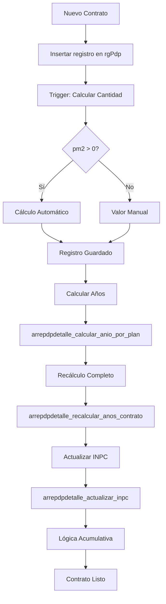

# Documentación de la Tabla rgPdp

## 📋 Descripción General

La tabla `rgPdp` almacena los planes de pago de arrendamiento garantizados del sistema SPH. Contiene la información principal de los contratos de arrendamiento con garantía, incluyendo detalles financieros, fechas y estados de los planes.

## 🏗️ Estructura de la Tabla

### Campos Principales

| Campo | Tipo | Descripción |
|-------|------|-------------|
| `idRtaG` | text | Identificador único del plan de pago garantizado |
| `uid` | uuid | Identificador único del registro |
| `fc` | timestamp | Fecha de creación |
| `status` | boolean | Estado del registro (activo/inactivo) |
| `idPropiedad` | text | Identificador de la propiedad asociada |
| `rentaActiva` | numeric | Monto de renta activa |
| `precioM2` | numeric | Precio por metro cuadrado |
| `tasaIVA` | numeric | Tasa de IVA |
| `fechaInicio` | date | Fecha de inicio del contrato |
| `duracionRenta` | smallint | Duración del contrato en meses |
| `estadoRenta` | text | Estado de la renta |
| `observaciones` | text | Observaciones adicionales |
| `fechaFin` | date | Fecha de finalización del contrato |
| `subtotal` | numeric | Subtotal del contrato |
| `m2Construccion` | numeric | Metros cuadrados de construcción |
| `iva` | numeric | Monto del IVA |
| `total` | numeric | Monto total del contrato |
| `tieneRg` | boolean | Indica si tiene garantía |
| `cumpMin` | boolean | Cumplimiento mínimo |
| `proporcional` | boolean | Proporcional |
| `incrementoAnual` | numeric | Incremento anual |

### Campos de Control

| Campo | Tipo | Descripción |
|-------|------|-------------|
| `fc` | timestamp | Fecha de creación |
| `uidc` | uuid | Usuario que creó el registro |
| `montoDividido` | boolean | Indica si el monto fue dividido |
| `UltimoPago` | boolean | Marca si es el último pago |
| `ciclo` | integer | Ciclo de pago (año de inicio) |

### Campos de Pago

| Campo | Tipo | Descripción |
|-------|------|-------------|
| `comprobantePago` | text | Referencia del comprobante de pago |
| `cantidadAplicada` | double precision | Monto realmente pagado |
| `uidPago` | uuid | Usuario que registró el pago |
| `fecPago` | date | Fecha del pago realizado |

## 🔗 Relaciones con Otras Tablas

### Relaciones Principales
- **`arrenPropiedades`** (`idPropiedad`) - Propiedad asociada
- **`catUsers`** (`uidc`) - Usuario que crea el registro
- **`catTipoOperacion`** (`tipoOperacion`) - Tipo de operación

### Relaciones Secundarias
- **`inpc`** - Para obtener valores del índice INPC

## 📁 Estructura de Carpetas

```
rentaGarantizada/
├── funciones y trigger/          # Funciones y triggers asociados
│   ├── README.md               # Documentación detallada de componentes
│   ├── instalar_todo.sql       # Script de instalación completa
│   └── ...                     # Funciones y triggers específicos de rgPdp
├── vistas/                     # Vistas asociadas (vacío - no hay vistas)
└── README.md                  # Documentación de la tabla principal
```

## 🔄 Flujo de Procesamiento



## 🔧 Componentes Disponibles

### Funciones (7)
1. `rgpdp_insertar_registro.sql` - Función para insertar registros en rgPdp con cálculos automáticos (NUEVA)
2. `rgpdp_generar_plan_pagos.sql` - Función para generar plan de pagos de Renta Garantizada (NUEVA)
3. `arrepdp_crear_plan_completo_rpc.sql` - Función RPC principal para crear planes completos
4. `arrepdp_crear_plan_simple_rpc.sql` - Función RPC simplificada con validación de superposición de períodos
5. `arrepdp_generar_detalle_desde_plan.sql` - Función para generar detalles de plan desde un plan existente
6. `arrepdp_agregar_concepto_financiado.sql` - Función para agregar conceptos financiados a planes existentes
7. `arrepdp_eliminar_plan_y_actualizar_estados.sql` - Función para eliminar un plan y actualizar estados de propiedad y nave

### Triggers (0)
- No hay triggers asociados directamente a esta tabla

### Vistas (0)
- No hay vistas asociadas

## 📊 Estado Actual
- **Total funciones**: 7 ✅
- **Total triggers**: 0 ✅
- **Total vistas**: 0 ❌
- **Documentación**: Completa ✅
- **Scripts de instalación**: Disponibles ✅

## 🚀 Instalación
### Instalación Completa
```sql
-- Desde la carpeta funciones y trigger/
\i instalar_todo.sql
```

### Instalación Individual
```sql
-- Instalar funciones en orden
\i rgpdp_insertar_registro.sql
\i rgpdp_generar_plan_pagos.sql
\i arrepdp_crear_plan_completo_rpc.sql
\i arrepdp_crear_plan_simple_rpc.sql
\i arrepdp_generar_detalle_desde_plan.sql
\i arrepdp_agregar_concepto_financiado.sql
\i arrepdp_eliminar_plan_y_actualizar_estados.sql

-- Instalar trigger al final
\i trigger_arrepdpdetalle_calcular_cantidad.sql
```

## 💡 Casos de Uso Típicos

### 1. Crear Nuevo Contrato con Función Automatizada (NUEVO)
```sql
-- Insertar registro usando la función con cálculos automáticos
SELECT * FROM rgpdp_insertar_registro(
    'PROP_001',           -- idPropiedad
    15000.0,              -- rentaActiva
    150.0,                -- precioM2
    16.0,                 -- tasaIVA
    '2026-01-01'::date,   -- fecInicio
    'Activo',              -- estadoRenta
    '2028-01-01'::date,   -- fechaFin
    100.0,                -- m2Construccion
    1920.0,               -- iva
    true,                  -- tieneRG
    true,                  -- cumpMin
    false,                 -- proporcional
    0.0,                  -- incrementoAnual
    'uuid-usuario'::uuid   -- uid
);

-- Resultado esperado: JSON con éxito y datos calculados automáticamente
```

### 2. Generar Plan de Pagos de Renta Garantizada (NUEVO)
```sql
-- Generar las partidas mensuales de pago para un plan existente
SELECT * FROM rgpdp_generar_plan_pagos('RG_1234567890abcdef');

-- Resultado esperado: JSON con éxito y datos del plan generado
-- {
--   "exito": true,
--   "codigo": "PLAN_GENERADO",
--   "mensaje": "Plan de pagos generado exitosamente",
--   "datos": {
--     "idRtaG": "RG_1234567890abcdef",
--     "idPropiedad": "PROP_001",
--     "duracionRenta": 24,
--     "montoTotal": 13920.0,
--     "montoMensual": 580.0,
--     "partidasGeneradas": 24,
--     "fechaInicio": "2026-01-01",
--     "fechaFin": "2028-01-01",
--     "concepto": "Renta Garantizada"
--   }
-- }
```

### 2. Crear Nuevo Contrato (Método Manual)
```sql
-- Insertar registro en rgPdp manualmente
INSERT INTO "rentaGarantizada"."rgPdp" (idRtaG, uid, fc, status, idPropiedad, rentaActiva, precioM2, tasaIVA, fechaInicio, duracionRenta, estadoRenta, observaciones, fechaFin, subtotal, m2Construccion, iva, total, tieneRg, cumpMin, proporcional, incrementoAnual)
VALUES ('RG_2026_01_01_001', 'uuid_abc123', now(), true, 'PROP_001', 15000.0, 150.0, 16.0, '2026-01-01', 24, 'Activo', 'Plan de pago garantizado', '2029-01-01', 12000.0, 100.0, 1920.0, 13920.0, true, true, false, 0.0);

-- Calcular años automáticamente
SELECT arrepdpdetalle_calcular_anio_por_plan('PROP_001');

-- Recalcular con manejo de depósitos
SELECT arrepdpdetalle_recalcular_anos_contrato('PROP_001');

-- Actualizar INPC
SELECT * FROM arrepdpdetalle_actualizar_inpc('PROP_001');

-- Actualizar ciclos
SELECT actualizar_ciclo_plan_pago();
```

### 2. Ajuste Manual de Montos
```sql
-- Actualizar campo específico de forma segura
SELECT arrepdpdetalle_actualizar_campo_manual(
    'PROP_001', 3, 'rentaActiva', 'precioM2', 5.2
);
```

### 3. Recálculo Masivo
```sql
-- Recalcular todas las cantidades del sistema
SELECT arrepdpdetalle_recalcular_todas_cantidades();
```

### 4. Actualización Parcial de INPC
```sql
-- Actualizar INPC desde año específico
SELECT * FROM arrepdpdetalle_actualizar_inpc_desde_anio('PROP_001', 3);
```

### 5. Actualización de Ciclos
```sql
-- Actualizar ciclos para todos los contratos
SELECT actualizar_ciclo_plan_pago();
```

### 6. Aplicar Meses de Gracia
```sql
-- Aplicar meses de gracia según configuración JSON del plan
SELECT arrePdpDetalle_aplicar_meses_gracia('PROP_001');

-- Ejemplo con JSON {"renta": 1, "vigilancia": 6, "mantenimiento": 5.5, "administracion": 0}:
-- - Renta: Mes 1 → pm2 = 0, tieneMesGratis = 'Si'
-- - Vigilancia: Meses 1-6 → pm2 = 0, tieneMesGratis = 'Si'
-- - Mantenimiento: Meses 1-5 → pm2 = 0, tieneMesGratis = 'Si'; Mes 6 → pm2 = pm2/2, tieneMesGratis = 'Medio'
-- - Administración: Sin descuentos aplicados
```

### 7. Generación de Plan Completo
```sql
-- Generar plan completo con todos los conceptos
SELECT * FROM arrepdpdetalle_generar_plan_completo(
    'PROP_001', 'ID_ARRENDADOR', 'UUID_USER',
    '2026-01-01', 24, 50000.0, 150.0, 100.0,
    110.5, 2.0, 25.0, 15.0, 10.0,
    0, 1, 2, 0
);
```

### 8. Obtener Resumen de Plan
```sql
-- Obtener resumen agrupado por partida de un plan específico (con validación por defecto)
SELECT * FROM arrepdpdetalle_obtener_resumen_por_plan('PROP_001');

-- Obtener resumen SIN validación de pdpActivo
SELECT * FROM arrepdpdetalle_obtener_resumen_por_plan('PROP_001', false);

-- Resultado esperado: tabla con:
-- - numPartida: número de partida agrupado
-- - anio: año máximo de la partida
-- - fecha: fecha mínima de la partida
-- - pm2, constM2, INPC, ptsINPC, totalINPC: valores del concepto 'Renta'
-- - ciclo: ciclo máximo de la partida
-- - total_cantidad: suma de cantidades de todos los conceptos
-- - idArrePdp: ID del plan
```

## ⚠️ Consideraciones Importantes
1. **Orden de Instalación**: Las funciones dependen de las funciones de `arrepdpDetalle`
2. **Rendimiento**: Las funciones masivas afectan a toda la tabla
3. **Seguridad**: Todas las funciones usan SECURITY INVOKER
4. **Dependencias**: Las funciones de INPC requieren datos en tabla `inpc`
5. **Cálculo Automático**: El trigger garantiza consistencia en cantidades

## 🔗 Políticas RLS
La tabla tiene Row Level Security (RLS) habilitado. Las funciones heredan los permisos del usuario que las ejecuta (SECURITY INVOKER).

## 📝 Historial de Cambios
- **28/01/2026 08:20:00**: Creación de `rgpdp_generar_plan_pagos()` - Función para generar plan de pagos de Renta Garantizada basado en un registro existente en rgPdp
- **28/01/2026 04:01:00**: Creación de `rgpdp_insertar_registro()` - Función para insertar registros con cálculos automáticos de idRtaG, duración, subtotal y total
- **27/11/2025 18:06:00**: Documentación completa de `arrepdp_agregar_concepto_financiado()` - Función para agregar conceptos financiados a planes existentes
- **19/11/2025 11:05**: Creación de `arrepdp_eliminar_plan_y_actualizar_estados()` - Función para eliminar planes y actualizar estados
- **27/10/2025 18:15**: Actualización de `arrepdp_crear_plan_simple_rpc()` - Agregada validación de superposición de períodos
- **27/10/2025 01:51**: Creación de la función RPC simple - `arrepdp_crear_plan_simple_rpc()`
- **27/10/2025**: Creación de la función RPC principal - `arrepdp_crear_plan_completo_rpc()`
- **25/09/2025**: Fecha de referencia de las funciones originales

## 📚 Documentación Adicional
- **Documentación detallada de componentes**: [`funciones y trigger/README.md`](funciones%20y%20trigger/README.md)
- **Script de instalación**: [`funciones y trigger/instalar_todo.sql`](funciones%20y%20trigger/instalar_todo.sql)
- **Guía de documentación**: [`/.kilocode/rules/GUIA_DE_DOCUMENTACION.md`](../.kilocode/rules/GUIA_DE_DOCUMENTACION.md)

---
**Última actualización**: 28/01/2026 08:20:00
**Estado**: Documentación completa ✅
**Componentes listos para instalación**: 7/7 ✅