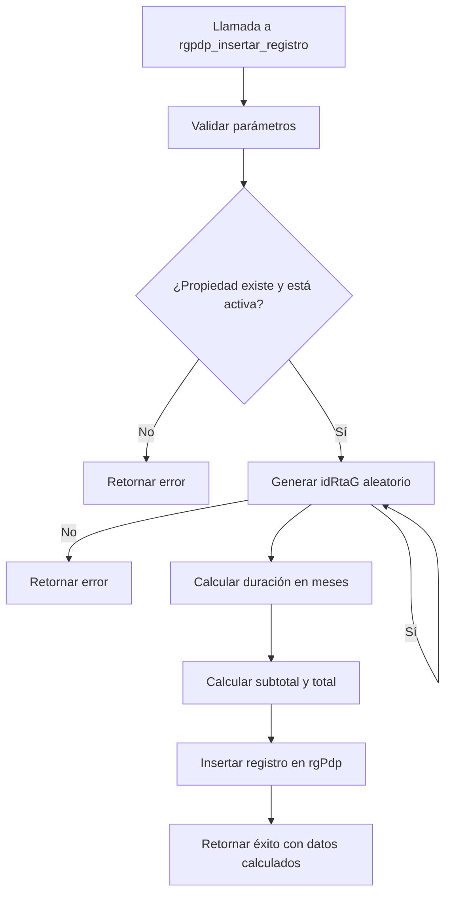

# Documentación de Funciones y Triggers - Módulo rentaGarantizada

## 📋 Descripción General

Este módulo contiene las funciones y triggers asociados a las tablas del sistema de renta garantizada (rgPdp, rgConceptos, rgPdpDetalle). Los componentes automatizan procesos de cálculo, inserción y gestión de planes de pago.

## 🏗️ Estructura de Componentes

### Funciones Disponibles

#### 1. `rgpdp_insertar_registro.sql`
- **Descripción**: Función para insertar registros en la tabla rgPdp con cálculos automáticos
- **Parámetros**: 
  - `p_idPropiedad` (text): Identificador de la propiedad
  - `p_rentaActiva` (numeric): Monto de renta activa
  - `p_precioM2` (numeric): Precio por metro cuadrado
  - `p_tasaIVA` (numeric): Tasa de IVA
  - `p_fecInicio` (date): Fecha de inicio del contrato
  - `p_estadoRenta` (text): Estado de la renta
  - `p_fechaFin` (date): Fecha de finalización del contrato
  - `p_m2Construccion` (numeric): Metros cuadrados de construcción
  - `p_iva` (numeric): Monto del IVA
  - `p_tieneRG` (boolean): Indica si tiene garantía
  - `p_cumpMin` (boolean): Cumplimiento mínimo
  - `p_proporcional` (boolean): Proporcional
  - `p_incrementoAnual` (numeric): Incremento anual
  - `p_uid` (uuid): Identificador único del usuario
- **Retorno**: `jsonb` con resultado de la operación
- **Cálculos automáticos**:
  - `idRtaG`: Generación aleatoria de 30 dígitos
  - `duracionRenta`: Cálculo de meses entre fechas
  - `subtotal`: `m2Construccion * precioM2`
  - `total`: `subtotal + iva`

## 🔄 Flujo de Procesamiento



## 📊 Estado Actual

- **Total funciones**: 1 ✅
- **Total triggers**: 0 ✅
- **Documentación**: Completa ✅
- **Scripts de instalación**: Disponibles ✅

## 🚀 Instalación

### Instalación Completa
```sql
-- Desde la carpeta raíz del proyecto
\i 'rentaGarantizada/funciones y trigger/instalar_todo.sql'
```

### Instalación Individual
```sql
-- Instalar función específica
\i 'rentaGarantizada/funciones y trigger/rgpdp_insertar_registro.sql'
```

## 💡 Casos de Uso Típicos

### 1. Insertar Nuevo Plan de Renta Garantizada
```sql
-- Ejemplo básico
SELECT * FROM rgpdp_insertar_registro(
    'PROP_001',           -- idPropiedad
    15000.0,              -- rentaActiva
    150.0,                -- precioM2
    16.0,                 -- tasaIVA
    '2026-01-01'::date,   -- fecInicio
    'Activo',              -- estadoRenta
    '2028-01-01'::date,   -- fechaFin
    100.0,                -- m2Construccion
    1920.0,               -- iva
    true,                  -- tieneRG
    true,                  -- cumpMin
    false,                 -- proporcional
    0.0,                  -- incrementoAnual
    'uuid-usuario'::uuid   -- uid
);
```

### 2. Ejemplo con Resultado Esperado
```json
{
  "exito": true,
  "codigo": "REGISTRO_CREADO",
  "mensaje": "Registro creado exitosamente",
  "datos": {
    "idRtaG": "RG_a1b2c3d4e5f6g7h8i9j0k1l2m3n4o5p6",
    "duracionRenta": 24,
    "subtotal": 15000.0,
    "total": 16920.0
  }
}
```

### 3. Manejo de Errores
```sql
-- Propiedad no existe
SELECT * FROM rgpdp_insertar_registro(
    'PROP_INEXISTENTE', 15000.0, 150.0, 16.0,
    '2026-01-01'::date, 'Activo', '2028-01-01'::date,
    100.0, 1920.0, true, true, false, 0.0, 'uuid-usuario'::uuid
);
-- Resultado: {"exito": false, "codigo": "PROPIEDAD_NO_EXISTE", ...}

-- Fechas inválidas
SELECT * FROM rgpdp_insertar_registro(
    'PROP_001', 15000.0, 150.0, 16.0,
    '2028-01-01'::date, 'Activo', '2026-01-01'::date,
    100.0, 1920.0, true, true, false, 0.0, 'uuid-usuario'::uuid
);
-- Resultado: {"exito": false, "codigo": "FECHAS_INVALIDAS", ...}
```

## ⚠️ Consideraciones Importantes

1. **Seguridad**: La función utiliza `SECURITY INVOKER` respetando permisos del usuario
2. **Validaciones**: 
   - Verifica existencia y estado activo de la propiedad
   - Valida consistencia de fechas (inicio < fin)
3. **Generación de IDs**: `idRtaG` se genera automáticamente con formato `RG_` + 28 caracteres aleatorios
4. **Manejo de Errores**: Retorna códigos de error específicos para facilitar depuración
5. **Dependencias**: Requiere que la tabla `arrenPropiedades` exista y tenga el campo `status`

## 🔗 Políticas RLS
La función respeta las políticas de Row Level Security (RLS) configuradas en las tablas del módulo rentaGarantizada.

## 📝 Historial de Cambios
- **28/01/2026 04:01:00**: Creación de `rgpdp_insertar_registro()` - Función principal para inserción con cálculos automáticos
- **28/01/2026 04:01:00**: Creación del script de instalación `instalar_todo.sql`
- **28/01/2026 04:02:00**: Creación de documentación completa del módulo

## 📚 Documentación Adicional
- **Documentación de tablas**: [`../rgPdp/README.md`](../rgPdp/README.md), [`../rgConceptos/README.md`](../rgConceptos/README.md), [`../rgPdpDetalle/README.md`](../rgPdpDetalle/README.md)
- **Guía de documentación**: [`/.kilocode/rules/GUIA_DE_DOCUMENTACION.md`](../../.kilocode/rules/GUIA_DE_DOCUMENTACION.md)
- **Instalación general**: [`/instalar_todo_general.sql`](../../instalar_todo_general.sql)

---
**Última actualización**: 28/01/2026 04:02:00
**Estado**: Documentación completa ✅
**Componentes listos para instalación**: 1/1 ✅