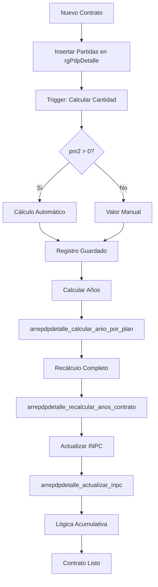

# Documentación de la Tabla rgPdpDetalle

## 📋 Descripción General

La tabla `rgPdpDetalle` almacena el detalle de los planes de pago de arrendamiento garantizados del sistema SPH. Contiene las partidas mensuales de cada contrato de arrendamiento con garantía, información detallada sobre montos, fechas y cálculos automáticos basados en índices como el INPC.

## 🏗️ Estructura de la Tabla

### Campos Principales

| Campo | Tipo | Descripción |
|-------|------|-------------|
| `idRGdet` | text | Identificador único del detalle del plan |
| `uid` | uuid | Identificador único del registro |
| `fc` | timestamp | Fecha de creación |
| `status` | boolean | Estado del registro (activo/inactivo) |
| `idRtaG` | text | Identificador del plan de pago principal |
| `numPago` | integer | Número de pago/secuencia del pago |
| `concepto` | text | Descripción del concepto de pago |
| `fecha` | timestamp | Fecha programada del pago |
| `pm2` | numeric | Precio por metro cuadrado |
| `constM2` | numeric | Constante de metros cuadrados |
| `cantidad` | real | Monto calculado del pago |
| `INPC` | real | Índice Nacional de Precios al Consumidor |
| `ptsINPC` | real | Puntos adicionales de INPC |
| `anio` | smallint | Año correspondiente a la partida |
| `statusPago` | boolean | Estado del pago |
| `razonRetencion` | text | Razon de retención del pago |
| `comentarios` | text | Comentarios adicionales |
| `fechaFactura` | date | Fecha de emisión de la factura |
| `subtotalFactura` | numeric | Subtotal del comprobante |
| `compCFDI` | text | Referencia del comprobante CFDI |
| `comentariosFactura` | text | Comentarios sobre el comprobante |
| `fechaPago` | date | Fecha del pago realizado |
| `subtotalComprobante` | numeric | Subtotal del comprobante de pago |
| `idMovBancario` | text | Identificador del movimiento bancario |
| `comentariosPago` | text | Comentarios sobre el pago |
| `fum` | text | Fum de la factura |
| `uidum` | uuid | Usuario que generó el comprobante |
| `uuidCFDI` | uuid | Identificador único del comprobante CFDI |

### Campos de Control

| Campo | Tipo | Descripción |
|-------|------|-------------|
| `fc` | timestamp | Fecha de creación |
| `uidc` | uuid | Usuario que creó el registro |
| `montoDividido` | boolean | Indica si el monto fue dividido |
| `UltimoPago` | boolean | Marca si es el último pago |
| `ciclo` | integer | Ciclo de pago (año de inicio) |

### Campos de Pago

| Campo | Tipo | Descripción |
|-------|------|-------------|
| `comprobantePago` | text | Referencia del comprobante de pago |
| `cantidadAplicada` | double precision | Monto realmente pagado |
| `uidPago` | uuid | Usuario que registró el pago |
| `fecPago` | date | Fecha del pago realizado |

## 🔗 Relaciones con Otras Tablas

### Relaciones Principales
- **`rentaGarantizada.rgPdp`** (`idRtaG`) - Plan de pago principal
- **`catUsers`** (`uidc`) - Usuario que crea el registro
- **`catTipoOperacion`** (`tipoOperacion`) - Tipo de operación

### Relaciones Secundarias
- **`inpc`** - Para obtener valores del índice INPC

## 📁 Estructura de Carpetas

```
rentaGarantizada/rgPdpDetalle/
├── funciones y trigger/          # Funciones y triggers asociados
│   ├── README.md               # Documentación detallada de componentes
│   ├── instalar_todo.sql       # Script de instalación completa
│   └── ...                     # Funciones y triggers específicos de rgPdpDetalle
├── vistas/                     # Vistas asociadas (vacío - no hay vistas)
└── README.md                  # Documentación de la tabla principal
```

## 🔄 Flujo de Procesamiento



## 🔧 Componentes Disponibles

### Funciones (11)
1. `arrepdpdetalle_generar_plan_completo.sql` - Generación completa de planes (NUEVA)
2. `arrepdpdetalle_calcular_cantidad.sql` - Función trigger para cálculo automático
3. `arrepdpdetalle_calcular_anio_por_plan.sql` - Cálculo masivo de años
4. `actualizar_ciclo_plan_pago.sql` - Cálculo y actualización del campo ciclo
5. `arrepdpdetalle_actualizar_campo_manual.sql` - Actualización manual segura
6. `arrepdpdetalle_actualizar_inpc.sql` - Actualización INPC completa
7. `arrepdpdetalle_actualizar_inpc_desde_anio.sql` - Actualización INPC parcial
8. `arrepdpdetalle_aplicar_meses_gracia.sql` - Aplica descuentos de cortesía basados en configuración JSON
9. `arrepdpdetalle_obtener_resumen_por_plan.sql` - Obtiene resumen agrupado por partida con validación opcional de pdpActivo (CORREGIDA)
10. `arrepdpdetalle_recalcular_anos_contrato.sql` - Recálculo completo de años
11. `arrepdpdetalle_recalcular_todas_cantidades.sql` - Recálculo masivo total

### Triggers (1)
- **`trigger_arrepdpdetalle_calcular_cantidad`** - Automatiza cálculo de cantidades

### Vistas (0)
- No hay vistas asociadas

## 📊 Estado Actual
- **Total funciones**: 11 ✅
- **Total triggers**: 1 ✅
- **Total vistas**: 0 ❌
- **Documentación**: Completa ✅
- **Scripts de instalación**: Disponibles ✅

## 🚀 Instalación
### Instalación Completa
```sql
-- Desde la carpeta funciones y trigger/
\i instalar_todo.sql
```

### Instalación Individual
```sql
-- Instalar funciones en orden
\i arrepdpdetalle_calcular_cantidad.sql
\i arrepdpdetalle_calcular_anio_por_plan.sql
\i arrepdpdetalle_recalcular_anos_contrato.sql
\i arrepdpdetalle_actualizar_campo_manual.sql
\i arrepdpdetalle_actualizar_inpc.sql
\i arrepdpdetalle_actualizar_inpc_desde_anio.sql
\i arrepdpdetalle_recalcular_todas_cantidades.sql
\i actualizar_ciclo_plan_pago.sql
\i arrepdpdetalle_generar_plan_completo.sql
\i arrepdpdetalle_obtener_resumen_por_plan.sql

-- Instalar trigger al final
\i trigger_arrepdpdetalle_calcular_cantidad.sql
```

## 💡 Casos de Uso Típicos

### 1. Crear Nuevo Contrato
```sql
-- Insertar partidas manualmente
INSERT INTO "rentaGarantizada"."rgPdpDetalle" (idRGdet, uid, fc, status, idRtaG, numPago, concepto, fecha, pm2, constM2, cantidad, INPC, ptsINPC, anio, statusPago, razonRetencion, comentarios, fechaFactura, subtotalFactura, compCFDI, comentariosFactura, fechaPago, subtotalComprobante, idMovBancario, comentariosPago, fum, uidum, uuidCFDI)
VALUES ('RGD_2026_01_01_001', 'uuid_abc123', now(), true, 'PROP_001', 1, 'Renta', '2026-01-01', 150.0, 100.0, 15000.0, 110.5, 2.0, 2026, true, '', '', '2026-01-01', 15000.0, '', '', '2026-01-01', 15000.0, '', '', '', 'uuid_abc123', 'uuid_cfdi_123');

-- Calcular años automáticamente
SELECT arrepdpdetalle_calcular_anio_por_plan('PROP_001');

-- Recalcular con manejo de depósitos
SELECT arrepdpdetalle_recalcular_anos_contrato('PROP_001');

-- Actualizar INPC
SELECT * FROM arrepdpdetalle_actualizar_inpc('PROP_001');

-- Actualizar ciclos
SELECT actualizar_ciclo_plan_pago();
```

### 2. Ajuste Manual de Montos
```sql
-- Actualizar campo específico de forma segura
SELECT arrepdpdetalle_actualizar_campo_manual(
    'PROP_001', 3, 'rentaActiva', 'precioM2', 5.2
);
```

### 3. Recálculo Masivo
```sql
-- Recalcular todas las cantidades del sistema
SELECT arrepdpdetalle_recalcular_todas_cantidades();
```

### 4. Actualización Parcial de INPC
```sql
-- Actualizar INPC desde año específico
SELECT * FROM arrepdpdetalle_actualizar_inpc_desde_anio('PROP_001', 3);
```

### 5. Actualización de Ciclos
```sql
-- Actualizar ciclos para todos los contratos
SELECT actualizar_ciclo_plan_pago();
```

### 6. Aplicar Meses de Gracia
```sql
-- Aplicar meses de gracia según configuración JSON del plan
SELECT arrePdpDetalle_aplicar_meses_gracia('PROP_001');

-- Ejemplo con JSON {"renta": 1, "vigilancia": 6, "mantenimiento": 5.5, "administracion": 0}:
-- - Renta: Mes 1 → pm2 = 0, tieneMesGratis = 'Si'
-- - Vigilancia: Meses 1-6 → pm2 = 0, tieneMesGratis = 'Si'
-- - Mantenimiento: Meses 1-5 → pm2 = 0, tieneMesGratis = 'Si'; Mes 6 → pm2 = pm2/2, tieneMesGratis = 'Medio'
-- - Administración: Sin descuentos aplicados
```

### 7. Generación de Plan Completo
```sql
-- Generar plan completo con todos los conceptos
SELECT * FROM arrepdpdetalle_generar_plan_completo(
    'PROP_001', 'ID_ARRENDADOR', 'UUID_USER',
    '2026-01-01', 24, 50000.0, 150.0, 100.0,
    110.5, 2.0, 25.0, 15.0, 10.0,
    0, 1, 2, 0
);
```

### 8. Obtener Resumen de Plan
```sql
-- Obtener resumen agrupado por partida de un plan específico (con validación por defecto)
SELECT * FROM arrepdpdetalle_obtener_resumen_por_plan('PROP_001');

-- Obtener resumen SIN validación de pdpActivo
SELECT * FROM arrepdpdetalle_obtener_resumen_por_plan('PROP_001', false);

-- Resultado esperado: tabla con:
-- - numPartida: número de partida agrupado
-- - anio: año máximo de la partida
-- - fecha: fecha mínima de la partida
-- - pm2, constM2, INPC, ptsINPC, totalINPC: valores del concepto 'Renta'
-- - ciclo: ciclo máximo de la partida
-- - total_cantidad: suma de cantidades de todos los conceptos
-- - idArrePdp: ID del plan
```

## ⚠️ Consideraciones Importantes
1. **Orden de Instalación**: Los triggers deben instalarse después de sus funciones
2. **Rendimiento**: Las funciones masivas afectan a toda la tabla
3. **Seguridad**: Todas las funciones usan SECURITY INVOKER
4. **Dependencias**: Las funciones de INPC requieren datos en tabla `inpc`
5. **Cálculo Automático**: El trigger garantiza consistencia en cantidades

## 🔗 Políticas RLS
La tabla tiene Row Level Security (RLS) habilitado. Las funciones heredan los permisos del usuario que las ejecuta (SECURITY INVOKER).

## 📝 Historial de Cambios
- **28/01/2026 08:38:00**: Corrección CRÍTICA en documentación - Campo `numPartida` corregido a `numPago` para reflejar la estructura real de la tabla rgPdpDetalle
- **20/01/2026 15:35**: Corrección CRÍTICA en `arrepdpdetalle_obtener_resumen_por_plan()` - Corregida referencia a columna pdpActivo: ahora selecciona de arrenPropiedades (arp) en lugar de arrePdp (ap). Resuelve error "column ap.pdpActivo does not exist". Función ahora valida correctamente que pdpActivo = true en arrenPropiedades.
- **20/01/2026 15:15**: Mejora en `arrepdpdetalle_obtener_resumen_por_plan()` - Agregado parámetro p_validar con valor por defecto true para validar pdpActivo en arrenPropiedades. Si p_validar = true, valida que pdpActivo = true; si la validación falla, devuelve conjunto vacío. Si p_validar = false, muestra la consulta sin validación.
- **20/01/2026**: Creación de `arrepdpdetalle_obtener_resumen_por_plan()` - Función para obtener resumen agrupado por partida de un plan específico
- **21/10/2025**: Creación completa de documentación y estructura de carpetas
- **25/09/2025**: Fecha de referencia de las funciones originales
- **Documentación estándar**: Aplicación completa de guía de documentación

## 📚 Documentación Adicional
- **Documentación detallada de componentes**: [`funciones y trigger/README.md`](funciones%20y%20trigger/README.md)
- **Script de instalación**: [`funciones y trigger/instalar_todo.sql`](funciones%20y%20trigger/instalar_todo.sql)
- **Guía de documentación**: [`/.kilocode/rules/GUIA_DE_DOCUMENTACION.md`](../.kilocode/rules/GUIA_DE_DOCUMENTACION.md)

---
**Última actualización**: 28/01/2026 08:38:00
**Estado**: Documentación completa ✅
**Componentes listos para instalación**: 11/11 ✅