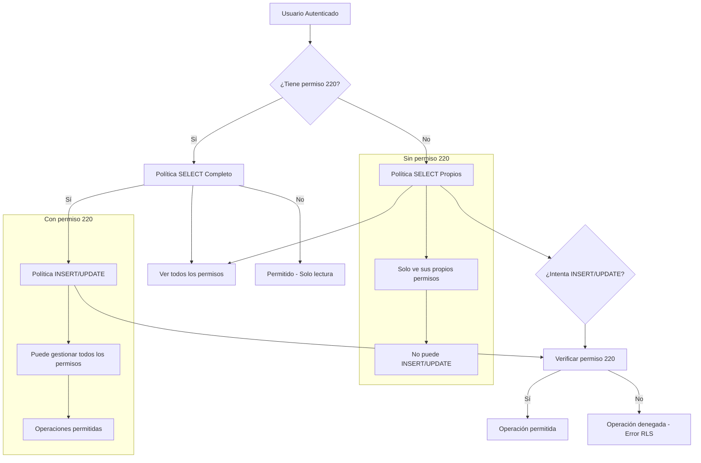

# Políticas RLS y Tabla de Permisos para segModulosUsuarios v2

## [Fecha y Hora]: 07/11/2025 07:05:00

## Descripción
Documento que contiene las políticas RLS para la tabla segModulosUsuarios basadas en permisos específicos y una tabla gráfica que muestra cómo quedarían distribuidos los permisos según los requerimientos solicitados.

## Políticas RLS para segModulosUsuarios

### Paso 1: Eliminar políticas actuales
```sql
DROP POLICY IF EXISTS segmodulosusuarios_select ON public."segModulosUsuarios";
DROP POLICY IF EXISTS segmodulosusuarios_update ON public."segModulosUsuarios";
```

### Paso 2: Política SELECT - Usuarios sin permiso 220
```sql
CREATE POLICY segmodulosusuarios_select_propios ON public."segModulosUsuarios"
    FOR SELECT USING (
        -- Solo puede ver sus propios permisos
        uid = auth.uid()
    );
```

### Paso 3: Política SELECT - Usuarios con permiso 220
```sql
CREATE POLICY segmodulosusuarios_select_permisos_220 ON public."segModulosUsuarios"
    FOR SELECT USING (
        -- Puede ver sus propios permisos siempre
        uid = auth.uid()
        OR 
        -- Puede ver todos los permisos si tiene permiso 220
        EXISTS (
            SELECT 1 FROM public."segModulosUsuarios" smu_inner
            WHERE smu_inner.uid = auth.uid()
              AND smu_inner.modulo = 'Configuraciones'
              AND smu_inner.seccion = 'Permisos'
              AND smu_inner.clave = 220
              AND smu_inner.acceso = true
        )
    );
```

### Paso 4: Política INSERT - Usuarios con permiso 220
```sql
CREATE POLICY segmodulosusuarios_insert_permisos_220 ON public."segModulosUsuarios"
    FOR INSERT WITH CHECK (
        -- Solo usuarios con permiso 220 pueden insertar permisos
        EXISTS (
            SELECT 1 FROM public."segModulosUsuarios" smu_inner
            WHERE smu_inner.uid = auth.uid()
              AND smu_inner.modulo = 'Configuraciones'
              AND smu_inner.seccion = 'Permisos'
              AND smu_inner.clave = 220
              AND smu_inner.acceso = true
        )
    );
```

### Paso 5: Política UPDATE - Usuarios con permiso 220
```sql
CREATE POLICY segmodulosusuarios_update_permisos_220 ON public."segModulosUsuarios"
    FOR UPDATE USING (
        -- Puede actualizar sus propios permisos siempre
        uid = auth.uid()
        OR 
        -- Puede actualizar permisos si tiene permiso 220
        EXISTS (
            SELECT 1 FROM public."segModulosUsuarios" smu_inner
            WHERE smu_inner.uid = auth.uid()
              AND smu_inner.modulo = 'Configuraciones'
              AND smu_inner.seccion = 'Permisos'
              AND smu_inner.clave = 220
              AND smu_inner.acceso = true
        )
    );
```

### Paso 6: Verificación de políticas creadas
```sql
SELECT schemaname, tablename, policyname, permissive, roles, cmd, qual 
FROM pg_policies 
WHERE tablename = 'segModulosUsuarios' AND schemaname = 'public'
ORDER BY policyname;
```

## Tabla de Permisos - Distribución por Tipo de Usuario

### Usuarios SIN permiso 220 (Permisos)
| Perfil | Ver Propios | Ver Otros | Insertar | Actualizar | Observaciones |
|----------|---------------|------------|----------|------------|-------------|
| Soporte | ✅ | ❌ | ❌ | ❌ | Solo ve sus propios permisos |
| Gerencia | ✅ | ❌ | ❌ | ❌ | Solo ve sus propios permisos |
| Administrador | ✅ | ❌ | ❌ | ❌ | Solo ve sus propios permisos |
| Ventas | ✅ | ❌ | ❌ | ❌ | Solo ve sus propios permisos |
| Cobranza | ✅ | ❌ | ❌ | ❌ | Solo ve sus propios permisos |

### Usuarios CON permiso 220 (Gestionar Permisos)
| Perfil | Ver Propios | Ver Otros | Insertar | Actualizar | Observaciones |
|----------|---------------|------------|----------|------------|-------------|
| Soporte | ✅ | ✅ | ✅ | ✅ | Acceso completo a gestión de permisos |
| Gerencia | ✅ | ✅ | ✅ | ✅ | Acceso completo a gestión de permisos |
| Administrador | ✅ | ✅ | ✅ | ✅ | Acceso completo a gestión de permisos |
| Ventas | ✅ | ✅ | ✅ | ✅ | Acceso completo a gestión de permisos |
| Cobranza | ✅ | ✅ | ✅ | ✅ | Acceso completo a gestión de permisos |

## Diagrama de Flujo de Permisos



## Casos de Uso

### Caso 1: Usuario de Ventas sin permiso 220
- **Acceso**: Solo puede ver sus propios permisos
- **Operación**: `SELECT * FROM segmodulosusuarios_smu('uid_usuario', true)` ✅
- **Operación**: `SELECT * FROM segmodulosusuarios_smu('uid_usuario', false)` ❌ (Error RLS)
- **Resultado**: Solo ve sus permisos, no puede gestionar los de otros

### Caso 2: Usuario de Soporte con permiso 220
- **Acceso**: Puede ver todos los permisos
- **Operación**: `SELECT * FROM segmodulosusuarios_smu('uid_soporte', true)` ✅
- **Operación**: `SELECT * FROM segmodulosusuarios_smu('uid_soporte', false)` ✅
- **Operación**: INSERT/UPDATE en segModulosUsuarios ✅
- **Resultado**: Acceso completo a gestión de permisos

### Caso 3: Usuario de Gerencia con permiso 220
- **Acceso**: Puede ver todos los permisos
- **Operación**: Todas las operaciones permitidas
- **Resultado**: Acceso completo a gestión de permisos

## Implementación

### Paso 1: Ejecutar el script completo
```sql
-- Copiar y ejecutar todo el contenido de este archivo
-- desde psql o el cliente de Supabase
```

### Paso 2: Verificar políticas
```sql
-- Confirmar que las políticas se crearon correctamente
SELECT schemaname, tablename, policyname, permissive, roles, cmd, qual 
FROM pg_policies 
WHERE tablename = 'segModulosUsuarios' AND schemaname = 'public'
ORDER BY policyname;
```

### Paso 3: Probar con diferentes usuarios
```sql
-- Prueba con usuario sin permiso 220
SELECT * FROM public.segmodulosusuarios_smu('uid_sin_permiso_220', false);

-- Prueba con usuario con permiso 220
SELECT * FROM public.segmodulosusuarios_smu('uid_con_permiso_220', false);
```

## Consideraciones de Seguridad

### Principios Aplicados
1. **Principio de Menor Privilegio**: Por defecto, los usuarios solo ven sus propios permisos
2. **Control Granular**: Solo usuarios con permiso específico pueden gestionar permisos
3. **Seguridad en Capas**: Políticas RLS + validación en función
4. **Auditoría**: Todas las operaciones están registradas y pueden ser auditadas

### Ventajas de este Enfoque
- **Claridad**: Reglas explícitas y fáciles de entender
- **Seguridad**: Control preciso de quién puede hacer qué
- **Flexibilidad**: Fácil de ajustar permisos según necesidades
- **Mantenimiento**: Simplifica la administración de permisos

## Resumen

Este diseño de políticas RLS para `segModulosUsuarios` asegura que:
- Los usuarios sin permiso 220 solo puedan ver y modificar sus propios permisos
- Los usuarios con permiso 220 tengan acceso completo a la gestión de permisos
- Las operaciones estén protegidas por políticas RLS claras y auditableables
- El sistema sea seguro, flexible y fácil de mantener

La implementación de estas políticas resolverá el problema que experimentas con la función `segmodulosusuarios_smu()` cuando intenta consultar permisos de otros usuarios sin tener los permisos adecuados.