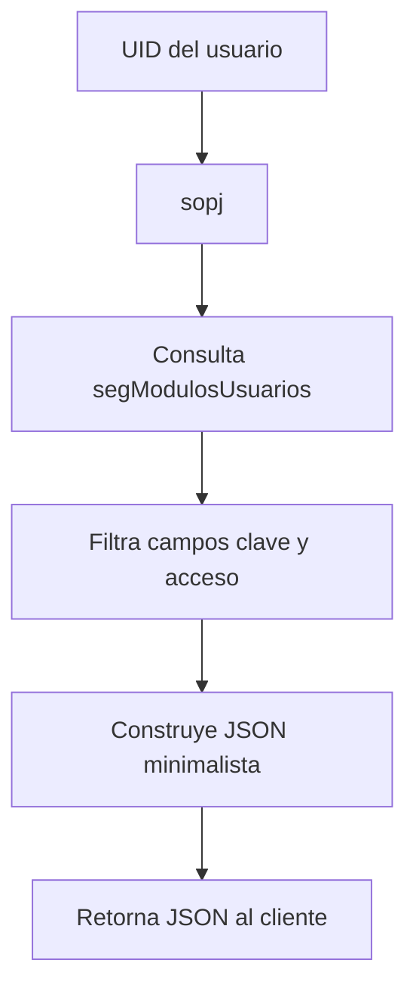
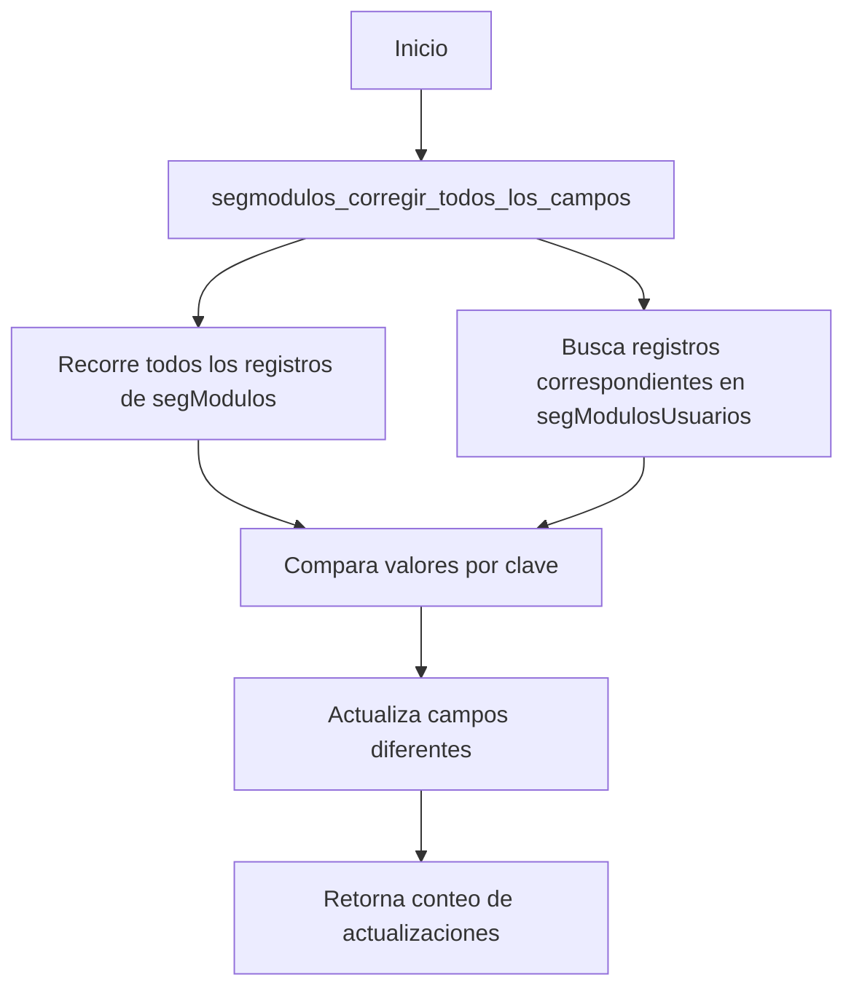

# Funciones y Triggers - segModulosUsuarios

## [Fecha y Hora]: 17/11/2025 06:57:00

## Descripción
Este directorio contiene todas las funciones y triggers asociados a la tabla `segModulosUsuarios`, que gestiona los permisos de los usuarios en el sistema.

## Componentes Actuales

### 1. sopj.sql
- **Tipo**: Función SQL de nivel sensitivo y prioritario
- **Propósito**: Obtener únicamente los campos clave y acceso de un usuario en formato JSON
- **Parámetros**:
  - `p_uid` (uuid): UID del usuario a consultar
- **Retorno**: JSON con solo los campos clave y acceso del usuario en segModulosUsuarios
- **Uso**: `SELECT sopj('uuid-usuario');`
- **Nivel de seguridad**: Sensitivo - Solo expone información mínima necesaria

### 2. segmodulos_corregir_todos_los_campos.sql
- **Tipo**: Función SQL de corrección de datos
- **Propósito**: Recorre todos los registros de segModulos y corrige los campos módulo, sección y área en segModulosUsuarios
- **Parámetros**: No requiere parámetros
- **Retorno**: integer - Número de registros actualizados
- **Uso**: `SELECT segmodulos_corregir_todos_los_campos();`
- **Nivel de seguridad**: INVOKER - Respeta permisos del usuario que ejecuta

## Flujo de Procesamiento

### Flujo para obtención de permisos (sopj)


### Flujo para corrección de datos


## Comportamiento Detallado

### sopj (Seguridad de Operaciones de Permisos JSON)
1. **Entrada**: Recibe un UID de usuario como parámetro
2. **Proceso**:
   - Consulta registros en segModulosUsuarios donde el UID coincide
   - Extrae únicamente los campos clave y acceso (información sensitiva)
   - Construye un objeto JSON minimalista para cada registro
   - Agrupa todos los objetos en un array JSON
3. **Salida**: Retorna el array JSON o NULL si no hay registros
4. **Casos especiales**:
   - Si el usuario no tiene permisos, retorna NULL
   - Si el UID es inválido, genera un error de PostgreSQL
   - Función de nivel sensitivo: minimiza exposición de datos

### segmodulos_corregir_todos_los_campos
1. **Entrada**: No requiere parámetros
2. **Proceso**:
   - Recorre todos los registros de la tabla segModulos
   - Para cada registro, busca los correspondientes en segModulosUsuarios por clave
   - Compara los campos módulo, sección y área
   - Actualiza solo los registros que tienen diferencias
   - Maneja correctamente los valores NULL
3. **Salida**: Retorna el número total de registros actualizados
4. **Casos especiales**:
   - Si no hay diferencias, retorna 0
   - Si hay error en la actualización, retorna -1 y muestra el error

## Instrucciones de Instalación

Ejecutar el script `instalar_todo.sql` para instalar todas las funciones en el orden correcto:

```bash
psql -h tu-host -U tu-usuario -d tu-base-de-datos -f instalar_todo.sql
```

O si usas Supabase:

```bash
supabase db push
```

## Estado Actual
- **Total de funciones**: 2
- **Total de triggers**: 0
- **Última actualización**: 17/11/2025 06:57:00

## Notas Importantes
1. Todas las funciones usan SECURITY INVOKER por defecto
2. Las funciones respetan las políticas RLS de la tabla segModulosUsuarios
3. Los nombres de campos con mayúsculas se manejan con comillas dobles
4. La documentación interna de cada función incluye ejemplos de uso
5. La función sopj es de nivel sensitivo y prioritario (nombre abreviado por seguridad)
6. La función de corrección trabaja automáticamente con todos los registros de segModulos

## Consideraciones de Seguridad
- Las funciones están diseñadas para trabajar con las políticas RLS existentes
- Solo retornan información que el usuario autenticado tiene permiso de ver
- No exponen información de otros usuarios
- La función sopj minimiza la exposición de datos retornando solo campos esenciales
- La función de corrección respeta las políticas RLS existentes

## Nuevo Sistema de Plantillas de Permisos

### Descripción
Se ha implementado un nuevo sistema de plantillas de permisos que permite crear, almacenar y aplicar conjuntos predefinidos de permisos a los usuarios del sistema.

### Ubicación
Los archivos del nuevo sistema se encuentran en:
```
segModulosUsuarios/plantillas permisos/
├── README.md                          # Documentación completa
├── crear_tablas_plantillas.sql         # Script de creación de tablas
├── funciones_plantillas.sql           # Funciones RPC del sistema
├── politicas_rls_plantillas.sql      # Políticas RLS de seguridad
├── instalar_todo_plantillas.sql       # Script principal de instalación
└── ejemplos_uso.sql                 # Ejemplos prácticos de uso
```

### Componentes Principales

#### Tablas
- **segPlantillasPermisos**: Catálogo de plantillas de permisos
- **segDetallesPlantilla**: Detalles específicos de permisos por plantilla

#### Funciones RPC
- `seg_crear_plantilla_desde_usuario()`: Crea plantilla desde permisos de usuario
- `seg_aplicar_plantilla_a_usuario()`: Aplica plantilla a usuario
- `seg_listar_plantillas()`: Lista plantillas disponibles
- `seg_ver_detalles_plantilla()`: Muestra detalles de plantilla
- `seg_eliminar_plantilla()`: Elimina plantilla del sistema

#### Seguridad
- RLS habilitado en ambas tablas
- Control de acceso basado en permiso 206 (Gestionar perfiles)
- Los creadores pueden gestionar sus propias plantillas
- Plantillas públicas visibles para administradores

### Instalación
Para instalar el nuevo sistema:

1. **Ejecutar script principal:**
   ```sql
   \i segModulosUsuarios/plantillas permisos/instalar_todo_plantillas.sql
   ```

2. **Ejecutar funciones RPC:**
   ```sql
   \i segModulosUsuarios/plantillas permisos/funciones_plantillas.sql
   ```

3. **Aplicar políticas RLS:**
   ```sql
   \i segModulosUsuarios/plantillas permisos/politicas_rls_plantillas.sql
   ```

### Ejemplo de Uso Rápido
```sql
-- Crear plantilla desde usuario existente
SELECT seg_crear_plantilla_desde_usuario(
    'Gerente Ventas',
    'Permisos completos para gerentes de ventas',
    '896f01e5-283f-4bdb-b3f3-11381adedb30',
    'Ventas',
    true
);

-- Aplicar plantilla a nuevo usuario
SELECT seg_aplicar_plantilla_a_usuario(
    'uuid-plantilla-gerente',
    'uid-nuevo-usuario',
    true
);
```

### Beneficios
- **Centralización**: Catálogo unificado de configuraciones de permisos
- **Consistencia**: Usuarios con mismos roles tienen permisos idénticos
- **Eficiencia**: Reducción drástica en tiempo de configuración
- **Auditoría**: Registro completo de cambios y aplicaciones
- **Flexibilidad**: Personalización y actualización masiva

Para más detalles, consultar la documentación completa en:
`segModulosUsuarios/plantillas permisos/README.md`