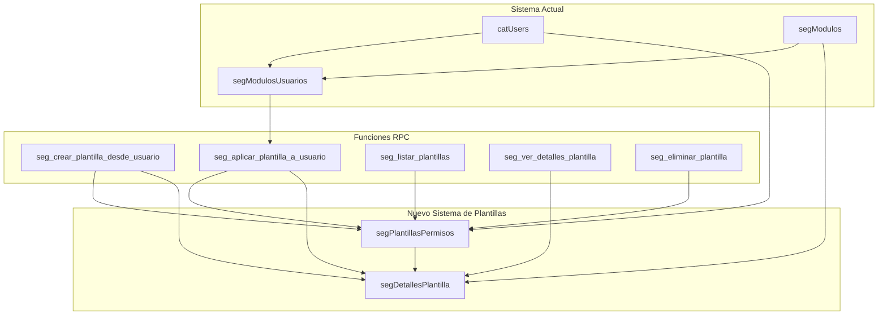

# Sistema de Plantillas de Permisos - Documentación Completa

## [Fecha y Hora]: 16/11/2025 10:53:00

## Descripción General

El Sistema de Plantillas de Permisos es una extensión del sistema actual de gestión de permisos `segModulosUsuarios` que permite crear, almacenar y aplicar conjuntos predefinidos de permisos a los usuarios del sistema.

### Objetivos Principales

1. **Centralización**: Mantener un catálogo centralizado de configuraciones de permisos
2. **Consistencia**: Asegurar que usuarios con roles similares tengan permisos idénticos
3. **Eficiencia**: Reducir el tiempo de configuración de permisos para nuevos usuarios
4. **Auditoría**: Mantener registro completo de cambios y aplicaciones de plantillas
5. **Flexibilidad**: Permitir personalización y actualización masiva de permisos

## Arquitectura del Sistema



## Estructura de Datos

### Tabla: segPlantillasPermisos

Almacena la información principal de cada plantilla de permisos.

| Columna | Tipo | Descripción | Restricciones |
|----------|------|-------------|---------------|
| idPlantilla | uuid | Identificador único de la plantilla | PRIMARY KEY |
| nombrePlantilla | text | Nombre descriptivo de la plantilla | UNIQUE, NOT NULL |
| descripcion | text | Descripción detallada del propósito | NULL |
| categoria | text | Categoría para organización | CHECK (valores predefinidos) |
| esPublica | boolean | Si puede ser usada por otros admins | DEFAULT false |
| uidCreador | uuid | Usuario que creó la plantilla | FK → catUsers |
| fechaCreacion | timestamptz | Fecha de creación | DEFAULT now() |
| status | boolean | Estado activo/inactivo | DEFAULT true |

### Tabla: segDetallesPlantilla

Almacena los permisos específicos de cada plantilla.

| Columna | Tipo | Descripción | Restricciones |
|----------|------|-------------|---------------|
| idDetalle | uuid | Identificador único del detalle | PRIMARY KEY |
| idPlantilla | uuid | Referencia a la plantilla | FK → segPlantillasPermisos |
| modulo | text | Módulo del sistema | NOT NULL |
| seccion | text | Sección dentro del módulo | NOT NULL |
| area | text | Área funcional | NULL |
| acceso | boolean | Si se concede el acceso | DEFAULT false |
| clave | smallint | Código numérico del permiso | NULL |
| status | boolean | Estado del detalle | DEFAULT true |

## Funciones RPC

### 1. seg_crear_plantilla_desde_usuario

Crea una plantilla basada en los permisos de un usuario existente.

```sql
SELECT seg_crear_plantilla_desde_usuario(
    p_nombre_plantilla text,
    p_descripcion text DEFAULT NULL,
    p_uid_usuario_origen uuid,
    p_categoria text DEFAULT 'General',
    p_es_publica boolean DEFAULT false
);
```

**Parámetros:**
- `p_nombre_plantilla`: Nombre descriptivo de la plantilla
- `p_descripcion`: Descripción detallada (opcional)
- `p_uid_usuario_origen`: UID del usuario a copiar permisos
- `p_categoria`: Categoría de organización (por defecto 'General')
- `p_es_publica`: Si es visible para otros administradores (por defecto false)

**Retorno:** JSON con resultado de la operación

**Ejemplo:**
```sql
SELECT seg_crear_plantilla_desde_usuario(
    'Gerente Ventas Senior',
    'Permisos completos para gerentes senior de ventas con acceso a reportes avanzados',
    '896f01e5-283f-4bdb-b3f3-11381adedb30',
    'Ventas',
    true
);
```

### 2. seg_aplicar_plantilla_a_usuario

Aplica una plantilla de permisos a un usuario específico. **Función optimizada para producción que maneja duplicados sin requerir restricciones únicas.**

```sql
SELECT seg_aplicar_plantilla_a_usuario(
    p_uid_usuario_destino uuid,
    p_id_plantilla uuid,
    p_reemplazar_todos boolean DEFAULT false
);
```

**Parámetros:**
- `p_uid_usuario_destino`: UID del usuario al que se aplicarán los permisos
- `p_id_plantilla`: ID de la plantilla de permisos a aplicar
- `p_reemplazar_todos`: Si es true, elimina todos los permisos existentes del usuario antes de aplicar la plantilla (por defecto false)

**Retorno:** JSON con resultado detallado de la operación incluyendo:
- success: boolean - Indica si la operación fue exitosa
- permisos_aplicados: integer - Cantidad de permisos aplicados
- permisos_eliminados: integer - Cantidad de permisos eliminados (si aplica)
- mensaje: text - Mensaje descriptivo del resultado

**Ejemplo:**
```sql
SELECT seg_aplicar_plantilla_a_usuario(
    '896f01e5-283f-4bdb-b3f3-11381adedb30',
    '177412a8-5e30-40c5-aa57-d043ea856082',
    true
);
```

**Notas importantes:**
- **Versión actualizada**: 17/11/2025 - Optimizada para producción
- Maneja duplicados existentes sin eliminar datos
- Actualiza permisos existentes en lugar de crear duplicados
- No requiere restricciones únicas en la tabla segModulosUsuarios

### 3. seg_listar_plantillas

Lista las plantillas disponibles con filtros opcionales.

```sql
SELECT * FROM seg_listar_plantillas(
    p_categoria text DEFAULT NULL,
    p_solo_publicas boolean DEFAULT false,
    p_incluir_inactivas boolean DEFAULT false
);
```

**Parámetros:**
- `p_categoria`: Filtrar por categoría específica
- `p_solo_publicas`: Mostrar solo plantillas públicas
- `p_incluir_inactivas`: Incluir plantillas inactivas

**Retorno:** Tabla con información de plantillas y conteo de permisos

### 4. seg_ver_detalles_plantilla

Muestra los permisos específicos de una plantilla.

```sql
SELECT * FROM seg_ver_detalles_plantilla(p_id_plantilla uuid);
```

**Retorno:** Tabla con todos los permisos de la plantilla

### 5. seg_eliminar_plantilla

Elimina una plantilla del sistema.

```sql
SELECT seg_eliminar_plantilla(
    p_id_plantilla uuid,
    p_uid_autorizador uuid DEFAULT NULL
);
```

**Retorno:** JSON con resultado de la eliminación

## Seguridad y Políticas RLS

### Principios de Seguridad

1. **Control de Acceso**: Solo usuarios con permiso 206 (Gestionar perfiles) pueden administrar plantillas
2. **Aislamiento**: Los creadores solo pueden modificar sus propias plantillas
3. **Visibilidad**: Las plantillas públicas son visibles para todos los administradores
4. **Auditoría**: Todas las operaciones registran quién y cuándo se ejecutaron

### Políticas Implementadas

#### segPlantillasPermisos
- **SELECT**: Administradores (permiso 206) + creadores + plantillas públicas
- **INSERT**: Solo administradores
- **UPDATE**: Administradores + creadores (con restricciones)
- **DELETE**: Administradores + creadores

#### segDetallesPlantilla
- Hereda permisos de la plantilla padre
- Mismas reglas de acceso que la tabla principal

### Funciones de Verificación

```sql
-- Verificar si es administrador de plantillas
SELECT seg_es_administrador_plantillas();

-- Verificar acceso a plantilla específica
SELECT seg_puede_acceder_plantilla('uuid-plantilla');
```

## Categorías de Plantillas

Las plantillas se organizan en las siguientes categorías:

- **General**: Plantillas de uso general o multipropósito
- **Ventas**: Permisos específicos para equipos de ventas
- **Administración**: Permisos administrativos generales
- **Soporte**: Permisos para equipos de soporte técnico
- **Gerencia**: Permisos para niveles gerenciales
- **Operaciones**: Permisos para operaciones diarias
- **Finanzas**: Permisos para áreas financieras

## Casos de Uso Típicos

### Caso 1: Nuevo Empleado

```sql
-- 1. Crear plantilla para "Vendedor Junior"
SELECT seg_crear_plantilla_desde_usuario(
    'Vendedor Junior',
    'Permisos básicos para nuevos vendedores',
    'uid-vendedor-referencia',
    'Ventas',
    true
);

-- 2. Aplicar a nuevo vendedor
SELECT seg_aplicar_plantilla_a_usuario(
    'uuid-plantilla-vendedor-junior',
    'uid-nuevo-vendedor',
    true
);
```

### Caso 2: Promoción de Cargo

```sql
-- Aplicar plantilla de "Gerente" a vendedor promovido
SELECT seg_aplicar_plantilla_a_usuario(
    'uuid-plantilla-gerente-ventas',
    'uid-vendedor-promovido',
    true
);
```

### Caso 3: Auditoría de Permisos

```sql
-- Ver permisos actuales de un usuario
SELECT "modulo", "seccion", "area", "acceso", "clave"
FROM public."segModulosUsuarios"
WHERE "uid" = 'uid-usuario-auditar'
ORDER BY "modulo", "seccion", "area";

-- Comparar con plantilla esperada
SELECT * FROM seg_ver_detalles_plantilla('uuid-plantilla-esperada');
```

### Caso 4: Actualización Masiva

```sql
-- Actualizar todos los vendedores junior con nuevos permisos
UPDATE public."segModulosUsuarios" smu
SET "acceso" = sdp."acceso"
FROM public."segDetallesPlantilla" sdp
JOIN public."segPlantillasPermisos" sp ON sdp."idPlantilla" = sp."idPlantilla"
WHERE sp."nombrePlantilla" = 'Vendedor Junior Actualizado'
AND smu."modulo" = sdp."modulo"
AND smu."seccion" = sdp."seccion"
AND smu."area" = sdp."area";
```

## Instalación y Configuración

### Prerrequisitos

1. PostgreSQL 12+ con RLS habilitado
2. Acceso como superusuario o owner de las tablas
3. El sistema `segModulosUsuarios` debe estar funcionando

### Pasos de Instalación

1. **Ejecutar script principal:**
   ```sql
   -- En la base de datos de producción
   \i segModulosUsuarios/plantillas permisos/instalar_todo_plantillas.sql
   ```

2. **Ejecutar funciones RPC:**
   ```sql
   \i segModulosUsuarios/plantillas permisos/funciones_plantillas.sql
   ```

3. **Aplicar políticas RLS:**
   ```sql
   \i segModulosUsuarios/plantillas permisos/politicas_rls_plantillas.sql
   ```

4. **Verificar instalación:**
   ```sql
   SELECT * FROM seg_listar_plantillas();
   ```

## Mantenimiento y Buenas Prácticas

### Mantenimiento Regular

1. **Revisión de plantillas**: Mensualmente revisar y actualizar plantillas
2. **Limpieza**: Eliminar plantillas obsoletas o duplicadas
3. **Auditoría**: Revisar aplicaciones de plantillas no autorizadas
4. **Backup**: Exportar plantillas importantes regularmente

### Buenas Prácticas

1. **Nomenclatura**: Usar nombres descriptivos y consistentes
2. **Documentación**: Mantener descripciones actualizadas
3. **Categorización**: Usar categorías apropiadas para cada plantilla
4. **Pruebas**: Probar plantillas en ambiente de desarrollo antes de producción
5. **Versionamiento**: Considerar incluir versión en nombre para cambios importantes

### Monitoreo

```sql
-- Plantillas más usadas
SELECT sp."nombrePlantilla", COUNT(*) as "usos"
FROM public."segPlantillasPermisos" sp
JOIN public."segModulosUsuarios" smu ON EXISTS (
    SELECT 1 FROM public."segDetallesPlantilla" sdp
    WHERE sdp."idPlantilla" = sp."idPlantilla"
    AND sdp."modulo" = smu."modulo"
    AND sdp."seccion" = smu."seccion"
    AND sdp."area" = smu."area"
)
GROUP BY sp."idPlantilla", sp."nombrePlantilla"
ORDER BY "usos" DESC;

-- Plantillas sin uso reciente
SELECT sp."nombrePlantilla", sp."fechaCreacion"
FROM public."segPlantillasPermisos" sp
WHERE NOT EXISTS (
    SELECT 1 FROM public."segModulosUsuarios" smu
    JOIN public."segDetallesPlantilla" sdp ON smu."modulo" = sdp."modulo"
    AND smu."seccion" = sdp."seccion"
    AND smu."area" = sdp."area"
    WHERE sdp."idPlantilla" = sp."idPlantilla"
    AND smu."fc" > now() - interval '6 months'
);
```

## Troubleshooting

### Problemas Comunes

1. **Error: "Usuario no tiene permisos"**
   - Verificar que el usuario tenga permiso 206 activo
   - Revisar políticas RLS correctamente aplicadas

2. **Error: "Plantilla duplicada"**
   - Verificar que no exista otra plantilla con el mismo nombre
   - Considerar agregar versión o sufijo al nombre

3. **Error: "Usuario origen no encontrado"**
   - Verificar que el UID del usuario sea correcto
   - Confirmar que el usuario esté activo

### Consultas de Diagnóstico

```sql
-- Verificar políticas RLS aplicadas
SELECT schemaname, tablename, policyname, permissive, roles, cmd, qual 
FROM pg_policies 
WHERE tablename IN ('segPlantillasPermisos', 'segDetallesPlantilla')
ORDER BY tablename, policyname;

-- Verificar permisos de usuario
SELECT "modulo", "seccion", "area", "acceso", "clave"
FROM public."segModulosUsuarios"
WHERE "uid" = auth.uid()
ORDER BY "modulo", "seccion", "area";

-- Verificar estado de plantillas
SELECT "nombrePlantilla", "status", "esPublica", "categoria", "fechaCreacion"
FROM public."segPlantillasPermisos"
ORDER BY "fechaCreacion" DESC;
```

## Referencia Rápida

### Comandos Útiles

```sql
-- Listar todas las plantillas
SELECT * FROM seg_listar_plantillas();

-- Crear plantilla desde usuario
SELECT seg_crear_plantilla_desde_usuario('Nombre', 'Descripción', 'uid-usuario');

-- Aplicar plantilla
SELECT seg_aplicar_plantilla_a_usuario('uuid-plantilla', 'uuid-usuario');

-- Ver detalles de plantilla
SELECT * FROM seg_ver_detalles_plantilla('uuid-plantilla');

-- Eliminar plantilla
SELECT seg_eliminar_plantilla('uuid-plantilla');
```

### Estructura de Archivos

```
segModulosUsuarios/plantillas permisos/
├── README.md                          # Esta documentación
├── crear_tablas_plantillas.sql         # Script de creación de tablas
├── funciones_plantillas.sql           # Funciones RPC del sistema
├── seg_aplicar_plantilla_a_usuario.sql # Función principal actualizada (17/11/2025)
├── politicas_rls_plantillas.sql      # Políticas RLS de seguridad
├── instalar_todo_plantillas.sql       # Script principal de instalación
└── ejemplos_uso.sql                 # Ejemplos prácticos de uso
```

---

**Versión del documento**: 1.1
**Fecha de última actualización**: 17/11/2025
**Autor**: Sistema de Gestión SPH
**Estado**: Producción
**Cambios recientes**: Actualización de función seg_aplicar_plantilla_a_usuario para manejar duplicados en producción

Para soporte técnico o preguntas sobre este sistema, contactar al equipo de administración de base de datos.